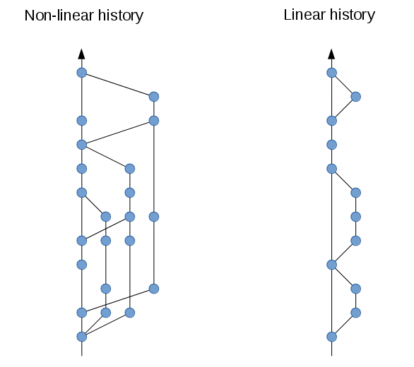

## Git Black Magic

---

## Assumptions

<!-- .slide: class="fragmented-lists" -->
* You have at least basic knowledge on how to use git
    * committing
    * branching and merging
* You're working on a non-trivial project with multiple committers

---

## Agenda

<!-- .slide: class="fragmented-lists" -->
* Commits
* Log/Grep
* Useful commands
* Find bugs with bisect
* Linear history

---

## Commits

<!-- .slide: class="fragmented-lists" -->
* Use a concise headline; max 50 chars
* Only commit one thing at a time
* Use the body to
    * give more context to what the motivation behind the change was
    * what exactly was changed in the code
* Use trailers for external references
* Use [conventional commit](https://www.conventionalcommits.org/en/v1.0.0/)

--

## Example

```text [1|3-7|9-10]
fix: prevent racing of requests

Introduce a request id and a reference to latest request. Dismiss
incoming responses other than from latest request.

Remove timeouts which were used to mitigate the racing issue but are
obsolete now.

Reviewed-by: Z
Refs: #123
```

---

## Log/Grep

```shell [1|2|3|4|5|6]
git log --format="%h %s %(trailers:key=Refs,valueonly)" # -h = commit hash; %s = subject (title-line)
git shortlog --group=trailer:Refs
git log 1.0.0..2.0.0
git log --follow path/to-file
git log --graph
git grep [-ni] "some string" $(git rev-list --all) # -n = show line number; -i = ignore case
```
<!-- .element: style="margin-bottom: 200px" -->
See also: [Pretty formats](https://git-scm.com/docs/pretty-formats)

---

## Useful commands

--

### add or discard partial changes

```shell [1|2]
git add -p
git checkout -p
```

--

### remove untracked files

```shell
git clean [-nfd] # -n = dry-run; -f = force; -d = directories
```

--

### Recover added files
```shell [1-2|3|4-5]
echo "test" >> testfile
git add testfile
git reset --hard
git fsck
git show $blob
```

--

### Recover lost commits
```shell [1-10|11|12-13]
echo row > test.txt
git add -A && git commit -m "Add first row"
echo row >> test.txt
git add -A && git commit -m "Add second row"
echo row >> test.txt
git add -A && git commit -m "Add third row"
echo your >> test.txt
git add -A && git commit -m "Add the word 'your'"
echo boat >> test.txt
git add -A && git commit -m "Add the word 'boat'"
git reset --hard origin/main
git reflog
git reset --hard $ref
```

---

## Find bugs with bisect

### Find ALL the bugs

Example courtesy of: [A beginner's guide to GIT BISECT - The process of elimination](https://www.metaltoad.com/blog/beginners-guide-git-bisect-process-elimination)

--

### First, add some history

```shell
echo row > test.txt
git add -A && git commit -m "Add first row"
echo row >> test.txt
git add -A && git commit -m "Add second row"
echo row >> test.txt
git add -A && git commit -m "Add third row"
echo your >> test.txt
git add -A && git commit -m "Add the word 'your'"
echo boat >> test.txt
git add -A && git commit -m "Add the word 'boat'"
echo gently >> test.txt
git add -A && git commit -m "Add the word 'gently'"
sed -i -e 's/boat/car/g' test.txt 
git add -A && git commit -m "Change the word 'boat' to 'car'"
echo down >> test.txt
git add -A && git commit -m "Add the word 'down'"
echo the >> test.txt
git add -A && git commit -m "Add the word 'the'"
echo stream >> test.txt
git add -A && git commit -m "Add the word 'stream'"
```

--

### Let's start our investigation

```shell [1|2|3|4|5]
git bisect start
git bisect bad # mark the head as bad
git bisect good $(git log --format="%h %s" | grep "Adding the word 'boat'" | cut -d' ' -f1) # we know this commit is good
cat test.txt # is the word car visible? `git bisect bad` : `git bisect good`
git bisect reset # when you're done 
```

---

## Linear history



--

### Why a linear history

<!-- .slide: class="fragmented-lists" -->
* A non-linear history is hard to follow
* Ordering of features and bugfixes is hard to determine
* Removing specific commits can become harder when there are also merge commits to consider

--

### How to keep your history linear

<!-- .slide: class="fragmented-lists" -->
* Rebase!
```shell
git pull --rebase [--autostash]
git push --force-with-lease
git rebase -i $ref
```
* Most git providers support forcing linear histories
    * [Azure DevOps](https://devblogs.microsoft.com/devops/pull-requests-with-rebase/)
    * [GitLab](https://docs.gitlab.com/ee/user/project/merge_requests/methods/#configure-a-projects-merge-method)
    * [GitHub](https://docs.github.com/en/repositories/configuring-branches-and-merges-in-your-repository/defining-the-mergeability-of-pull-requests/managing-a-branch-protection-rule)

--

### How to rebase hiervoor?!

```shell [1-10|11-19|20-22|23|24]
echo row > test.txt
git add -A && git commit -m "Add first row"
echo row >> test.txt
git add -A && git commit -m "Add second row"
echo row >> test.txt
git add -A && git commit -m "Add third row"
echo your >> test.txt
git add -A && git commit -m "Add the word 'your'"
echo boat >> test.txt
git add -A && git commit -m "Add the word 'boat'"
git switch -c feature/x
echo gently >> test.txt
git add -A && git commit -m "Add the word 'gently'"
echo down >> test.txt
git add -A && git commit -m "Add the word 'down'"
echo the >> test.txt
git add -A && git commit -m "Add the word 'the'"
echo stream >> test.txt
git add -A && git commit -m "Add the word 'stream'"
git switch main 
sed -i -e 's/boat/car/g' test.txt
git add -A && git commit -m "Change the word 'boat' to 'car'"
git switch feature/x
git rebase main
```