# Large Language Models 
### Part 1 - An introduction to AI


----

## Contents

- Goal <!-- .element: class="fragment" -->
- Different types of Neural Networks <!-- .element: class="fragment" -->
- What are neurons and neural networks? <!-- .element: class="fragment" -->
- Math stuff <!-- .element: class="fragment" -->
- <span>`MNIST` implementation in `Deeplearning4j`</span> <!-- .element: class="fragment" -->

---

### I am an idiot... <!-- .element: class="fragment" -->

- Math LMAO <!-- .element: class="fragment" -->
- I'll use Nederlands and English door elkaar, so be voorbereid <!-- .element: class="fragment" -->

--- 

### Goal

> After this session you <strong>understand</strong> how Neural Networks work and how they are trained. <!-- .element: class="fragment" -->

----


## Types of Neural Networks

- Feedforward Neural Networks (FNNs)
- Convolutional Neural Networks (CNNs)
- Recurrent Neural Networks (RNNs)
- Long Short-Term Memory (LSTM) Networks
- Autoencoders (AEs)
- Generative Adversarial Networks (GANs)

Note:

There are various types of neural networks, each with its unique architecture and use cases. We'll be discussing these five types in detail.

---

## Feedforward Neural Networks (FNNs)

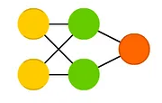

Note:

- Simplest type of neural network
- Consists of input, hidden, and output layers
- No cycles or loops in the network

<hr>

- used for Spam email classification, other clasification as well
- Simplest type of neural networks, 
- consisting of an input layer, one or more hidden layers, and an output layer.
- Wat we hebben gezien

---

### (Deep) Convolutional Neural Networks (CNNs)

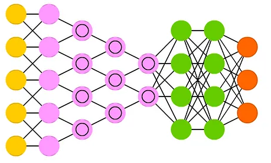

Note:

- Designed for image processing and computer vision tasks
- Convolutional layers and pooling layers
- Translational invariance

<hr>

- used for: Image recognition
- Designed for image processing and computer vision
- Convolutional layers, apply filters to the input data, and pooling layers, which reduce the spatial dimensions of the data.
- Achieve translational invariance, allowing them to recognize objects regardless of their position in the image.

---

### Recurrent Neural Networks (RNNs)


Note:
- Designed for sequential data
- Connections between neurons form directed cycles
- Retain memory of past inputs

<hr>

- Practical example: Sentiment analysis
- Designed to handle sequential data
- Connections between neurons that form directed cycles.
- maintain a memory of past inputs, 
- suitable for tasks involving time series or sequence data
    - speech recognition.
    - natural language processing 

---

### Long Short-Term Memory (LSTM) Networks

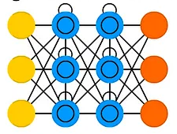

Note:

- A type of RNN with improved memory capabilities
- Overcomes the vanishing gradient problem
- Suitable for tasks involving long sequences

<hr>

- Practical example: Machine translation
- Special type of RNN 
- machine translation and text generation
- Overcome the vanishing gradient problem, which occurs when ??

---


### Autoencoders (AEs)

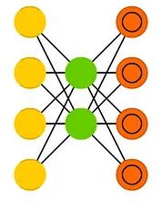

Note:

- Autoencoders: Unsupervised learning for dimensionality reduction and feature learning
- GANs: Two neural networks (generator and discriminator) competing against each other to generate realistic data

<hr>

- Practical example: denoising images, inpainting missing parts of an image, or transferring the style of one image onto another (style transfer).
- unsupervised learning neural network 
- Dimensionality reduction and feature learning. 
- encoder that compresses the input data 
- decoder that reconstructs the data from the compressed representation.

---

### Generative Adversarial Networks (GANs)

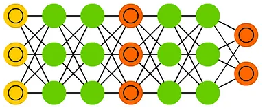

Note:

- GANs: Two neural networks (generator and discriminator) competing against each other to generate realistic data

<hr>

GANs
- Practical example: generate realistic synthetic images
- 2 neural networks, generator and the discriminator
- compete against each other. 
- The generator creates realistic data samples, while the discriminator attempts to distinguish between real and generated samples. 
- This competition leads to the generator producing increasingly realistic data.

---

### Overview NNs

- Feedforward Neural Networks (FNNs)
    - Classification
- Convolutional Neural Networks (CNNs)
    - Image processing and computer vision
- Recurrent Neural Networks (RNNs)
    - Sentiment analysis
- Long Short-Term Memory (LSTM) Networks
    - Machine translation
- Autoencoders (AEs)
    - Denoising Images, Inpainting, style transfer
- Generative Adversarial Networks (GANs)
    - Synthetic images, audio

--- 

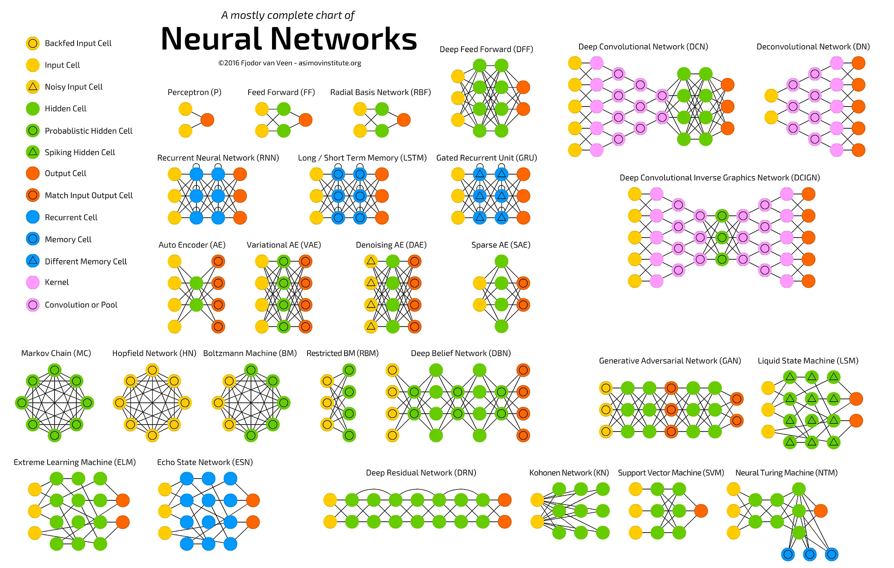

----

### Neural network

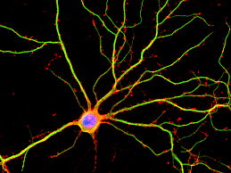

Note:
- Artificial neurons: Inspired by biological neurons
- Dendrites from other neurons
- Via Axon
- Splits into synapses (connect to other dendrites)
- Connects to other neurons

---

### Neural network

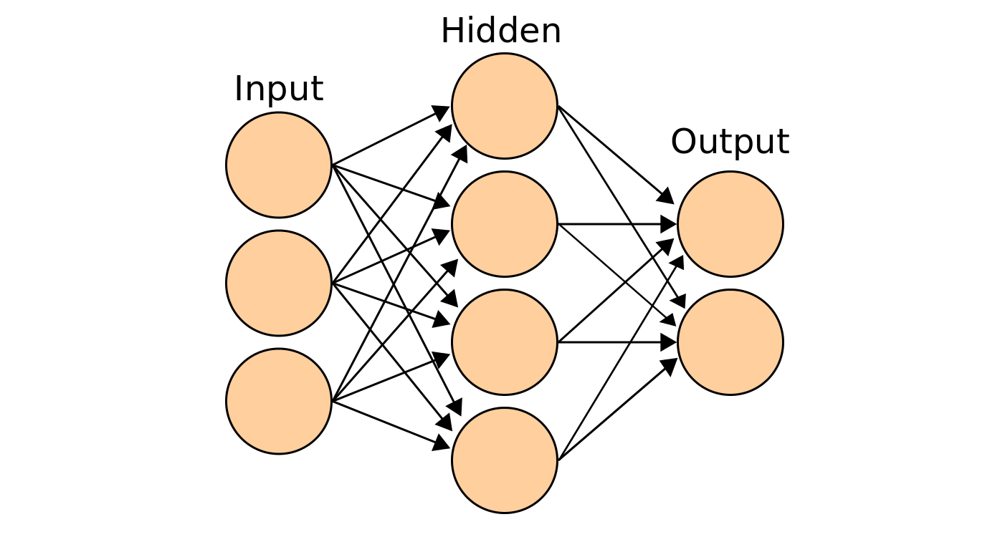

- Input
- Weights
- Bias

---

```java
class Neuron {
    double value;
    List<Weight> weights;
}

class Weight {
    double value;
    Neuron neuron;
}
```

---

### Neural network

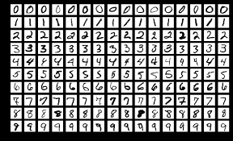
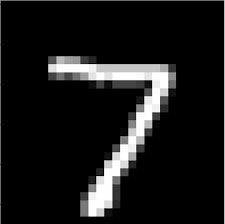

Note:
- 28 * 28 pixels
- Waarde van 0.0 - 1.0
- Dit is input layer voor ons neurale netwerk

---

### Neural network

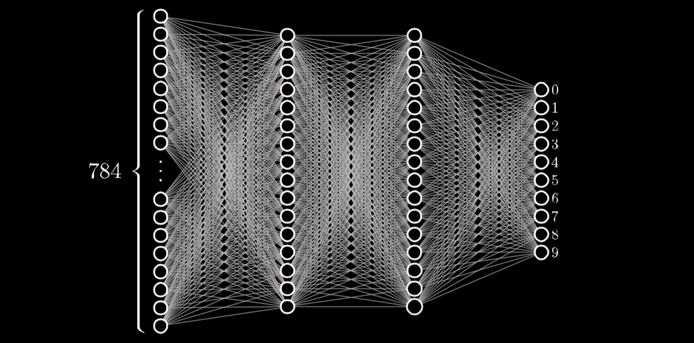

Note:
- 2 hidden layers
- voorbeeld komt van 3Blue1Brown

---

### Neural network

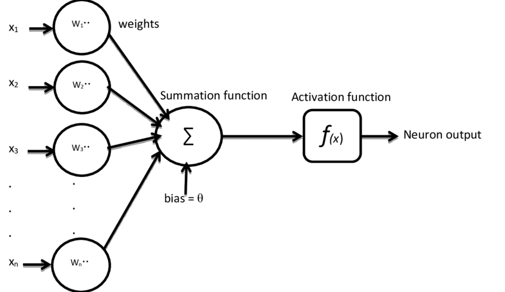

Note:
- 2 hidden layers
- voorbeeld komt van 3Blue1Brown

---

### Activation Function

`$$ \sigma(x) = \frac{1}{1 + e^{-x}} $$`<!-- .element: class="fragment fade-in" -->
`$$ ReLu(x) = max(0, x) $$`<!-- .element: class="fragment fade-in" -->
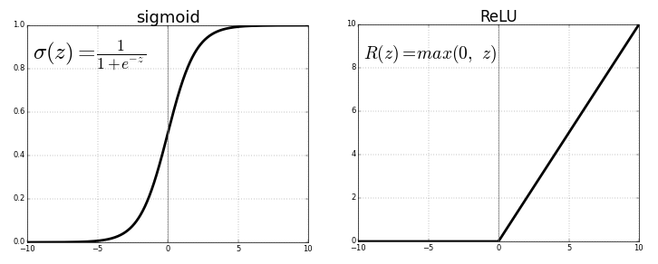<!-- .element: class="fragment fade-in" -->

---

<!-- .slide: class="two-floating-elements" -->
###  Neuron

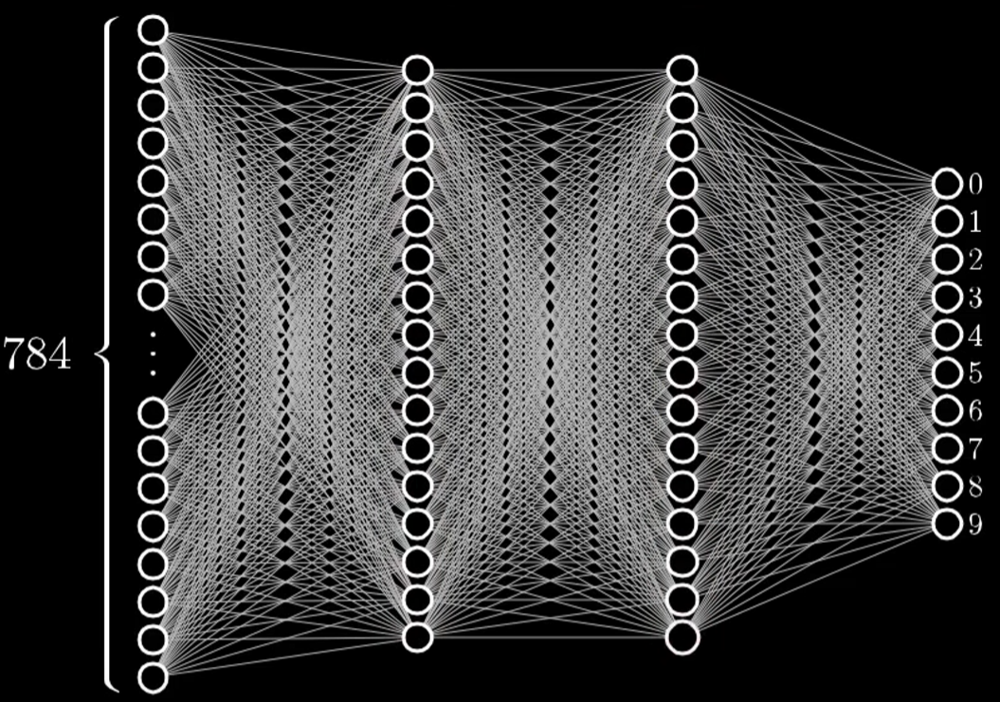

* `$$(w_1 a_1 + w_2 a_2 + ... +w_n a_n)$$` <!-- .element: class="fragment fade-in-then-semi-out" -->
* `$$\sigma(w_1 a_1 + w_2 a_2 + ... +w_n a_n )$$` <!-- .element: class="fragment fade-in" -->
* `$$\sigma(w_1 a_1 + w_2 a_2 + ... +w_n a_n + \theta )$$` <!-- .element: class="fragment fade-in-then-semi-out" -->

---

### Neural network

`$$\sigma(w_{(1,1)} a_1 + w_{(1,2)} a_2 + ... +w_{1,n} a_n + \theta )$$`  <!-- .element: class="fragment fade-in-then-semi-out" -->
`$$
\sigma(
\begin{bmatrix}
w_{(1,1)} & w_{(1,2)} & \dots & w_{1,n} \\
\end{bmatrix}
\begin{bmatrix}
a_{1} \\
a_{2} \\
\vdots \\
a_{n}
\end{bmatrix}
+
\theta
)
$$` <!-- .element: class="fragment fade-in-then-semi-out" -->


`$$
\sigma
\left(
\left[
\begin{array}{ccc}
w_{(1,1)} & w_{(1,2)} & ... & w_{(1,n)} \\
w_{(2,1)} & w_{(2,2)} & ... & w_{(2,n)} \\
\vdots & \vdots  & \ddots & \vdots \\
w_{(m,1)} & w_{(m,2)} & ... & w_{(m,n)} \\
\end{array}
\right]
\begin{bmatrix}
a_{1} \\
a_{2} \\
\vdots \\
a_{n}
\end{bmatrix}
+
\begin{bmatrix}
\theta_{1} \\
\theta_{2} \\
\vdots \\
\theta_{n}
\end{bmatrix}
\right)
$$` <!-- .element: class="fragment fade-in-then-semi-out" -->

----

### Let's start!

- Initialize all values at random!

---

### But... it does not work! 

- We need it to improve <!-- .element: class="fragment" -->
- We need to quantify it's performance  <!-- .element: class="fragment" -->
- Define a "Cost function" <!-- .element: class="fragment" -->

Note:
- Met een Cost function kunnen we zeggen hoe slecht het werkt 

---

### Cost function of our Neural network

<!-- .slide: class="two-floating-elements" -->

`$
\begin{bmatrix}
0.25_0 \\
0.81_1 \\
0.91_2 \\
0.52_3 \\
0.19_4 \\
0.76_5 \\
0.01_6 \\
0.25_7 \\
0.19_8 \\
0.44_9 \\
\end{bmatrix}
$`<!-- .element: class="fragment" -->

Note:

- Stel we hebben input voor ons neurale netwerk, Laten we zeggen een plaatje van het getal `7`.
- Wanneer we dit door ons neural netwerk sturen, komt hier onzin uit.

---

`$
\begin{rcases}
(0.25 - 0.00)^2 = 0.06 \\
(0.81 - 0.00)^2 = 0.65 \\
(0.91 - 0.00)^2 = 0.82 \\
(0.52 - 0.00)^2 = 0.27 \\
(0.19 - 0.00)^2 = 0.03 \\
(0.76 - 0.00)^2 = 0.57 \\
(0.01 - 0.00)^2 = 0.00 \\
(0.25 - 1.00)^2 = 0.56 \\
(0.19 - 0.00)^2 = 0.03 \\
(0.44 - 0.00)^2 = 0.19
\end{rcases} 3.18
$`

---

`$Cost(\underbrace{w_{(0,1)},w_{(0,2)} ... \theta_0, \theta_1}_{\text{Weights and biasses}})$` <!-- .element: class="fragment fade-in-then-semi-out" -->

`$Cost(w)$` <!-- .element: class="fragment fade-in-then-semi-out" -->

`$ Cost (w) = 0 \implies Cost^{-1}(0) = w $` <!-- .element: class="fragment fade-in-then-semi-out" -->

Note:
- We kunnen dit zien als een functie over alle parameters.
- Simpeler, maar hoe gaan we bepalen wat er moet veranderen?
- We willen weten wat de laagst mogelijke waarde is, calculus zou ons kunnen helpen?

---

- Stel dat de function eenvoudig zou zijn: `$f(x) = x^2$` 
- 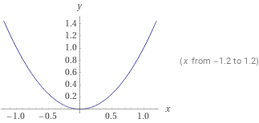 <!-- .element: class="fragment" -->
- `$f'(x) = 0 \implies \frac {\delta} {\delta x} x^2 = 0 \implies  2x=0 \implies 0$` <!-- .element: class="fragment" -->

---

Complexiteit neemt snel toe:

`$ f(x) = x^5 - 5x^3 + 4x $` 
- 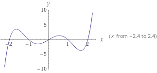 <!-- .element: class="fragment" -->
- Wordt al moeilijker... <!-- .element: class="fragment" -->
- <span> Een onbekende (`$x$`)... </span> <!-- .element: class="fragment" -->

Note:
- met 1 input en 1 output zou dit kunnen
- niet met 13000 inputs, erg moeilijk om het te vinden, maar we kunnen het wel benaderen
- dit noemen we "Gradient descent"
- Multivariabele calculus

---

### Gradient descent

> Er is een methode `f` die berekend hoe stijl, en wat de richting is van de "Steepest Descent".  
<!-- .element: class="fragment" -->

<ol>
<li>bereken $ \nabla C $ </li><!-- .element: class="fragment" -->
<li>stap in $-\nabla C $ richting</li><!-- .element: class="fragment" -->
<li><code>goto 1</code></li><!-- .element: class="fragment" -->
</ol><!-- .element: class="fragment" -->

Hetzelfde werkt voor veel inputs  <!-- .element: class="fragment" -->

---
<!-- .slide: class="two-floating-elements" -->
Verzamel alle parameters in een vector

`$
\overrightarrow{W} =
\begin{bmatrix}
-0.35 \\
0.81 \\
-.41 \\
\vdots \\
0.57 \\
-0.94 \\
0.41 \\
\end{bmatrix}
$`<!-- .element: class="fragment" -->
`$
-\nabla C(\overrightarrow{W}) =
\begin{bmatrix}
0.15 \\
-0.41 \\
-.24 \\
\vdots \\
-.91 \\
0.14 \\
-0.82 \\
\end{bmatrix}
= \overrightarrow{W}_{next}
$` <!-- .element: class="fragment" --> <br><br><br><br>
`$\overrightarrow{W} = \overrightarrow{W} + \overrightarrow{W}_{next}$` <!-- .element: class="fragment" -->

----

### In practice

- Batching  <!-- .element: class="fragment" -->
- Stochastic Gradient Descent  <!-- .element: class="fragment" -->

---

# MNIST Example