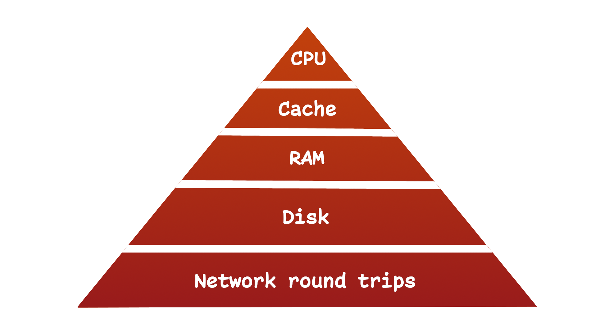
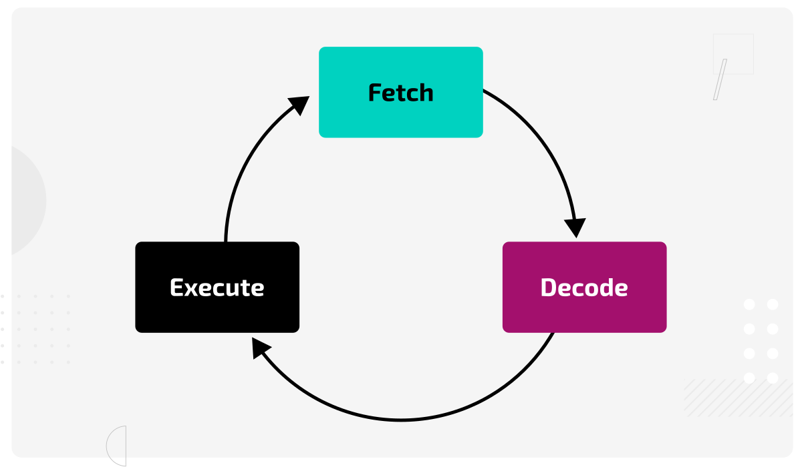
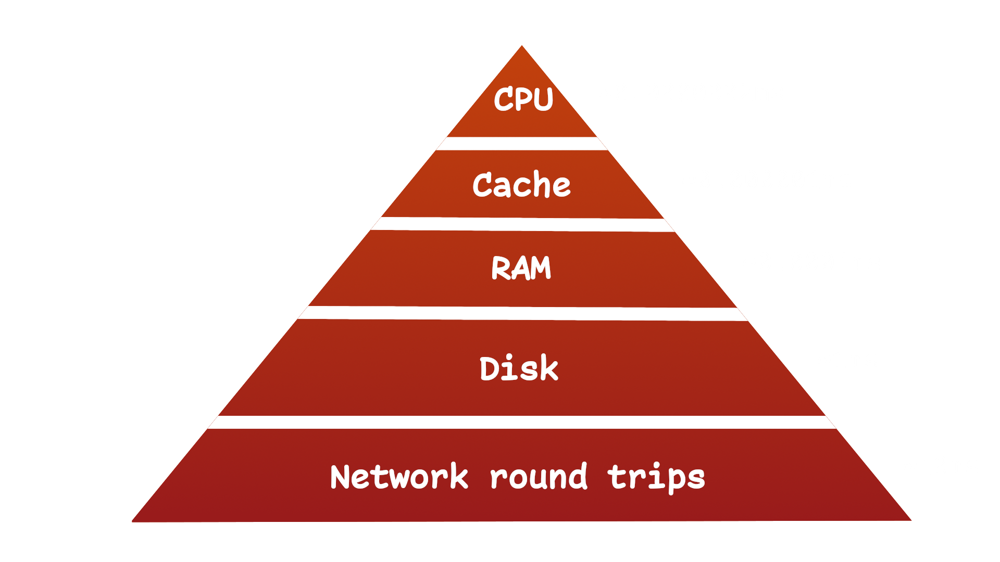
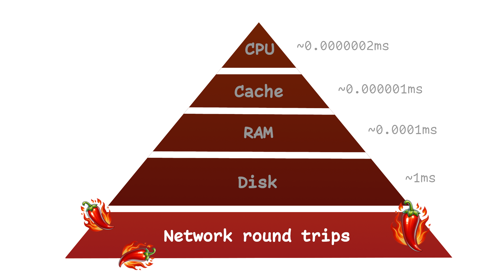
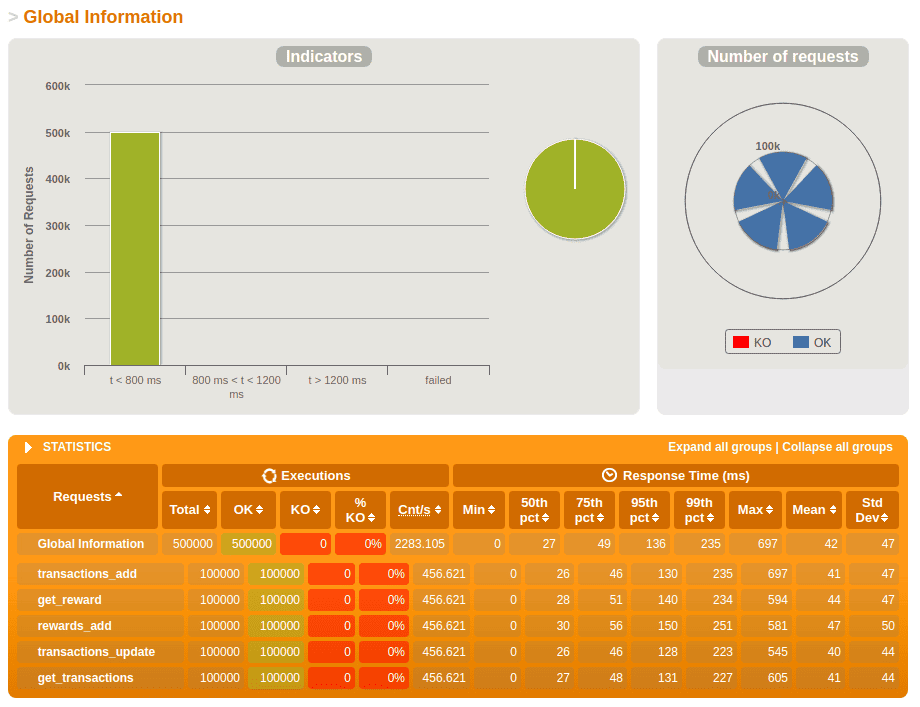
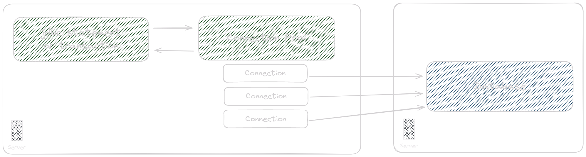
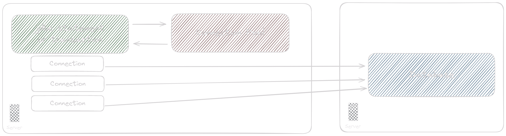

<!-- .slide: data-background-image="jspring_intro_breakout.png" -->

---

<div style="display: flex; gap: 50px">
    
    <div style="display: flex; flex-direction: column; justify-content: center; text-align: left;">
        <div>
            Lennart ten Wolde<br /><br/>
            Software Engineer, CHILIT
        </div>
    </div>
</div>

---

## Recap on keynote case study

Note:
* Case study of acute bottleneck in production
* Demonstration of bottleneck chain and potential  
  for peformance improvement of 19,066%
* Do's and dont's of performance optimization
* Hierarchy of bottlenecks 

--

 <!-- .element: height="500" -->

---

## Hierarchy of bottlenecks

--

### CPU



--

### CPU Stall


--

### Cache / RAM

<!-- .slide: class="fragmented-lists" -->
* Data is fetched from cache or DRAM
* Can be <1ns for L1 cache or >100ns for DRAM
* Insignificant compared to (network) IO
* Mainly targetted by hardware and compilers

--

### Disk / Network IO

<!-- .slide: class="fragmented-lists" -->
* Data is fetched from another system
* Can be ~1ms up to 100ms
* Many orders of magnitude slower
* Optimization targetted by application programmer

--



<!-- .slide: data-auto-animate -->

--



<!-- .slide: data-auto-animate -->

---

## Diagnosing & Monitoring

Note:
Step 1 in taking care of performance bottlenecks is knowing when and where they occur.

--

<!-- .slide: class="fragmented-lists" -->
* Metrics help visualize the status of your application over time
* Load tests help indicate peformance when under expected load

--

Let's explore some good practices

--

### Metrics (Observability)

Metrics are key indicators for problems

<!-- .slide: class="fragmented-lists" -->
* Possible bottlenecks
  * Database query duration & volume
  * HTTP call duration & volume
  * Available connections and threads
* Error rates
* Machine & JVM usage statistics

--


--


Note:
* Instrumentation: DropWizard, Micrometer, Prometheus Java Client
* Metrics database: Prometheus, Graphite, ElasticSearch
  * Cloud: AWS CloudWatch, Datadog
* Visualization: Grafana, Kibana

--

### Using standard metrics

Spring Boot Actuator provides:

<!-- .slide: class="fragmented-lists" -->
* JVM & system
* Task executing & scheduling
* Data source
* Queries
* (outgoing & incoming) HTTP requests
* RabbitMQ & JMS

Note:
* Read the docs
* Build quality dashboards

--

### Load testing

--

Use a tool:

* Gatling
* JMeter
* Or roll your own

--

 <!-- .element: height="500" -->

--

### Average load test

--

### Stress test

--

### Breakpoint test

--

### Soak test


<!-- .slide: data-auto-animate -->

--

### Soak test

<!-- .slide: data-auto-animate -->

---

## Solving common bottlenecks

---

## Database bottlenecks

--

### Database indexes

<!-- .slide: class="fragmented-lists" -->
* Prevent full table scans on large tables
* Use compound indexes for efficient filtering
* Use expressions in indexes
    e.g. `create index user_email_idx on account( lower(email) )`
* Don't overdo indexes and check if they're really used

--

### Efficient query design

<!-- .slide: class="fragmented-lists" -->
* Avoid excessive round-trips
    * Bulk select queries: `SELECT FROM table WHERE id IN(?, ?, ?)`
    * Bulk inserts using batch insert mode
    * Use joins correctly, for one-to-one and one-to-few
* Limit use of wildcard filtering: `WHERE name LIKE '%Jan%'`
* Don't be afraid to change your data model

--

### Changing your data model

Finding customers with recent orders

```sql
SELECT c.name FROM customers c
WHERE EXISTS(SELECT 1 FROM orders o
  WHERE o.customer_id = c.id
  AND o.creation_date > now() - interval '30 days'
)
```

--

With a `last_order_date` column
```sql
SELECT c.name FROM customers c
WHERE last_order_date > now() - interval '30 days'
```

---

## Concurrency bottlenecks


Note:
* No matter how many chefs, single oven
* If the chefs are your threads, what is the oven?

--

### Concurrency example
```java
ExecutorService executorService = Executors.newFixedThreadPool(20);

for(int i = 0; i < 10_000; i++) {
    executorService.execute(() -> doSomeDbQuery());
}
```

Note:
* Easiest way to use concurrency is with Executor API
* Distributes to thread workers under-the-hood
* Run small tasks on dedicated threads/cores

--

### Concurrency example
```java
ExecutorService executorService = Executors.newFixedThreadPool(20);

var future = CompletableFuture.allOf(
    CompletableFuture.supplyAsync(this::query1, executorService),
    CompletableFuture.supplyAsync(this::query2, executorService),
    CompletableFuture.supplyAsync(this::query3, executorService)
);

future.join(); // or future.get*
```

Note:
* Powerful for composing async tasks and dealing with results
* CompletableFuture async variations take executor
* Join on set of tasks and block thread

--


Note:
* Going back to the pizza kitchen
* Can increase threads but other bottleneck possible

--

### Connection pool



<!-- .slide: data-auto-animate -->

--

### Connection pool



<!-- .slide: data-auto-animate -->

Note:
* Be careful with scaling data pool
* Even with proxy, connections are costly
* Fix bad transactions first

--

### Bad transactions

```java[|3|4]
@Transaction
public void badConcurrentFunction() {
    Property property = propertyRepository().findByName("Name").get();
    slowHttpService.submitProperty(property);
}
```

Note:
* Pro tip: Dont name function this, boss wont like
* Property queries in transaction but no update
* Then a slow HTTP is done while tx still open
* Common with JPA because lazy load require tx

--

### Bad transactions

```java[|3]
public void badConcurrentFunction() {
    Property property = propertyRepository().findByName("Name").get();
    slowHttpService.submitOccupants(property.getOccupants());
}
```

Note:
* Throws exception with JPA because of missing transaction

--

### Eagerly fetching

```java
public interface PropertyRepository extends JpaRepository<Property, Long> {
    @EntityGraph(attributePaths = { "occupants" })
    Optional<Property> findByName(String name);
}
```

Note:
* To do relationships without tx, make new query functions
* And use entity graph
* Manually select better than always eager
* Also faster
* Make your own evaluation

---

## In Conclusion

--

### Diagnose before treatment

* Check your query and other IO metrics and monitoring
* Use `EXPLAIN ANALYZE` to analyze your queries
* Run automated load tests to find **your** bottlenecks

---

<!-- .slide: data-background-image="jspring_outro.png" -->
