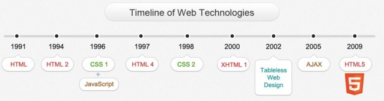
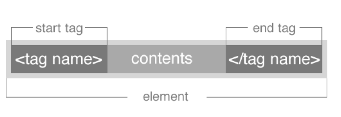
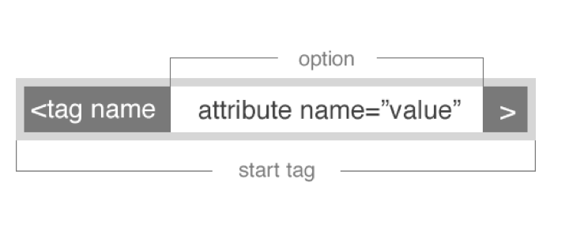

#FEWD - HTML BASICS

###Instructor Name

Instructors current role.

---


##Agenda

*	HTML Tags & CSS Selectors Review
*	Structure Reading w/ Understanding
*	External Style Sheets
*	Lab Time

---


##HTML Tags & CSS Selectors Review


---


##HTML Basics

---


##HTML vs HTML5

HTML5 is HTML with a few additions
The Doctype tells you if the page is HTML5 ready.


```<!DOCTYPE html>```


##HTML HISTORY



Note:
image retrieved from http://www.onbile.com/info/wp-content/uploads/2013/09/Timeline-of-web-technologies-639x168.jpg on October 1, 2013.

---


##HTML Syntax



---

##HTML Syntax



---

##Content Tags

Heading Elements

```<h1>```Largest Heading```</h1>```

```<h2>``` . . . ```</h2>```

```<h3>``` . . . ```</h3>```

```<h4>``` . . .```</h4>```

```<h5>``` . . . ```</h5>```

```<h6>```Smallest Heading```</h6>```

--

##Content Tags

Text Elements

```<p>```This is a paragraph```</p>```

```<code>```This is some computer code```</code>```

--

##Content Tags

Unordered list

```<ul>``` ```</ul>```

--

##Content Tags

Unordered list item

`
	```<li>```First item```</li>```
    ```<li>```Next item```</li>```


--

##Content Tags

links

 ```<a href="Link">```First item```</a>```


--


##General Assembly Press Release

---


##External Style Sheets

---


##Cookie Recipe

---

## Homework

*	Create a resume website
*	Watch a video on the Internet about the Internet
*	Read about CSS Colors

---
