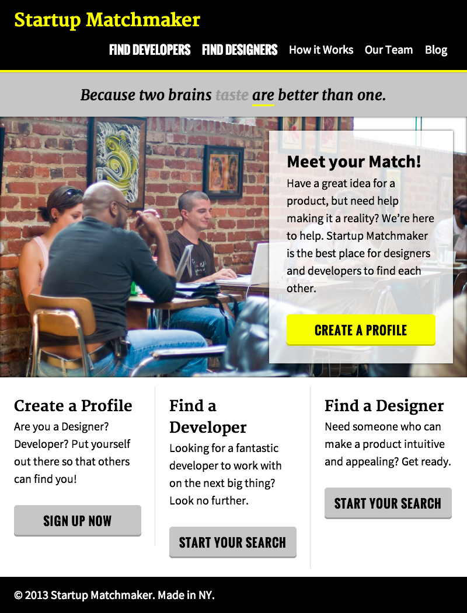

###Week 3 HTML/CSS Lab

This week we continue to teach students how to think like a Front-End Web Developer. The next to lessons are dedicated to in class lab time, where students practice and review HTML/CSS.

__Main projects and homeworks:__ Relaxr Part 2 & Startup Match Maker.

