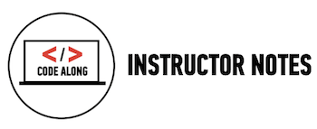
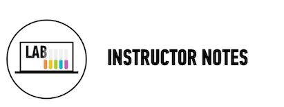
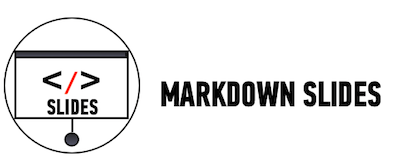

##Advanced Lessons: Arrays

###Learning Objectives

*	Apply JS and jQuery knowledge to program a carousel.
*	Define arrays and collections 
*	Practice using indexes to access array elements

###Schedule

| Time        | Topic| GA ICLs| Comments |
| ------------- |:-------------|:-------------------|:----------------|
| 20 min | Arrays | [Arrays]() | Simple code along to demonstrate collections/arrays and index. |
| 20 min | Loops | [For Each]() | Explain looping context. We only show For Each loops due to this being a beginner course. If your class is advanced, an instructor can chose to show other loops. |
| 140 min | Lab Time| [Image Carousel]() |  |

###[Homework](../Homework/)

---

## [Arrays]()

###Time: 20 min

| | |
| ------------- |:-------------|
| __Topics__ | arrays, indexes | 
| __Description__| Understanding collections and arrays. |   
| __Activity Type__| Code Alongs| 
 
####Instructional Design Notes

*	Introduce arrays as just a way to store collections of data. Then focus on the syntax over accessing individual elements of the array. Understanding the accessing of individual elements will come in more advanced material that includes for and while loops.

*	This code along is in the console. The carousel lab exercise expects students to transfer what they learn in the code along to manipulating DOM. 

## [ForEach]()

###Time: 20 min

| | |
| ------------- |:-------------|
| __Topics__ | looping, arrays.| 
| __Description__| A code along that includes a series of questions to help students understand the forEach function. |    
| __Activity Type__| Code Alongs| 

####Instructional Design Notes

*	This code along is in the console. The carousel lab exercise expects students to transfer what they learn in the code along to manipulating DOM. 

*	You may switch the forEach with jQuery's $.each. We used the forEach because the function name is  more descriptive. That is, I say "for each element in this array" not "each element in this array".

---
 

##[Image Carousel](starter_code/carousel_obfuscated)

####Time: Remainder of Class

| | |
| ------------- |:-------------|
| __Topics__ | .foreach(), repetition, looping, arrays, image carousel. | 
| __Description__| Students create a basic image carousel using arrays and .foreach jQuery function. |    
| __Activity Type__| Paired | 

####Instructional Design Notes 

In this lab, students will build a version of the carousel. Students can choose whether to use the provided photos of food or animals or pull photos from another location.

*	Students will use an .onclick method to navigate between pictures (back and forward)without voting (that's bonus).

*	The first part of this exercise is TIMED!! 
	1. __15 minutes__: Create the HTML for the page.
	2.	__15 minutes__: Add the CSS to style the page. Make any needed HTML modifications.
	3. After 30 min, provide students with HTMl/CSS code to start. The remainder of the time should be used to implement the JS code. This exercise can carry over into next week if not complete.

__Bonus__: They will use the change event to give a ranking to the photos between 1 and 5. The user should be forwarded to the next image after voting.

---

click icon for slides.
