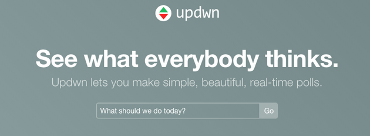
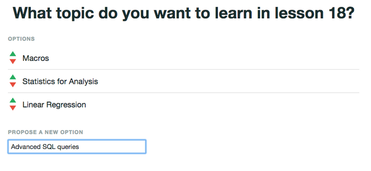
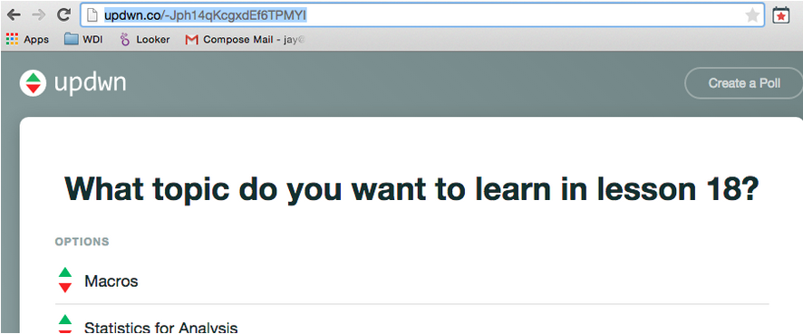
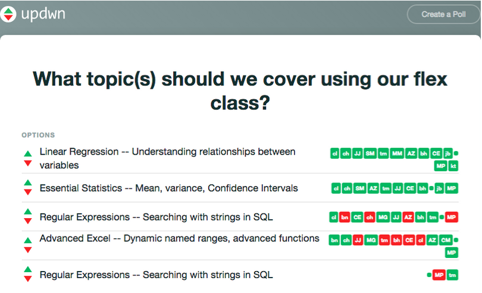

#FEWD Week #9: Instructor / Student Choice and In-Class Time for Final Projects

All part-time courses at General Assembly offer students and instructors the option of an “instructor’s choice lesson”, a “student’s choice lesson”, or both.  To help you choose a topic for lesson 18 that is relevant and that meets the needs of your students, create a class poll using [updwn.co](http://updwn.co/).  In your poll, you’ll be able to suggest topics and allow students to upvote/downvote your suggestions as well as add their own.

###Guidance for administering the poll:

- Create a question asking about what students want to learn about and click “Go”. This will create a unique poll for you, so you can distribute the URL:

- Add topics to your poll using the “Propose a new Option” form:

- Distribute the URL to students at least one week before you flex class.  Remind students they can upvote/downvote topics you’ve proposed as well as add their own:

- Be sure to keep the URL so you can come back to the poll and check what students are looking to learn.   Each upvote is represented by a green box with the student’s initials with downvotes in red.  This should help you make an informed decision about what content you should create and give students a greater sense of ownership of their learning experience:

 

---

###Final Project Milestone 4

By week 9, you should have submitted a second, updated draft of the code for your final project.  The following week is final presentations!  Be prepared to present your finished project.
