<!-- .slide: data-visibility="hidden" -->

> [!NOTE]
> This is the [reveal.js](https://revealjs.com/) Slide Deck for the Talk **"SBOMs - Eine Tragikomödie in 3 Akten"** by Jasmin Mair and Lukas Mika.
> 
> The rendered presentation is available **[here](https://something-appsec.github.io/sbom-talk/)**.

---

# SBOMs
## Eine Tragikomödie in 3 Akten

_by *Jasmin Mair* and *Lukas Mika*_

Presentation Slides and Script available at 
<a href="https://github.com/something-appsec/sbom-talk">https://github.com/something-appsec/sbom-talk</a> 
 

---

# Disclaimer

All characters appearing in this work  
are purely fictitious.

Any resemblance to real persons, living or dead,  
is purely coincidental.

---

No CISOs were harmed  
in the Making of this Presentation

Dialog:

A [am Telefon]: ...ich sag's dir, wenn noch jemand mit SBOMs um die Ecke kommt, dann kündige ich. Oh, ich melde mich nachher der Chef kommt gerade.

---

# 1st Act

## _Introductio_

Dialog:

C [kommt herein]: Einen wunderschönen guten Morgen, Frau Mair! Wie geht's uns denn heute?

A [verdreht Augen]: Guten Morgen, Chef. Ich kann ja nur für mich sprechen, aber wir haben gerade monsterviel Stress mit...

C: Mir geht es grandios, danke der Nachfrage!

A [seufzt]: Was kann ich denn für Sie tun?

---

<figure>
    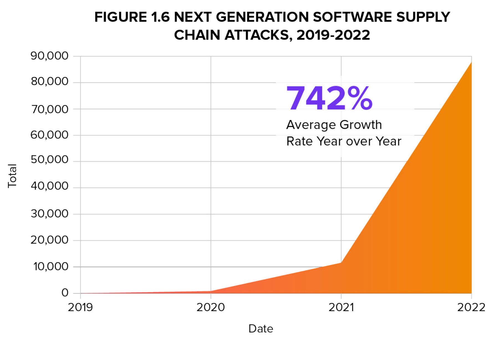
    <figcaption><a href="https://www.sonatype.com/hubfs/1-2023%20New%20Site%20Assets/SSCR/8th-Annual-SSCR-digital-0206%20update.pdf">Sonatype: 2022 State of the Supply Chain</a></figcaption>
</figure>
 

Dialog:

C: Haben Sie schon von den ganzen Supply Chain Angriffen gehört? Die sind gerade überall! Wir müssen uns hier wirklich _schnellstmöglich_ dagegen schützen!

A: Naja, also...

C: Aber ich habe auch schon die Lösung dafür: S-B-O-M-S

---

Dialog:

A: Bitte was?

C: S-B-O-M-S

A: Was?

C: Software... Billy...

A: Software Bill of Materials? SBOMs?

C: Ja genau, hab ich ja gesagt! Die müssen jetzt alle erstellen, um ihre Security Posture zu verbessern!

A: Waren sie mal wieder auf einem Compliance Kongress?

---

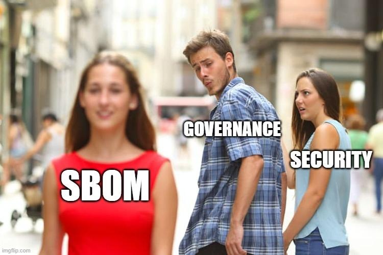 

Dialog:

C: Woher... [sammelt sich kurz] Die Anzahl an Supply Chain Attacks wie log4j hat in den letzten Jahren so stark zugenommen und wir müssen uns dagegen schützen. Hier gibt es mit SBOMs wirklich eine tolle Lösung!

---

Dialog:

A: Ähm... SBOMs als Lösung für Supply Chain Attacks? Wissen sie denn, was eine SBOM ist?

C: Ja klar, eine SBOM ist wie so eine Zutatenliste, die mir sagt was in einem Lebensmittel enthalten ist, nur halt für Software. Also 30 Zeilen HTML, 50 Zeilen Java, sowas halt.

---

<figure>
    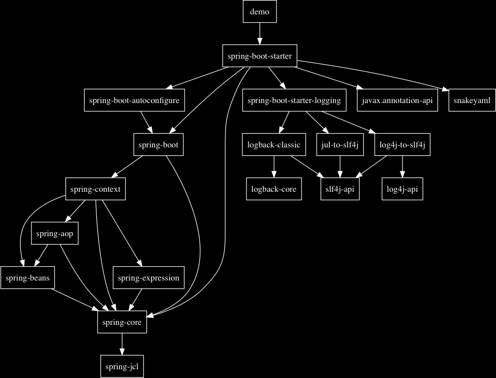
    <figcaption><a href="https://blog.droidchef.dev/mastering-the-gradle-dependency-tree/">Ishan Khanna: Mastering the Gradle Dependency Tree</a></figcaption>
</figure>
 

Dialog:

A: Gar nicht mal sooo schlecht. Aber fangen wir mal etwas kleiner an: In der modernen Softwareentwicklung schreiben die Entwickler:innen nicht jede Zeile Code selbst, sondern greifen auf vorgefertigte Teile zurück. Nehmen wir die Datumsauswahlfunktion in einer x-beliebigen Anwendung: das ist einerseits recht komplex, andererseits wird sie immer wieder benötigt. Somit ist es effizienter, solchen Code in Form von Bibliotheken oder Frameworks aus dem Internet zu laden, statt jedes Mal das Rad neu zu erfinden.

C: Die Entwickler:innen nehmen schon fertigen Code aus dem Internet? Wofür geben wir denn dann Unmengen an Geld für die Entwicklungsteams aus?

A: Wollen Sie das Geld ausgeben, damit jedes Team sein Datumsauswahltool selbst schreibt, oder sollen sie lieber Business Value generieren? :D

C: Ja, Business Value...

---

<figure>
    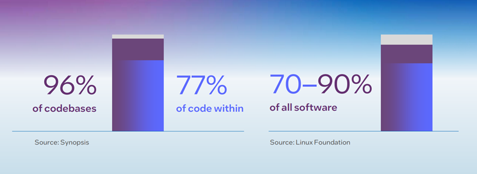
    <figcaption><a href="https://www.intel.com/content/www/us/en/developer/articles/guide/the-careful-consumption-of-open-source-software.html">Intel: The Careful Consumption of Open Source Software</a></figcaption>
</figure>
 

Dialog:

A: Das wäre ohne den Einsatz solcher externen Komponenten heutzutage kaum mehr möglich. Unterschiedliche Analysen kommen zu dem Schluss, dass durchschnittlich 70-90% aller halbwegs moderner Software aus externen Komponenten besteht.

C: So viel?! Aber so viele Datumsfelder haben wir doch gar nicht in unserer Software?!

A: Es geht ja nicht nur um Datumsfelder, sondern um ganz unterschiedliche, grundlegende Funktionalitäten, die in Form von Bibliotheken oder Frameworks aus unterschiedlichen Fremdquellen geladen werden und ihrerseits wiederum von anderen Komponenten abhängen, den sogenannten 'Transitiven Abhängigkeiten' - wie beispielsweise von log4j

---

Dialog:

C: log4j, ja, genau! Da wusste ja auch niemand, wo das alles drinhängt.

A: Richtig. Und diese Komponenten haben wiederum ihre eigenen Abhängigkeiten, auf die sie zurückgreifen.

---

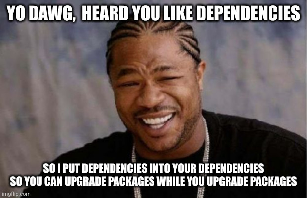

Dialog:

C: ...und die wiederum haben auch wieder Abhängigkeiten, die ihrerseits wiederum Abhängigkeiten haben, welche...

---

<figure>
    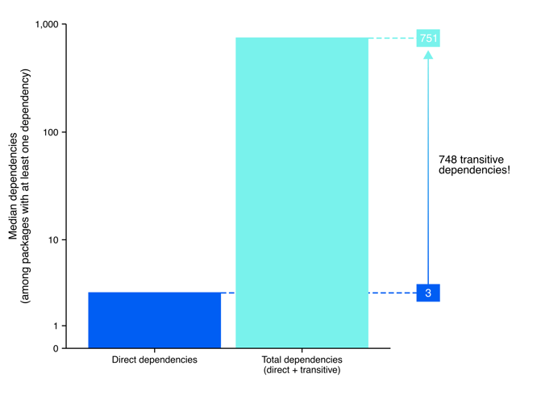
    <figcaption><a href="https://blog.phylum.io/hidden-dependencies-lurking-in-the-software-dependency-network/">Phylum: Hidden Dependencies lurking in the Software Dependency Network</a></figcaption>
</figure>
 

Dialog:

A: Genau! So können also auch schon wenige _direkte_ Komponenten einen Rattenschwanz an weiteren Abhängigkeiten nachladen.

C: Das wird ja dann immer komplexer! Wie behalten Sie denn da den Überblick?

---

Dialog:

A [grinst] ...und genau da kommen SBOMs ins Spiel!

C: Ja klar, die Zutatenliste, wusste ich doch! Ich wollt Sie nur testen [zwinkert]

---

# SBOM

- Supplier Name
- Component Name
- Version of the Component
- Other Unique Identifiers
- Dependency Relationship
- Author of SBOM Data
- Timestamp
- Licenses

Dialog:

A: Sehr gut! SBOMs sind folglich standardisierte Strukturen, in denen die wichtigsten Datenpunkte zu all diesen Abhängigkeiten aufgeführt werden. Was ist das für eine Komponente, wo kommt sie her, welche Version hat sie, welche Lizenz,... Wollen Sie mal eine solche SBOM sehen?

C: Oh, ja, gerne!

---

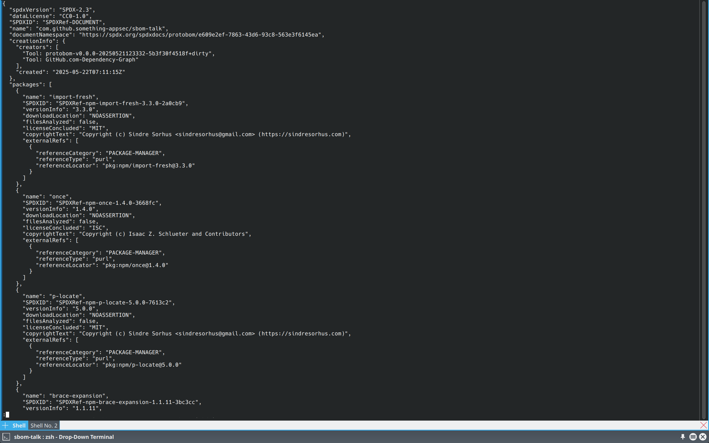

Dialog:

C: Oh, das kann ja kein Mensch lesen!!

A: Korrekt, SBOMs sind auch eigentlich in erster Linie für Maschinen gedacht.

C: [schleimig] ...und für solche Top-Talente wie Sie! Haben sie das geschrieben?

A: Nein, das wäre unmöglich. Diese SBOM haben wir von einem unserer Software-Lieferanten erhalten.

C: Ach, das stammt gar nicht von unserer Software?

A: Nein, diese nicht. Die listet die Komponenten auf, die in seiner Software genutzt werden. Aber für unsere eigene Software können wir auch SBOMs erstellen, die wiederum unsere Abhängigkeiten auflisten.

C: ...und die geben wir dann wiederum an unsere Kunden?

A: Ja, genau!

C: Aber dann wissen die ja, wie unsere Software gebaut wurde! Können die das dann nicht einfach nachbauen?

A: Nein, in der SBOM steht ja nur drin, welche externen Komponenten genutzt werden. Die Geschäftslogik und wie die diese Komponenten nutzt, ist ja nicht aufgeführt.

C: Okay... aber wenn wir so viele Komponenten in unserer Software nutzen, müsste die SBOM ja jedes Mal neu erstellt werden, wenn sich daran etwas ändert...

A: Richtig.

C: Ist das nicht ein Riesenaufwand? Ist das der Grund, warum die Entwickler:innen immer so stark ausgelastet sind?

A: In moderner Software-Entwicklung glücklicherweise nicht, weil sich die Erstellung im Build Process automatisieren lässt; die SBOM wird also jedes Mal automatisch generiert, wenn wir aus dem Quellcode das entsprechende Programm bauen.

C: Ach, das ist ja praktisch!

---

# About SBOM

- Machine-readable nested inventory list of ingredients making up software components
- High expectations from different stakeholders
- Differentiation between direct and transitive dependencies

---

# 2nd Act

## _Disputatio_

Dialog:

C: Also haben wir mit diesen ganzen SBOMs die Zutatenliste von jeder Software die wir entwickeln und einsetzen?

A: Ja, teilweise. Unsere Entwickler:innen arbeiten dran, SBOMs für unsere Produkte zu erstellen. 

C: ...dann sind wir ja bald fertig damit! Prima!

---

<figure>
    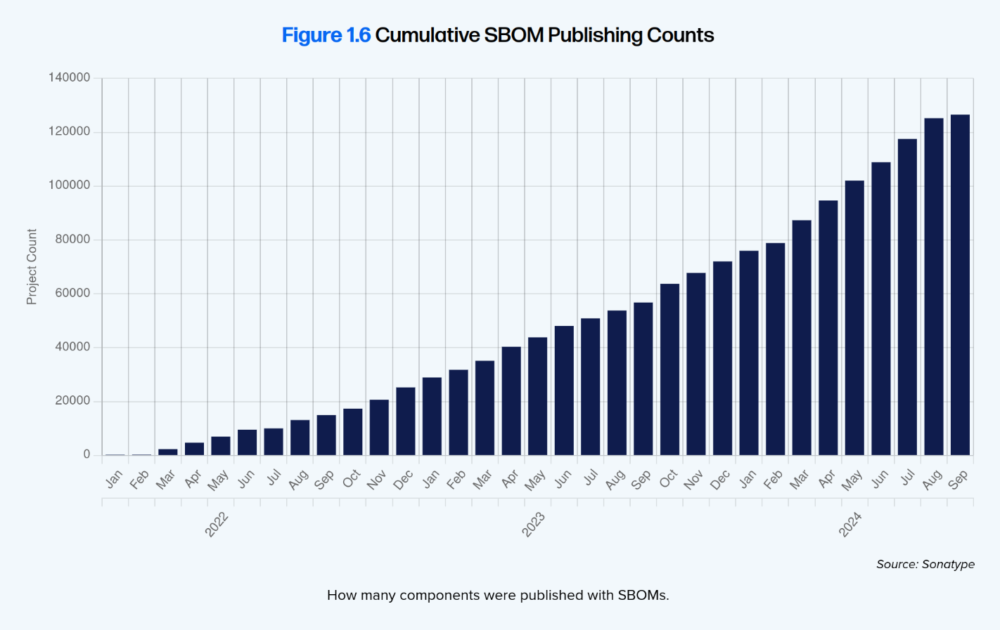
    <figcaption><a href="https://www.sonatype.com/state-of-the-software-supply-chain/2024/10-year-look">Sonatype: 2024 State of the Supply Chain</a></figcaption>
</figure>
 

Dialog:

A: Nicht so schnell! Damit wir die SBOMs für unsere Produkte finalisieren können, brauchen wir alle SBOMs von Komponenten, die von unseren Lieferanten kommen.

C: Frau Mair, das geht doch einfach; wir schreiben es in die Verträge und zwingen alle dazu. Jeder macht heutzutage SBOMs, da müssen wir auch mithalten!

---

<figure>
    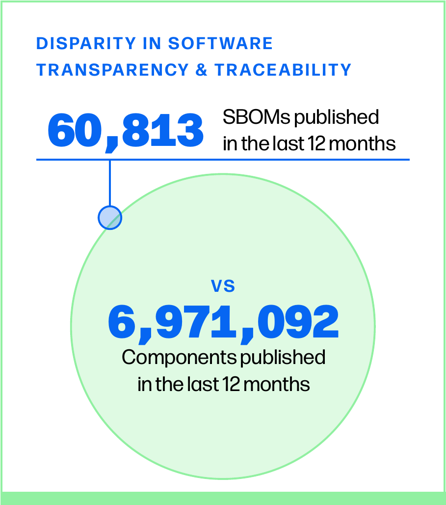
    <figcaption><a href="https://www.sonatype.com/state-of-the-software-supply-chain/2024/10-year-look">Sonatype: 2024 State of the Supply Chain</a></figcaption>
</figure>
 

Dialog:

A: Naja... es stimmt schon, dass immer mehr SBOMs erstellt werden, aber wir sind noch lange nicht da, wo wir sein sollten. 2024 gab es auf npm ganze 7 Mio. veröffentlichte Komponenten, von denen gerade einmal 61k SBOMs besaßen.

---

<figure>
    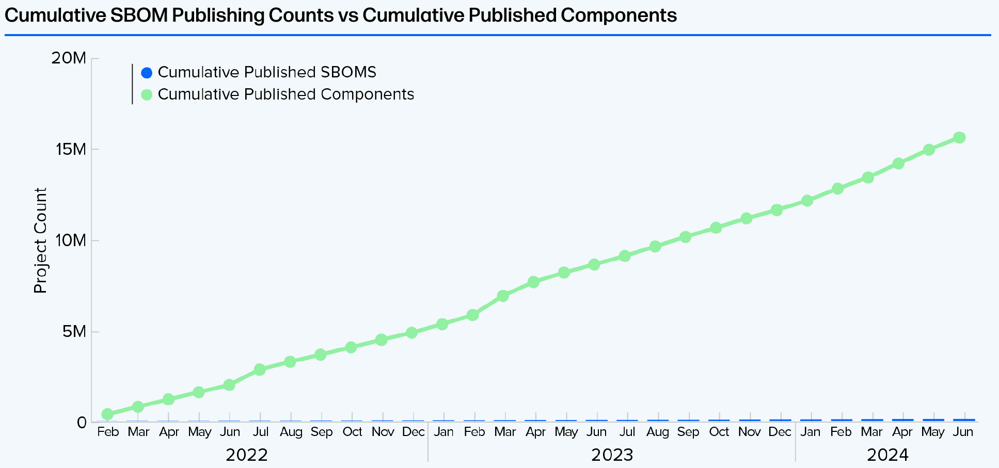
    <figcaption><a href="https://www.sonatype.com/state-of-the-software-supply-chain/2024/10-year-look">Sonatype: 2024 State of the Supply Chain</a></figcaption>
</figure>
 

Dialog:

C: Nur so wenige???

A: Ja, und die Rate, mit der die Bereitstellung von SBOMs zunimmt, macht da auch nicht viel mehr Hoffnung.

A: Die großen Hersteller sind dabei gar nicht einmal so problematisch; die kleinen Lieferanten, in bestimmten Nischen, die nicht auf Software-Entwicklung spezialisiert sind, haben es schon schwieriger.

C: Da können wir nun wirklch keine Rücksicht nehmen; SBOMs sollten dann trotzdem bei den nächsten Verlängerungen in die Verträge mit aufgenommen werden!

A: Wie vorhin kurz angedeutet, beinhalten unsere Anwendungen nicht nur Komponenten von unseren Lieferanten, sondern auch...

C: Open Source Teile?

A: Genau, und diese Projekte müssen nicht unbedingt eine SBOM liefern. Verträge haben wir in diesen Fällen auch nicht.

C: Na, das lässt sich ja auch einfach lösen. Wir verbieten unseren Entwickler:innen einfach, Open Source zu verwenden. 

A: Sie haben keine wirkliche Ahnung, wie viel Open Source bei uns im Unternehmen verwendet wird, oder? 

C: Das kann doch nicht so viel sein...

---

<figure>
    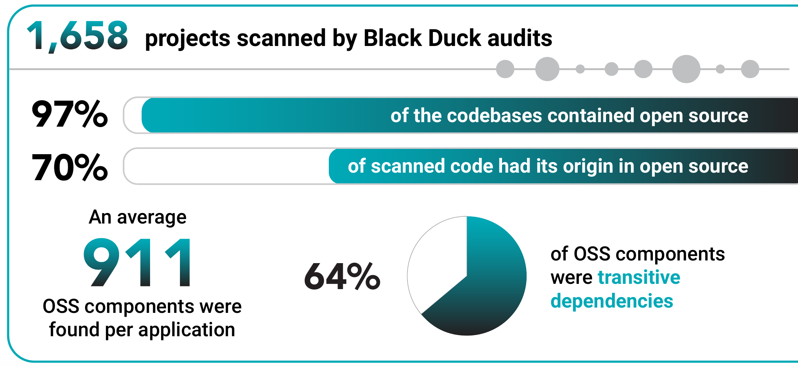
    <figcaption><a href="https://www.blackduck.com/content/dam/black-duck/en-us/reports/rep-ossra.pdf">Black Duck: 2025 Open Source Security and Risk Analysis Report</a></figcaption>
</figure>
 

Dialog:

A: Naja, einzelne Untersuchungen schätzen, dass Open Source in 97% der modernen Anwendungen verwendet werden

C: Dann nutzen wir halt einfach kein Linux mehr... Haben Sie schon die neuen MacBooks im Marketing-Team gesehen?

A: Es geht hierbei nicht nur um Betriebssysteme, sondern um Bibliotheken, die Entwickler:innen verwenden um die Arbeit zu beschleunigen, Datenbanktechnologien, CI/CD-Tools, Programmiersprachen und Containertechnologin.

C: Dann sollten wir an die Quelle gehen und die Open Source Projekte irgendwie dazu bringen, SBOMs zur Verfügung zu stellen. Das erhöht ja schlussendlich auch deren Marktanteil.

---

<figure>
    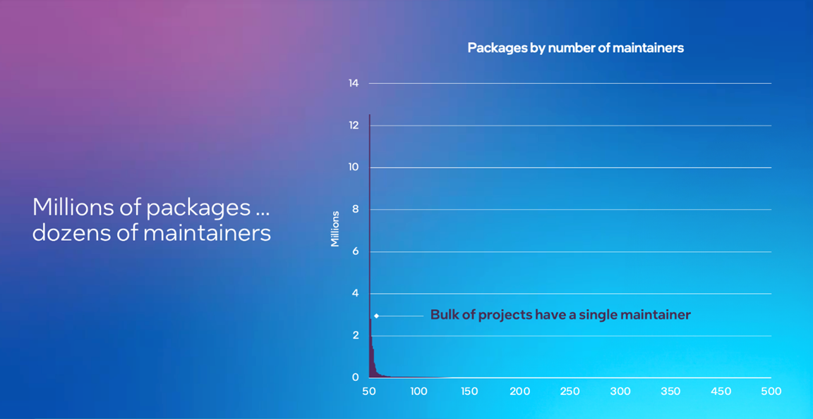
    <figcaption><a href="https://www.intel.com/content/www/us/en/developer/articles/guide/the-careful-consumption-of-open-source-software.html">Intel: The Careful Consumption of Open Source Software</a></figcaption>
</figure>
 

Dialog:

A: Marktanteile? Marktanteile spielen im Open Source Kontext nicht wirklich eine Rolle. Hinzu kommt, dass die meisten Open Source Projekte von einzelnen oder wenigen Menschen gewartet werden. Diese haben wenig Zeit, wenig Support und sind sehr unter Druck und kommen nicht wirklich dazu.

---

# Sponsor more open source projects!

Dialog:

A: Da könnten wir als Unternehmen sowohl mit finanzieller als auch mit fachlicher Unterstützung supporten!

C: Whoooow, das wurde in diesem Geschäftsjahr nicht budgetiert und die Finanzplanung ist auch bereits abgeschlossen. Vielleicht aber nächstes Jahr?

---

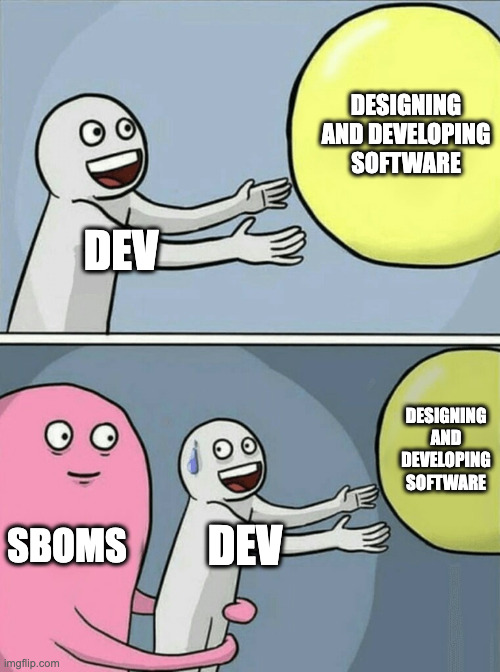

Dialog:

A: Mal abgesehen von diesen Herausforderungen hängt die Komplexität für die Erstellung einer SBOM stark von der Programmiersprache und den verwendeten Frameworks ab.

C: Ach kommen sie schon! Code ist doch Code, egal in welcher Sprache!

A: Die Sprachen und wie sie funktionieren unterscheiden sich recht stark. In der modernen Web-Welt erhält man häufig schon automatisch die direkten Abhängigkeiten einer Applikation.

C: Wir haben aber nicht nur Web-Applikationen bei uns...

A: Genau! Bei Legacy-Applikationen oder auch Hardware-naher Entwicklung werden Drittanbieter-Bibliotheken oftmals anders eingebunden und es gibt keine schöne Liste wie in der Web-Welt. Da müssen die Entwicklungsteams daran arbeiten, die Abhängigkeiten klar zu dokumentieren. Je älter die Technologie, desto schwieriger wird es, eine SBOM dafür zu erstellen.

C: Naja, da wird es wohl schon irgendeine technische Lösung geben, um diese SBOMs ganz einfach zu erstellen. Seien Sie doch mal forward thinking! Das kann doch nicht so schwer sein.
  
A: Leider doch schon. Die Erstellung von SBOMs ist nicht standardisiert. 

C: Es gibt doch Richtlinien und Standards! Sogsr vom BSI!

A: Ja, die Richtlinien und Standards beziehen sich auf die Struktur, und sind in erster Linie nur Mindestanforderungen.

C: Das ist ja, was wir brauchen!

A: Das ist wichtig, aber nicht genug. Granularität, Tiefe, oder die Beziehung zwischen den Komponenten macht dann jeder ein bisschen anders.

C: Stellt das ein echtes Problem dar?

A: So ist es sehr schwer herauszufinden, ob eine gelieferte SBOM korrekt und vollständig ist.

C: Aber es gibt doch tausende Tools auf dem Markt! Sagen Sie mir welches wir nehmen sollen, dann bring ich das für Sie durch den Einkauf.

A: Wie vorhin bereits angedeutet: einige unserer Teams erstellen bereits SBOMs als Teil der automatisierten Build Pipelines. Würden wir aber jetzt zwei Tools zur automatischen Erstellung von SBOMs über die Anwendungen laufen lassen, würden diese mit hoher Wahrscheinlichkeit verschiedene Ergebnisse liefern.

C: Na, da muss doch dann eins falsch sein!

A: Womöglich ist keine SBOM falsch, sondern beide unvollständig.

C: Dann sollten wir diese ganzen SBOMs einfach harmonisieren. Das geht bestimmt mit KI!

---

Dialog:

A: [Schnappatmung] Ich will ja keine Spielverderberin sein, aber da kommt schon das nächste Problem...

C: Was kann denn jetzt noch fehlen?

---

<figure>
    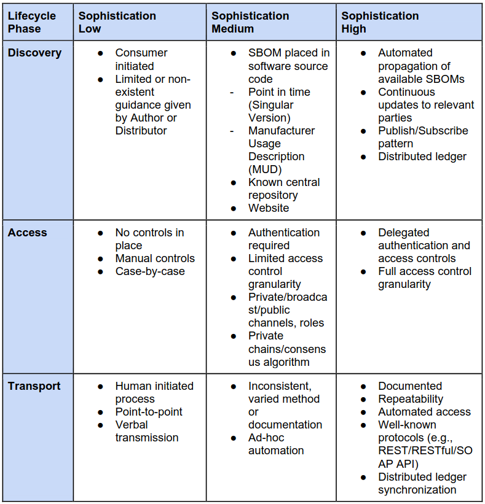
    <figcaption><a href="https://www.cisa.gov/sites/default/files/2024-05/SBOM%20Sharing%20Primer.pdf">CISA: SBOM Sharing Primer</a></figcaption>
</figure>
 

Dialog:

A: Die Übermittlung von SBOMs ist auch nicht standardisiert. Manche Hersteller stellen diese auf ihrer Website zum Download zur Verfügung, andere als Metadaten des Produkts, andere wiederum stellen sie via e-Mail auf Anfrage zur Verfügung.

C: Denken Sie doch nicht so kompliziert! Mit Sharepoint ginge das bestimmt einfacher.

A: [Verdreht die Augen] Aktuell fragen wir die SBOMs meistens per e-Mail an und auf demselben Weg erhalten wir diese dann auch. Aber so richtig können wir dabei auch die Integrität und Authentizität der SBOMs nicht überprüfen; wir können also nichtmal automatisiert sicherstellen, dass die aus der richtigen Quelle kommen und auf dem Weg zu uns nicht manipuliert wurden.

C: Dafür gibt es doch bereits bewährte Methoden mit elektronischen Signaturen. Kennen Sie das?

---

Dialog:

A: Ok, dann bekommen wir eine signierte SBOM, aber woher wissen wir, dass es sich um eine legitime Signatur handelt und nicht von jemandem, der uns etwas unterschieben möchte?

C: [schleimig] Sie haben wohl wirklich Zero Trust, hm?

A: [seufzt]

C: Nun ja, dann nehmen wir erstmal das, was wir bekommen können. Das ist dann mein Inventar in dem ich nach log4j und anderen Supply Chain Attacken suchen kann

---

Dialog:

A: Erstmal haben Sie nur eine Menge einzelner Dokumente, die händisch durchsucht werden müssten. Und vergessen Sie nicht, dass die SBOMs in erster Linie maschinenlesbar sind - oder wollen SIE noch einmal einen Blick reinwerfen? [grinst]

C: Nein danke, nein danke, auf keinen Fall!

A: Das bedeutet also, wir brauchen ein Tool, das die SBOMs verwalten kann, um diese durchsuchbar zu machen.

C: Ja, dann haben wir das ja zusammen. Noch ein weiteres Tool einkaufen kriegen wir auch noch hin! Dann wissen wir endlich, welche Schwachstellen die ganzen Produkte besitzen und können die Supply Chain Angriffe beheben. Großartig!

A: Hier sollten wir kurz einige Missverständnisse rund um Supply Chain Angriffe und Vulnerabilities aus dem Weg räumen.

C: Was denn für Missverständnisse?

---

# Supply Chain Attack Vectors

- Typosquatting
- Malicious Code Injection
  - Social Engineering
  - Compromised Build Systems
  - Repo-/Project-jacking
- Malicious Maintainer (e.g. "Protestware")
- Dependency Confusion/Hallucination

Dialog:

A: Fangen wir mit den Supply Chain Angriffen an: Bei einem Supply Chain Angriff wird ein Opfer über seine Supply Chain angegriffen, anstatt direkt seine Systeme zu penetrieren. 

C: So wie der Name schon sagt...

A: Zum Beispiel über Schadcode in einem legitimen Code-Repository zu injizieren oder die Entwickler:innen zu täuschen, dass sie schadhafte Abhängigkeiten installieren.

C: War das bei log4j nicht der Fall?

A: Nein, log4j war eine Bibliothek die von einer kritischen Zero-Day Schwachstelle - log4shell - betroffen war.

C: Zurück zu den Supply Chain Angriffen...

A: Ein sehr bekanntes Beispiel für eine Supply Chain Attacke war, als der Software-Hersteller Solarwinds in 2020 gehackt wurde: dabei haben die Angreifer das Build System kompromittiert und es ihnen so ermöglicht, Schadcode in das entwickelte Produkt einzubauen. Die Kunden haben dann die Software installiert, weil diese von ihrem Lieferanten kam. Dadurch haben sich die Angreifer dann Zugriff auf die Zielsysteme verschafft.

C: Ja, aber das würden wir ja anhand der SBOM verstehen, dass da was drin ist, was nicht da sein sollte.

A: Aber woher erhalten wir die SBOM?

---

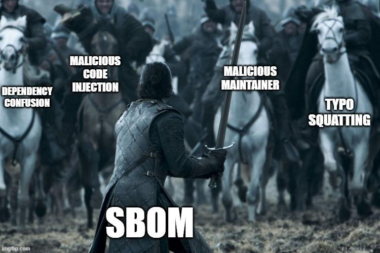

Dialog:

C: Ja... vom Anbieter!

A: ...der von einem Angreifer kompromittiert wurde, welcher dann wahrscheinlich auch die SBOM entsprechend anpasst, um seine Absichten zu verschleiern. ...und selbst wenn es eine Änderung an der SBOM geben sollte, haben wir als Konsumenten kaum Anhaltspunkte, um eine bösartige Änderung der Software von einer regulären Weiterentwicklung zu unterscheiden.

C: Verstanden... also helfen SBOMs gar nicht gegen Supply Chain Attacken?

A: Nein.

C: ...und was ist denn dann mit log4j?

---

Dialog:

A: Ja, da wären SBOMs schon eher hilfreich, weil es eine Dependency mit einer kritischen Schwachstelle war.

C: Das war ein Alptraum herauszufinden wo das im Einsatz war! Aber mit den SBOMs hätten wir ja jetzt die Schwachstellen alle zentral gelistet.

A: Mooooooment, machen wir einen kurzen Schritt zurück. Durch dieses Inventar bekommt ein Entwicklungsteam in erster Linie einen Überblick über die Abhängigkeiten ihrer Software. Durch die Informationen wie Hersteller, Name und Version der Komponenten werden diese zunächst einmal eindeutig identifiziert.

C: Und woher kriegen wir dann die Schwachstellen zu diesen Abhängigkeiten?

---

<figure>
    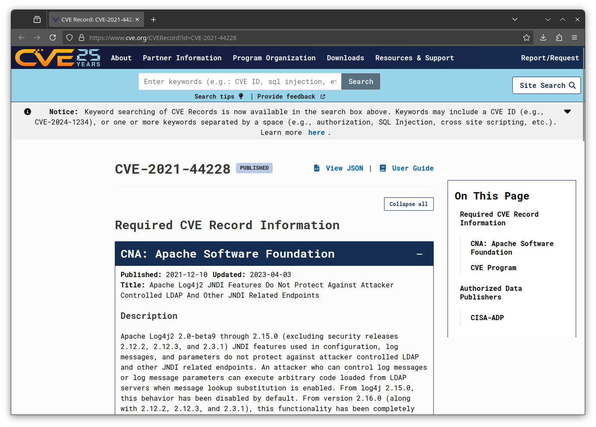
    <figcaption><a href="https://www.cve.org/CVERecord?id=CVE-2021-44228">CVE-2021-44228 on https://cve.mitre.org/</a></figcaption>
</figure>
 

Dialog:

A: Indem wir öffentliche Schwachstellen-Datenbanken nach Informationen dazu durchsuchen.

C: Öffentliche Schwachstellen-Datenbanken? Kann man sich da einfach anschauen, in welcher Software Sicherheitslücken enthalten sind?

A: Ja, genau. In diesen Datenbanken werden alle möglichen Sicherheitslücken dokumentiert, die von Unternehmen und Sicherheitsforscher:innen veröffentlicht werden. Die größte Datenbank an Schwachstellen wird nebenbei vom US-amerikanischen MITRE betrieben. Das Programm ist ein Eckpfeiler der globalen Sicherheit, da es weltweit von Unternehmen genutzt wird, um Schwachstellen zu veröffentlichen und von Security-Tool-Herstellern, um ihre Services damit zu füttern.

C: Welch ein Glück, dass wir uns in Punkto Sicherheit mal wieder auf die USA verlassen können!

---

<figure>
    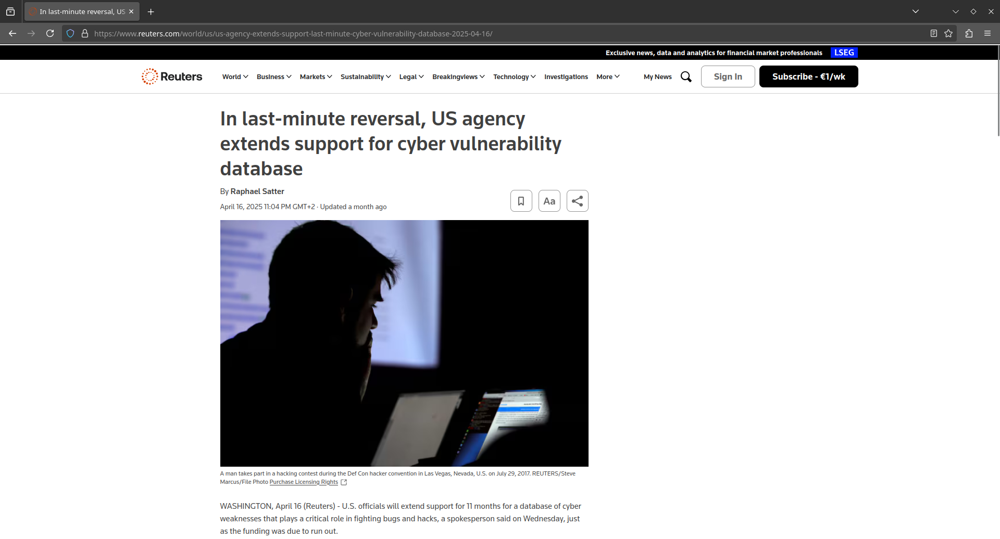
    <figcaption><a href="https://www.reuters.com/world/us/us-agency-extends-support-last-minute-cyber-vulnerability-database-2025-04-16/">Reuters: In last-minute reversal, US agency extends support for cyber vulnerability database</a></figcaption>
</figure>
 

Dialog:

A: Genau da liegt das nächste Problem: Durch die monetäre Abhängigkeit von der US-amerikanischen Regierung können sich politische Entscheidungen, z.B. von freidrehenden Präsidenten, recht schnell auf die Verfügbarkeit solcher zentralen Services auswirken.

C: Oh, ja, das könnte problematisch sein... Vielleicht sollten wir auch an dieser Stelle in Europa ein bisschen souveräner werden und unsere eigene Datenbank bauen.

---

<figure>
    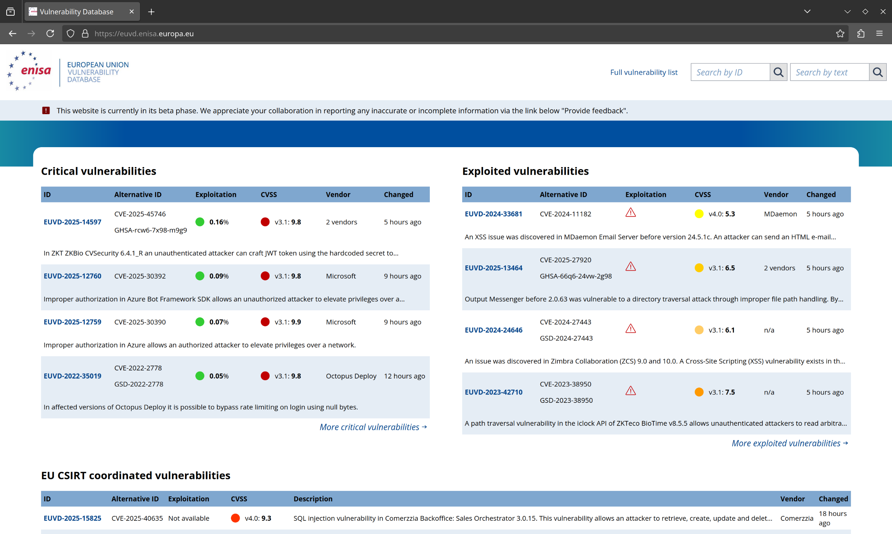
    <figcaption><a href="https://euvd.enisa.europa.eu/">https://euvd.enisa.europa.eu/</a></figcaption>
</figure>
 

Dialog:

A: Ja, die ENISA arbeitet bereits daran und hat gerade die Beta-Version ihrer Platform im Einsatz. Damit bewegen wir uns weg von der aktuellen "single source of truth", welche die Datenbank von MITRE war, hin zu mehreren Datenbanken und das Ganze wird fragmentiert.

C: Na gut, dann haben wir halt mehrere Quellen die mir sagen wo ich angreifbar bin. Doppelt gemoppelt hält ja besser!

A: Naja, wir haben dann eine sehr lange, eventuell inkonsistente Liste an Schwachstellen. Aber nur weil eine verwendete Bibliothek eine Schwachstelle enthält, bedeutet es nicht zwangsläufig, dass diese ausgenutzt werden kann.

C: Wie geht das denn? Man kann ja nicht ein bisschen angreifbar sein. Genau wie man nicht nur ein bisschen schwanger sein kann.

A: Wenn die Entwickler:innen den verwundbaren Teil nicht benutzen der von der Schwachstelle betroffen ist, dann haben Angreifende häufig auch nicht die Möglichkeit, diese zu missbrauchen. Das ist das Konzept von "Exploitability".

C: Aber woher wissen wir denn dann, ob wir angreifbar sind oder nicht?

A: Das müssen wir entsprechend testen und das damit verbundene Risiko bewerten.

C: Das klingt nach ganz schön viel Aufwand... Hah, warum lassen wir das nicht die Anbieter selber testen und die Ergebnisse mit uns teilen?

---

<figure>
    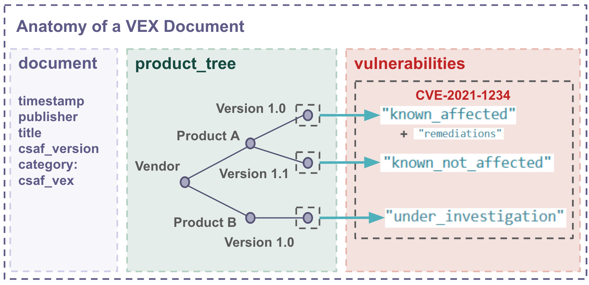
    <figcaption><a href="https://blog.adolus.com/a-deeper-dive-into-vex-documents">Adolus: A Deeper Dive into VEX Documents</a></figcaption>
</figure>
 

Dialog:

A: Ja, das gibt es auch schon. Das ist das sogenannte "Vulnerability Exploitability eXchange", kurz "VEX"

C: Lassen Sie mich raten: Wieder ein nur maschinell lesbares Dokument?

A: Ja, damit kann der Anbieter die SBOM erweitern, um die Ausnutzbarkeit von Schwachstellen in den aufgelisteten Komponenten zu klären.

C: Das klingt doch vielversprechend!

A: Naja, nicht wirklich. Die VEX ist ein statisches Dokument, Schwachstellen sind aber leider ein bisschen dynamischer. Der VEX gibt mir nur einen Snapshot zu einem gewissen Zeitpunkt. Wenn neue Schwachstellen entdeckt werden, müssen alle Hersteller, die diese Komponente einsetzen, ihre Produkte bewerten und neue VEX-Dateien für alle noch aktiv genutzten Versionen bereitstellen.

C: Ohje, dann ertrinken wir ja diesen Unterlagen!

A: Nicht nur das: Hersteller haben natürlich einen impliziten Anreiz zu zeigen, dass sie von möglichst wenigen Schwachstellen betroffen sind. Und wir können auch nicht bewerten, ob und wie der Hersteller die Anwendbarkeit getestet hat. 

C: ...weil es auch hier an einheitlichen Ansätzen fehlt?

A: Ja, sowohl bei SBOMs als auch VEX-Dokumente müssen wir darauf vertrauen, dass die Verfasser:innen ordentlich arbeiten und wissen was sie tun...

---

<!-- .slide: class="smaller-size" -->

# SBOM challenges

- Getting SBOMs from suppliers, open source components and other third parties is challenging
- Creation of complete and correct SBOMs can be hard for development teams
- Generation, transmission and update of SBOMs lacks standardization
- Managing vulnerabilities through SBOMs is unrealistic with current means (VEX)
- SBOMs are not helpful against supply chain attacks

---

# 3rd Act

## _Conclusio_

Dialog:

C: Bei all den Unzulänglichkeiten und dem Riesenaufwand... Lohnt es sich denn dann, in SBOMs zu investieren?

---

Dialog:

A: SBOMs können einen Mehrwert bieten, sie sind bloß schlicht nicht die Silver Bullet, die viele sich erhoffen.

C: Aber wofür brauchen wir die denn dann?

---

| **Regulation**           | **Industry**                     |
|--------------------------|----------------------------------|
| NIS-2 Directive          | Critical Infrastructure          |
| EU Cyber Resilience Act  | "Products with digital Elements" |
| DORA                     | Financial Sector                 |
| US Executive Order 14028 | US Government Software Suppliers |
| FDA                      | Medical Devices                  |
| UNECE R 155 WP.29        | Automotive (self-driving cars)   |

Dialog:

A: Allein schon, weil sie direkt oder indirekt in einigen neuen Cybersecurity Regularien abgebildet werden.

C: Also müssen wir das in unserem Kontext sowieso machen

---

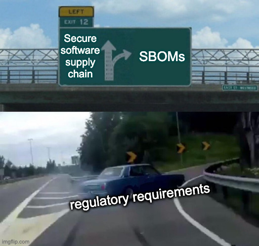

Dialog:

A: Ja, aber lassen Sie uns das nicht als Compliance-Checkbox betrachten, sondern was sinnvolles damit anstellen.

C: Wie soll dass jetzt funktionieren? All meine Ideen haben sie auseinandergenommen...

A: In der Software Entwicklung ist ein Thema von vitaler Wichtigkeit: Abhängigkeiten tracken! Das macht man in Bezug auf Open Source Packages mit einer sogenannten "Software Composition Analysis".

C: Und was bringt mir diese "Software Composition Analyse"? Versuchen Sie mal einen Elevator Pitch!

A: Naja mit der Software Composition Analysis wird die Applikation nach externen Abhängigkeiten durchsucht und überprüft, ob die Komponenten aktuell sind, Schwachstellen enthalten und gegebenenfalls problematische Lizenzen beinhalten. So sieht das beispielsweise mit dem 'OWASP Dependency Tracker' aus.

---

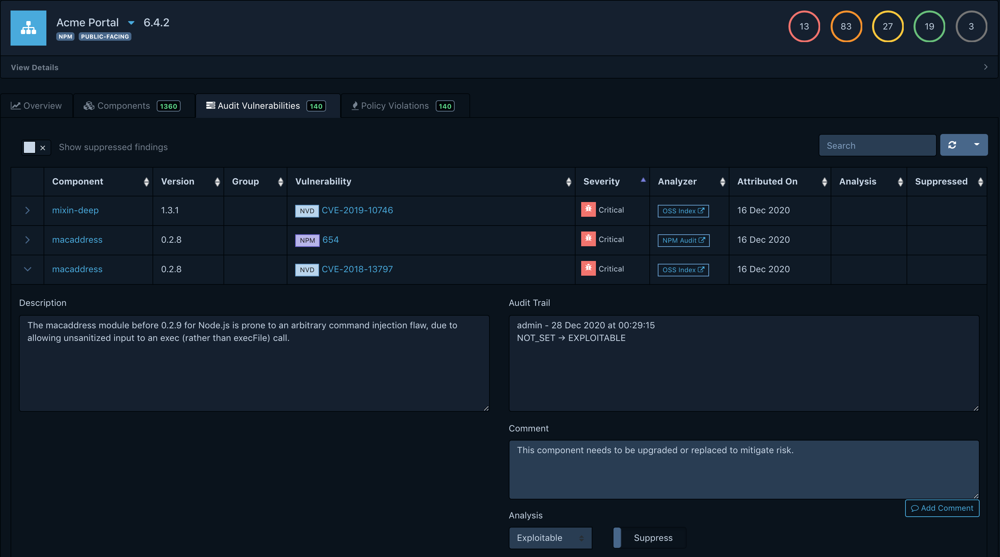

Dialog:

C: Gekauft!

A: Open Source!

C: Das klingt jetzt aber so insgesamt mehr nach Zutatenliste, als etwas Neuem...

A: Neu ist es auch nicht, durch die Einführung von SBOMs ist dieses Thema wieder in den Vordergrund getreten und um kommerzielle Komponenten erweitert worden. Die Notwendigkeit einer ordentlichen Inventarisierung von Software gibt es aber schon seit einiger Zeit.

C: Aber was soll das dann konkret bringen?

---

Dialog:

A: Die Inventarisierung schafft die Datengrundlage um die Qualität der Software und die damit verbundenen operativen Risiken bewerten zu können. Die Information/Metadaten einfach nur rumliegen zu haben bringt uns nichts, aber diese Transparenz ermöglicht uns folglich zu priorisieren wo die Entwicklungsteams patchen und nacharbeiten müssen.

C: Wer kontrolliert denn das das auch wirklich gemacht wird? Das bedarf ja auch einer neuen Governance Funktion

A: Ja wir sollten ein Auge darauf haben, dass zumindest die kritischen Punkte zeitnah behoben werden, wissen Sie wie häufig noch heute die veraltete und verwundabare log4j Version verwendet wird?

C: Nirgends hoffe ich mal!

---

<figure>
    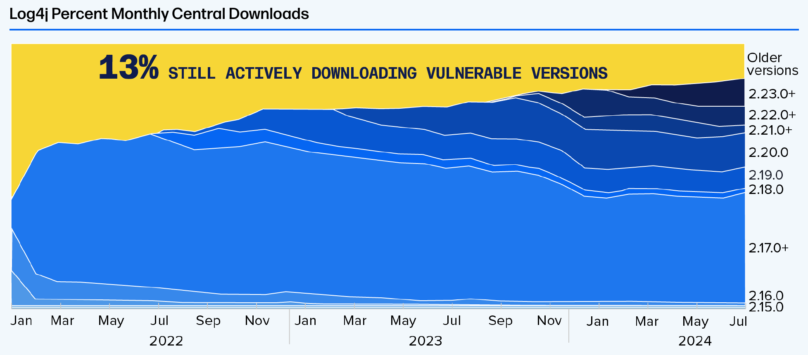
    <figcaption><a href="https://www.sonatype.com/state-of-the-software-supply-chain/2024/risk">Sonatype: 2024 State of the Supply Chain</a></figcaption>
</figure>
 

Dialog:

A: Weit gefehlt, diese wird noch regelmäßig heruntergeladen und in Software eingebunden. Daher müssen wir bei den Entwickler:innen das Bewusstsein für einen verantwortungsvollen Umgang mit Abhängigkeiten schärfen.

C: Z.B. mit einer Policy: nur Abhängigkeiten ohne jegliche Schwachstellen!

A: Ganz ohne Schwachstellen wird es sehr schwierig... Einmal sollten Entwickler:innen die Anzahl externer Abhängigkeiten wo möglich reduzieren. Die Auswahl sollte auch bestimmten Qualitätskriterien unterliegen z.B., dass sie aktiv gepflegt werden, ob sie von einem vertrauenswürdigen Publisher kommen, oder wie schnell Schwachstellen oder issues gelöst werden.

C: Woran können sie das denn erkennen? Gibt es da vielleicht etwas von Ratiopharm?

---

<figure>
    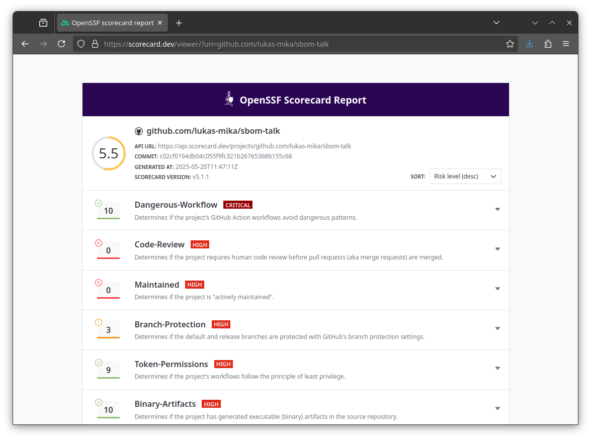
    <figcaption>Example OpenSSF Scorecard Report; see <a href="https://scorecard.dev/">https://scorecard.dev/</a></figcaption>
</figure>
 

Dialog:

A: Hier gibt es für Open Source z.B. die openssf scorecard zur Bewertung von Projekten die man auch direkt in den Pipelines einbinden kann um den Entwickler:innen direkt eine Einschätzung ihrer Abhängigkeiten zu geben.

C: Was hat den das alles mit SBOMs zu tun

---

# Meaningful use of SBOMs

- SBOMs can extend a proper Software Composition Analysis with proprietary components
- Raise awareness in development teams about third party dependencies
- Proper governance around the usage of third party dependencies

Dialog:

A: SBOMs stellen ein mögliches Artefakt dar um eine Zutaten der Software darzustellen. Schlussendlich ist das nur ein Format in dem bestimmte Informationen dargestellt und ausgetauscht werden. Gepaart mit einer ordentlichen Software Composition Analyse ermöglicht uns das Aussagen über Qualität und Risiken zu treffen.

C: Also würden Sie mir zustimmen, wenn ich sagen würde, SBOMs sind doch nicht gänzlich nutzlos?

A: Nicht gänzlich...

C: Großartig! Toll, dass ich Sie überzeugen konnte...

[C schaut auf's Handy]

C: Oh, entschuldigen Sie bitte, da muss ich rangehen. Arbeiten Sie mir dann bitte mal ein Konzept aus, wie wir die besprochenen Sachen alle im nächsten Quartal umsetzen können. Schaffen Sie das bis nächste Woche?

[C nimmt Handy ans Ohr und läuft von der Bühne]

C: Ja Tachchen Hermann! Ja, ja, Supply Chain Attacks kenn ich. Da nutzen wir jetzt S-B-O-M-S

[A schlägt die Hände vor's Gesicht]

---

Dialog:

A: ...ich kündige.

---

# Q & A

Slides and Content available at https://github.com/something-appsec/sbom-talk

SBOM available <!-- .element class="smaller-text" -->[here](https://github.com/something-appsec/sbom-talk/dependency-graph/sbom) 

---

 

<a href="https://github.com/something-appsec/sbom-talk">SBOM - Eine Tragikomödie in 3 Akten</a> © 2025 by Jasmin Mair, Lukas Mika is licensed under <a href="https://creativecommons.org/licenses/by-sa/4.0/">CC BY-SA 4.0</a>

 
Dialog:

Dieser Vortrag ist in Gänze, einschließlich Script und Slides, unter Creative-Commons-Lizenz auf unserem Github Repository verfügbar. Einschließlich der SBOM.
