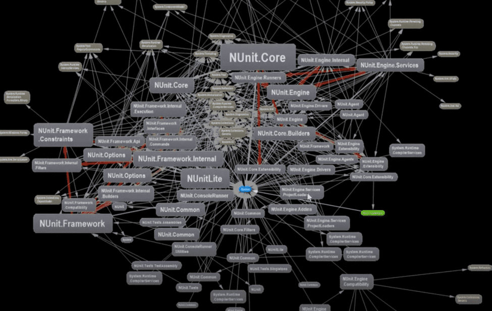
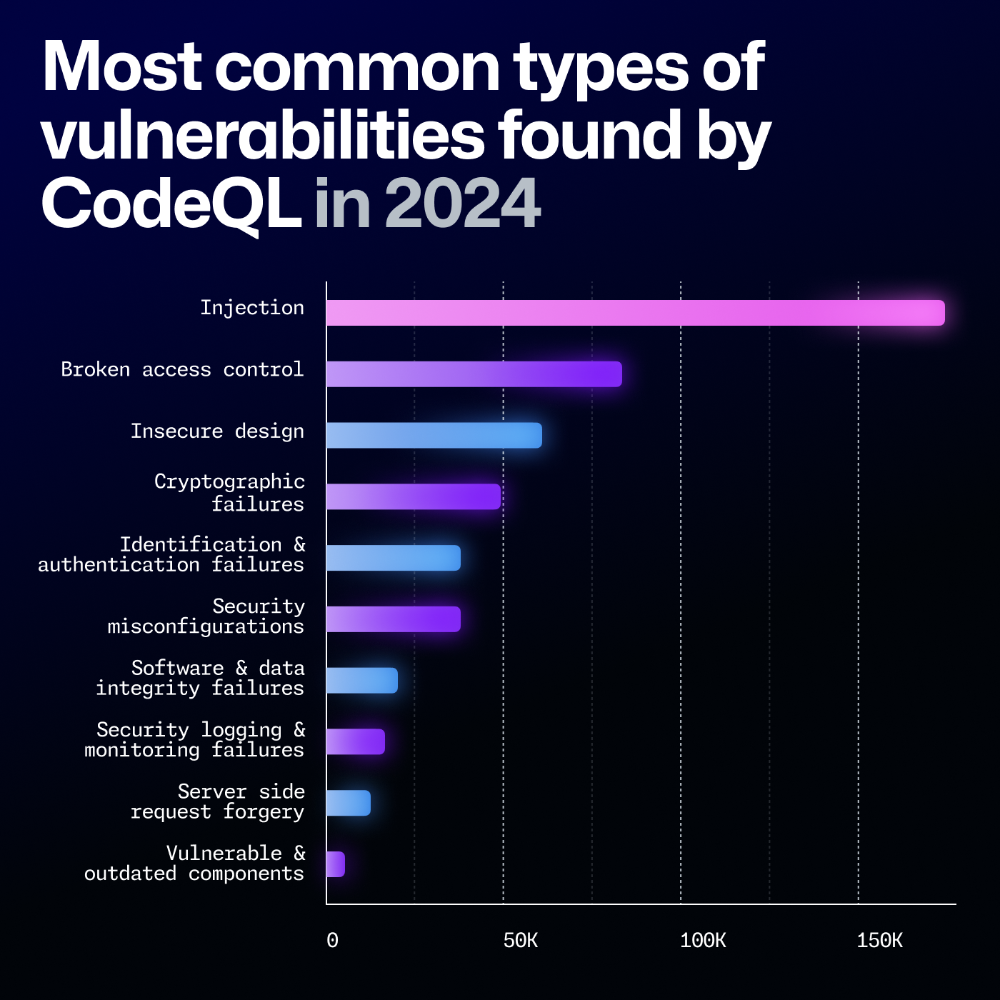

<<<<<<< HEAD
<<<<<<< HEAD
<<<<<<< HEAD
<<<<<<< HEAD

  
    
  
  

reveal.js is an open source HTML presentation framework. It enables anyone with a web browser to create beautiful presentations for free. Check out the live demo at [revealjs.com](https://revealjs.com/).

The framework comes with a powerful feature set including [nested slides](https://revealjs.com/vertical-slides/), [Markdown support](https://revealjs.com/markdown/), [Auto-Animate](https://revealjs.com/auto-animate/), [PDF export](https://revealjs.com/pdf-export/), [speaker notes](https://revealjs.com/speaker-view/), [LaTeX typesetting](https://revealjs.com/math/), [syntax highlighted code](https://revealjs.com/code/) and an [extensive API](https://revealjs.com/api/).

---

Want to create reveal.js presentation in a graphical editor? Try <https://slides.com>. It's made by the same people behind reveal.js.

---

### Getting started
- 🚀 [Install reveal.js](https://revealjs.com/installation)
- 👀 [View the demo presentation](https://revealjs.com/demo)
- 📖 [Read the documentation](https://revealjs.com/markup/)
- 🖌 [Try the visual editor for reveal.js at Slides.com](https://slides.com/)
- 🎬 [Watch the reveal.js video course (paid)](https://revealjs.com/course)

--- 

  MIT licensed | Copyright © 2011-2024 Hakim El Hattab, https://hakim.se

=======
# sbom-talk
A talk about SBOMs, based on reveal.js
<<<<<<< HEAD
>>>>>>> ca180c60 (Initial commit)
=======

---

# Slide 1
This file is also serving as the content for the Presentation at https://dim-0.github.io/sbom-talk/
>>>>>>> 8faf8173 (Modified Index)
=======
=======
](https://scorecard.dev/viewer/?uri=github.com/dim-0/sbom-talk)
=======
]
>>>>>>> e9d62e80 (Update README.md)

>>>>>>> 399887d8 (Update README.md)
# SBOMs
## Eine Tragikomödie in 3 Akten

_by *Jasmin Mair* and *Lukas Mika*_

Note:
This slide deck is based on [reveal.js](https://revealjs.com/).

This file provides the Payload for the presentation and might therefore contain code, which is not natively supported by GitHub's MarkDown implementation.

The rendered presentation is available via the repository's [GitHub Pages website](https://dim-0.github.io/sbom-talk/).

---

# Disclaimer

All characters appearing in this work  
are purely fictitious.

Any resemblance to real persons, living or dead,  
is purely coincidental.

<<<<<<< HEAD
<<<<<<< HEAD
<<<<<<< HEAD
>>>>>>> 535d44d2 (Added first slides)
=======
=======

>>>>>>> 5975023a (Added First Memes)
=======
>>>>>>> 7ecd15a0 (Formatting changes)
---

_No CISOs were harmed   
in the Making of this Presentation_

---

# 1. Akt

## _Introductio_

---

<figure>
    
    <figcaption><a href="https://www.sonatype.com/hubfs/1-2023%20New%20Site%20Assets/SSCR/8th-Annual-SSCR-digital-0206%20update.pdf">Sonatype: 2022 State of the Supply Chain</a></figcaption>
</figure>

---

---

 

---

<figure>
    
    <figcaption><a href="https://www.blackduck.com/content/dam/black-duck/en-us/reports/rep-ossra.pdf">Black Duck: 2025 Open Source Security and Risk Analysis Report</a></figcaption>
</figure>

---

---

<figure>
    
    <figcaption><a href="https://blog.phylum.io/hidden-dependencies-lurking-in-the-software-dependency-network/">Phylum: Hidden Dependencies lurking in the Software Dependency Network</a></figcaption>
</figure>

---

<figure>
    
    <figcaption><a href="https://blog.droidchef.dev/mastering-the-gradle-dependency-tree/">Ishan Khanna: Mastering the Gradle Dependency Tree</a></figcaption>
</figure>

---

<figure>
    
    <figcaption><a href="https://understandlegacycode.com/blog/safely-restructure-codebase-with-dependency-graphs/">Nicolas Carlo: Safely restructure your codebase with Dependency Graphs</a></figcaption>
</figure>

---

# SBOM

- Supplier Name
- Component Name
- Version of the Component
- Other Unique Identifiers
- Dependency Relationship
- Author of SBOM Data
- Timestamp
- Licenses

<!--
- Component (incl. Identifiers)
- Used Version
- Creator
- Timestamp
- Filename
- Dependencies on others
- License
- Origin
- Relations
-->

---

---

# 2. Akt

## _Disputatio_

---

<figure>
    
    <figcaption><a href="https://www.sonatype.com/state-of-the-software-supply-chain/2024/10-year-look">Sonatype: 2024 State of the Supply Chain</a></figcaption>
</figure>

---

<figure>
    
    <figcaption><a href="https://www.sonatype.com/state-of-the-software-supply-chain/2024/10-year-look">Sonatype: 2024 State of the Supply Chain</a></figcaption>
</figure>

---

<figure>
    
    <figcaption><a href="https://www.sonatype.com/state-of-the-software-supply-chain/2024/10-year-look">Sonatype: 2024 State of the Supply Chain</a></figcaption>
</figure>

---

<figure>
    
    <figcaption><a href="https://www.cisa.gov/sites/default/files/2024-05/SBOM%20Sharing%20Primer.pdf">CISA: SBOM Sharing Primer</a></figcaption>
</figure>

---

<figure>
    
    <figcaption><a href="https://www.intel.com/content/www/us/en/developer/articles/guide/the-careful-consumption-of-open-source-software.html">Intel: The Careful Consumption of Open Source Software</a></figcaption>
</figure>

---

<figure>
    
    <figcaption><a href="https://www.intel.com/content/www/us/en/developer/articles/guide/the-careful-consumption-of-open-source-software.html">Intel: The Careful Consumption of Open Source Software</a></figcaption>
</figure>

---

# Sponsor open source projects!

---

---

# Supply Chain Attack Vectors

- Typosquatting
- Malicious Code Injection
  - Social Engineering
  - Compromised Build Systems
  - Repo-/Project-jacking
- Malicious Maintainer (e.g. "Protestware")
- Dependency Confusion/Hallucination

---

---

<figure>
    
    <figcaption><a href="https://www.reuters.com/world/us/us-agency-extends-support-last-minute-cyber-vulnerability-database-2025-04-16/">Reuters: In last-minute reversal, US agency extends support for cyber vulnerability database</a></figcaption>
</figure>

---

# 3. Akt

## _Conclusio_

---
<<<<<<< HEAD
>>>>>>> 93fcb8b2 (No CISOs were harmed)
=======

<<<<<<< HEAD
<<<<<<< HEAD
<<<<<<< HEAD

>>>>>>> 6e7e7ea7 (Added The End)
=======
=======
<figure>
    
    <figcaption><a href="https://github.blog/news-insights/octoverse/octoverse-2024/">GitHub: Octoverse 2024</a></figcaption>
</figure>
=======
| **Regulation**           | **Industry**                     |
|--------------------------|----------------------------------|
| NIS-2 Directive          | Critical Infrastructure          |
| EU Cyber Resilience Act  | "Products with digital Elements" |
| DORA                     | Financial Sector                 |
| US Executive Order 14028 | US Government Software Suppliers |
| FDA                      | Medical Devices                  |
| UNECE R 155 WP.29        | Automotive (self-driving cars)   |
>>>>>>> 9efbddc4 (Added further slides)

---

<<<<<<< HEAD
>>>>>>> 3a233d00 (Added numerous screenshots for future slides)
=======
<figure>
    
    <figcaption><a href="https://www.sonatype.com/state-of-the-software-supply-chain/2024/risk">Sonatype: 2024 State of the Supply Chain</a></figcaption>
</figure>

---

>>>>>>> 05854103 (Added Slides and Pictures)

>>>>>>> 827d186f (Correcting image source for end slide)
