## CUBANTECH MEETUP ARDUINO HACKING
#### Electronic and software tricks to work with arduino

----------------

#### These slides: [slides.cuban.tech/arduino_hacking.html](http://slides.cuban.tech/arduino_hacking.html)

------------

Author: Pavel Milanes (pavelmc@gmail.com)

Network: cubantech

Password: meet-ups

------------

#### SOCIALIZING ADVANCED FREE SOFTWARE TECHNOLOGIES

[cuban.tech website](http://cuban.tech)

---

## WHAT IS THE CUBANTECH GROUP?

A group of Cuban entrepeneurs with a social vision

--

- Socializing knowleage across educational activities
- Teaching natural language digital evolution and programming language
- Promoting a sustainable network of cooperation and promotion of cuban tech innovation
- A complement to help common non-programming people to get tech into their lives healthily

---

## MEETUP RULES

#### HARASSMENT-FREE COMMUNITY FOR EVERYONE, REGARDLESS OF:

- [Code of conduct](https://github.com/nodeschool/havana/blob/master/Code_of_Conduct.md)
- sex, gender identity or expression, sexual orientation, disability,
- physical appearance, age, body size, race, nationality or religious beliefs

--

## HOST EXTRA-RULES

- Preserve the place, low voice, etc.
- Help yourself with refreshments ... outside the room

--

## OTHER BASIC RULES FOR AN ENGAGING EXPERIENCE:

- Respect time limit of your keynote.
- Ask no matter when, but PLEASE ASK!!!
- Share with attendants all you can.

---

## ARDUINO HACKING

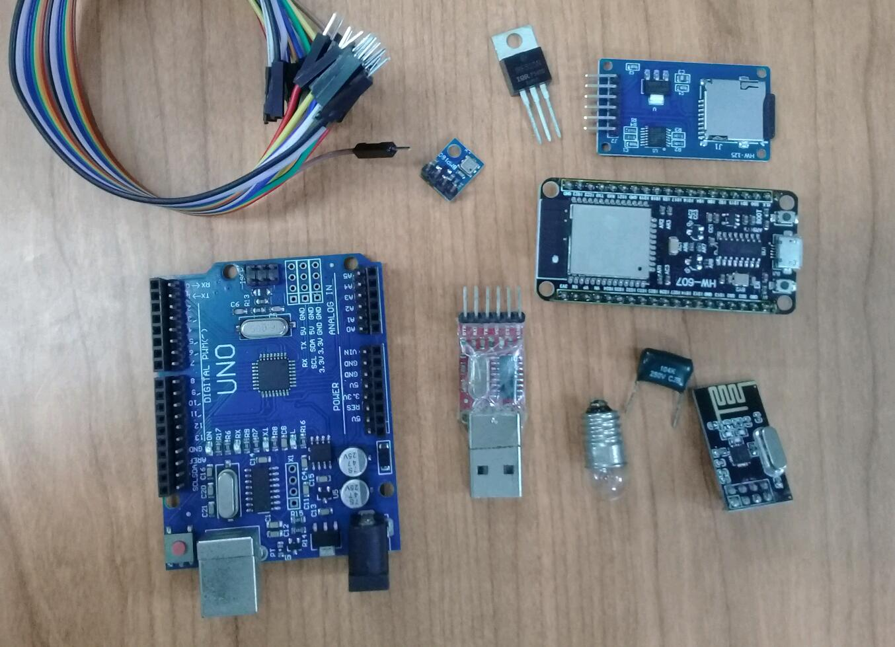

---

## THIS MEETUP AGENDA

- Analog electronic basics
- Communications buffers (I2C, SPI, OneWire)
- Visual Devices roundup (Various Displays)
- Wireless module nRF2401 (Non WiFi)
- How to get more resolution from the ADC.
- Other subject by popular demand

---

## Analog electronic basics

- Diodes
- Transistors
- Operational Amplifiers
- Passive filters (Low pass)

---

## Diodes

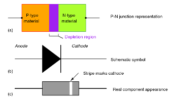

- It's the basic semiconductor piece of modern electronics
- It can pass current in one way and block it in the other
- Major characteristics are:
  * Voltage rating
  * Current rating
  * Cutoff frequency

--

## Diode types

- Germanium (Deprecated, just for reference)
  * Low voltage drop (0.1 - 0.2 volts)
  * High frequency cutoff (> 30 Mhz)
- Silicon diodes
  * High voltage drop (0.6 - 1.2 volts)
  * Wide frequency cutoff (from Hz to GHz)
- Schottky Silicon diodes
  * Low drop (0.1 - 0.15 volts)
  * Very high frequency cutoff

---

## Bipolar Transistors

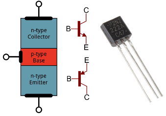

- Evolution of the two legs diode adding a third leg
- Two major types: NPN / PNP

--

## Bipolar Transistors

- The legs are Emitter, Base and Collector
- It measures like two diodes in series with a common point, common point is the Base
- The diode from Base to Collector has a **LOW** voltage dropout
- Controlling the current on the base you can control the collector current

--

## Bipolar Transistors

- There is a dead zone between 0.0 - 0.6 volts (the diode voltage drop)
- From 0.6 - 0.7 volts the collector current is exponential (amplification!)
- From 0.7 volts and forward you get the Emitter-Collector current saturated (~ 1.0 volts)
- When transistors are saturated they act like a closed switch

---

## MosFet transistors

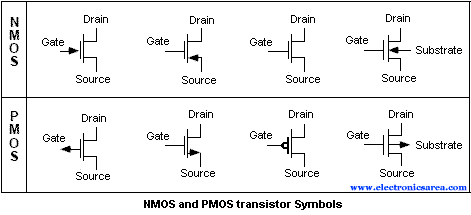

- Evolution of the Bipolar ones, they use voltage instead current
- Acting more like a vacuum tube
- Most common implementations are as a switch.
- They are very effective as a switch.

--

## MosFet transistors

- Legs are Source, Gate and Drain
- They respond to Voltage not to current
- Power transistors has usually a backwards diode between source and Drain, this is called a Damper diode
- Dead conducting zone is form 0.0 - 4.1 volts
- Conducting exponential zone is 4.1 - 5.1 volts
- Over 5.1 volts they saturate
- Always look for the datasheet!

---

## Operational Amplifiers

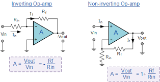

- Differential amplifiers two inputs and one output
- Two mode of amplification (inverting/non-inverting)
- Very High Input Impedance
- Very low differential voltage (0.1 to 0.00001 volts)
- Very low output impedance (medium current)
- Can be used as threshold detectors

--

## Operational Amplifiers

- Used as amplifiers that represents almost no load to the input circuit
- Then they are ideal buffers, high input impedance & low output impedance
- They can be used as level translators (move a negative signal to the positive side)
- Very low power consumption.
- There is a variation called comparators

---

## Passive Filters

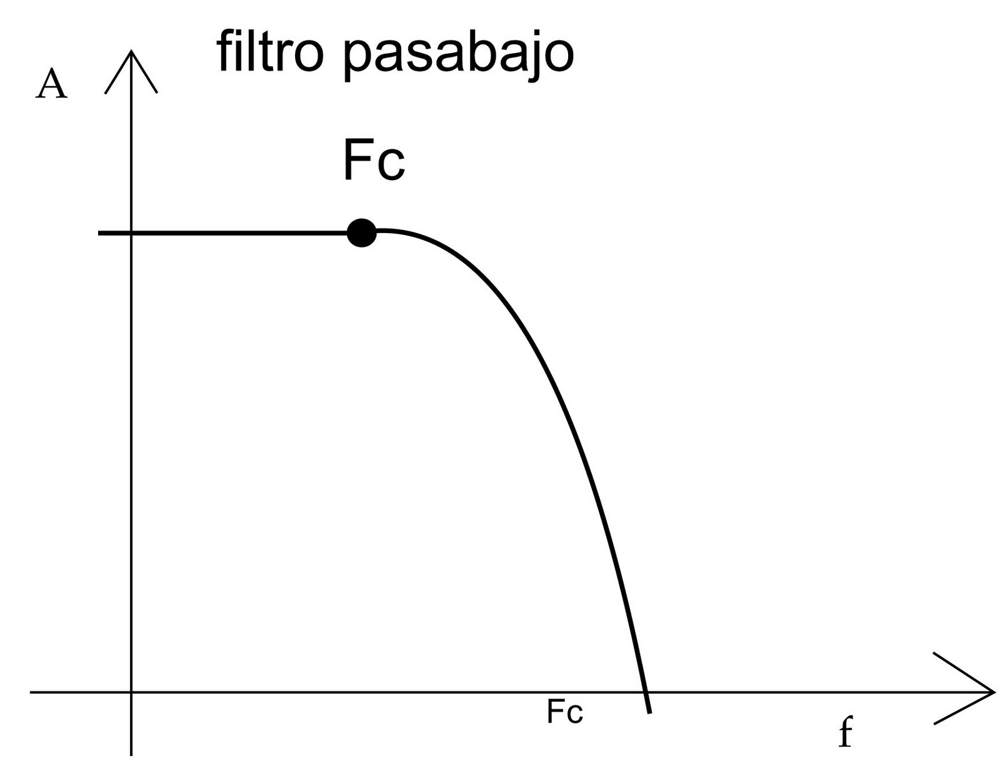

--

## Passive Filters (Low pass)

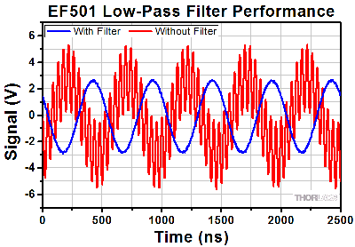

- Limit the bandwidth of a signal, cleaning it.
- Usefull to clean signals
  * For example to cleans a signal from a PWM output
  * To limit de noise on a ADC that has a limited bandwidth

---

## Communications Buffers

- SPI (Serial Peripheral Interface)
- I2C (Wire, two wire)
- OneWire

--

## SPI (Serial Peripheral Interface)

- Use at least 4 lines:
  * Clock (CLK)
  * Chip Select (SS, CS)
  * Sending (SDO, MOSI, DOUT)
  * Receiving (SDI, MISO, DIN)
- Based on the same principle:
  * ICSP
  * ICP
  * Bidirectional Clocked Serial Interface

--

## SPI principal characteristics

- Master Slave paradigm
- At least 4 wire and one additional for each new device
- Not speed limited, and can speak various speed on the same bus
- Typically, 1, 8, 16 & 32 MHz speed.

--

## I2C, Wire, Two Wire

- Only two wires:
  * Data (SDA)
  * Clock (SCL)
- All devices are Open Collector
  * Must provide a +Vcc link on both wires
  * With the lowest voltage (No need for translators)
  * If in doubt use +3.3V and not 5V, will work ok
- Slow, limited to 1 MHz of speed, standard is 400 kHz
- No additional wire for new device
- Devices are addressable by a Direction on the bus
- Limited to 127 devices
- Yo can scan the bus to find devices (-;

---

## Visual Devices roundup (Various Displays)

### Hands to work!

- Group together in at least two groups
- Pick a TFT display or a OLED display and make it work
  * You will need to identify and wire the Devices (SPI/I2C)
  * You will need to Identify the drivers (TFT)
  * Run the default libs examples
  * Ask for the libs to the lecturer

--

## Visual Devices roundup

### Tips from experience

- Do not update the full display on every run
- Split the LCD in update regions and code each one independently
- Code always a failsafe drawAll() function "just in case"
- Make the section updates flag driven
- Connecting cables must be as short as possible
  * Specially with Fast SPI TFTs
- If you get a device and don't know the driver:
  * Take a picture and search it via google image search

--

## More examples?

- BMP180 Barometric/pressure sensor
- RFID RC5222 card reader
- uSD Card Reader

---

## Wireless modules nRF24L01

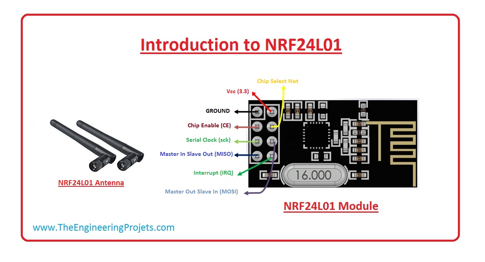

--

## Details

- Uses 2.4 GHz in the WIFI band
- Don't use WIFI protocols
- Use 1Mhz channel (125 Channels)
- 250 to 2048 Kbits/s modes
- Up to 100 in open space and direct vision
- Up to 1Km and more with external antennas and direct vision

--

## Wiring up

### Example from:

- [Crearte Arduino Playground](https://create.arduino.cc/projecthub/muhammad-aqib/nrf24l01-interfacing-with-arduino-wireless-communication-0c13d4)

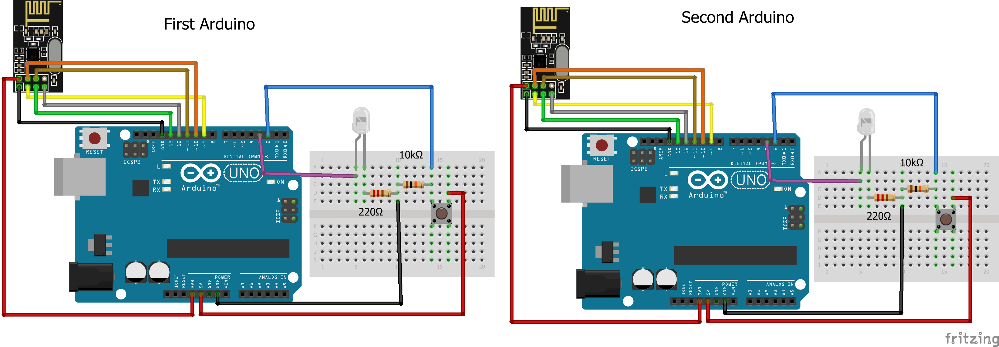

---

## ADC Oversampling

- Is a [trick to squeeze a few bits](https://www.researchgate.net/profile/Tagore_Doddipati/post/Any_suggesions_to_increase_the_bit_resolution_of_measurement_when_done_with_arduino_in_millivolt_range_scale/attachment/59d6227ac49f478072e98e67/AS%3A272115901632512%401441888894371/download/doc8003.pdf) more in resolution in the ADC
- Normal Arduinos has 10 bits (0-1023), newer ones has 12 bits (0-8191)
- But Why?

--

## ADC Oversampling an image

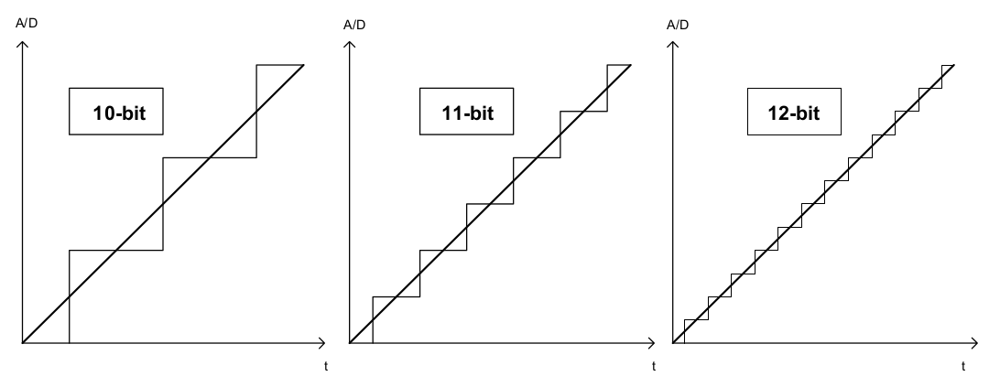

--

## ADC Oversampling explained

- Being ADC the **EXTRA** bits you want
  * Hardware gives 10 but you needs 12 bits; ADC = 2
- Take and sum the samples with a total of power(4, ADC)
- Shift the sum to the right by ADC
- It's slow but some times worth the effort

--

## ADC Oversampling: the code

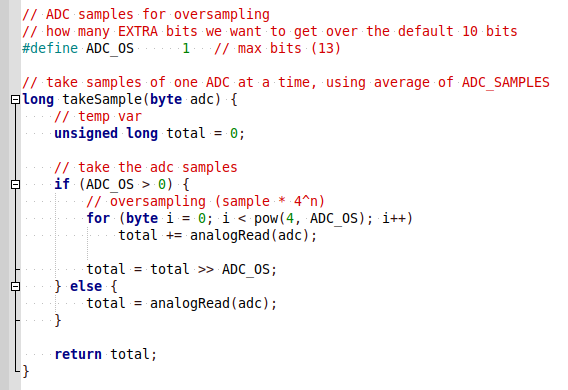

--

## ADC Oversampling details

- Beware of the aliasing: fake sinus on top of the signal
  * Is a side effect of this, read the paper
- Solution is to add or allow **NOISE** in the signal
  * If the signal has noise: don't clean it!
  * If the signal is nice and clean: add noise via the Vref Pin!
  * This increases the entropy and mask the aliasing to useable levels

---

## AMA

### share your ideas & problems

- Questions?
- Ideas?
