## Blockchain, DApps, and Blockstack
#### Basic concepts to get started

----------------

#### These slides: [slides.cuban.tech/dapps.html](http://slides.cuban.tech/dapps.html)

----------------

### Wifi Info

Network: cubantech

Password: meet-ups

---

## Outline

- Replicated state machines (a.k.a RSM)
- Deploying copies of the state machine
- Receiving and ordering client requests with Blockchain
- Executing the RSM
- Sending outputs to the client
- General Theory of DApps
- A (very) quick overview of Bitcoin and Ethereum
- Blockchain-independent DApp RSM with VirtualChain
- Blockstack overview

---

## State Machines - States

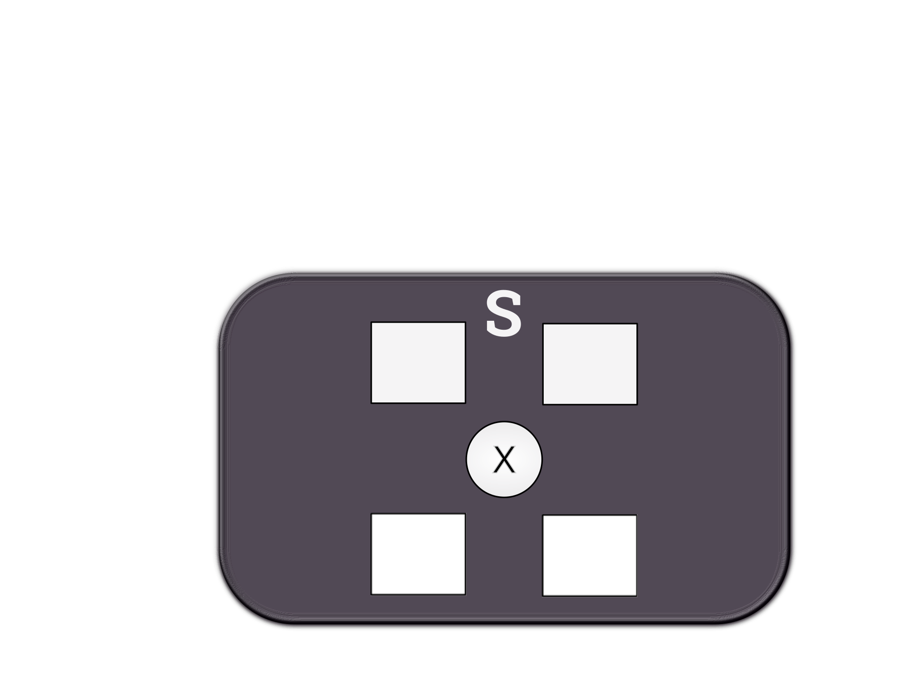

---

## State Machines - Inputs

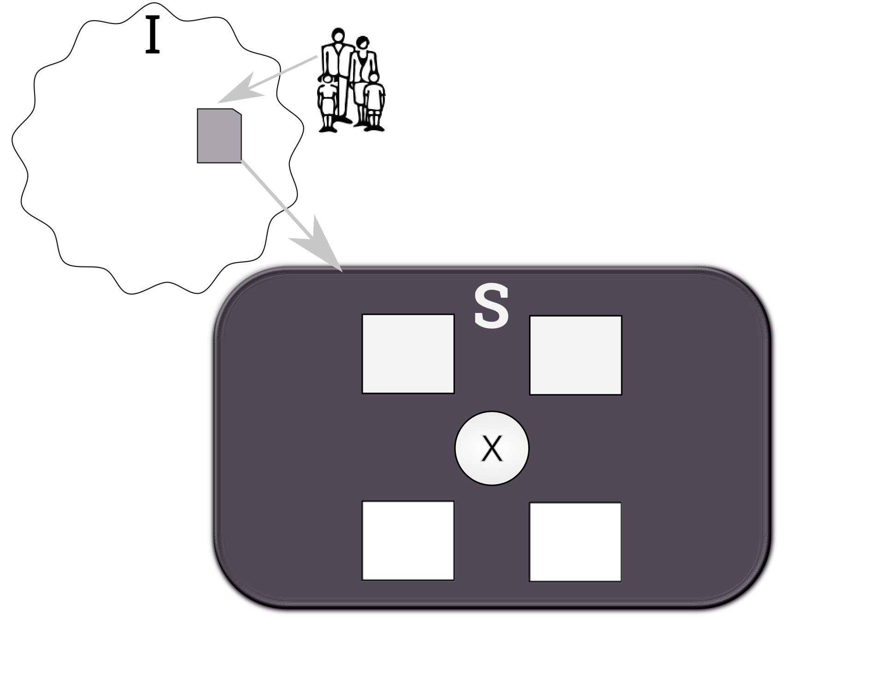

---

## State Machines - Transition

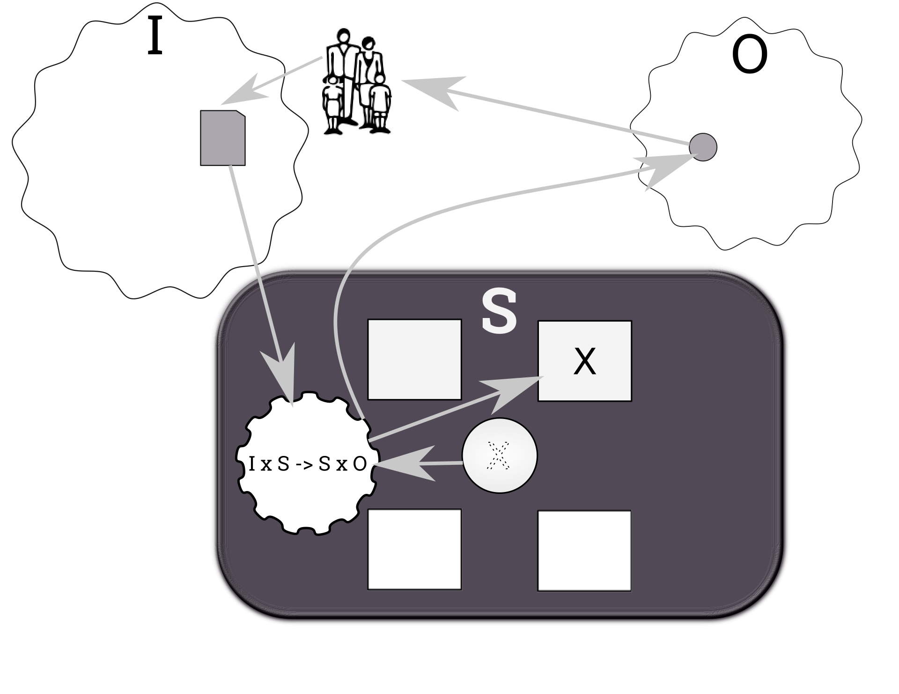

---

## The scalability problem

---

## Distributed services as state machines

- Fault tolerance beyond single-node processors
- Replicas of a single server executed on separate processors 
- Protocols for client interactions with replicas
- Physical and electrical isolation for independent server failures
- Let's assume deterministic state machine
  * ... even if Turing complete is possible

---

## The State Machine Approach

- Deploy replicas of the software
- Receive client requests (i.e. inputs)
- Order the inputs
- Execute SM transition over and over
- Monitor replicas for differences in State or Output

---

## The State Machine Approach

##### Deploy software to multiple servers

<small> [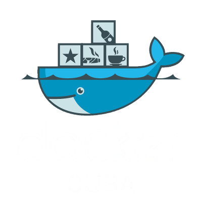](http://docker.cuban.tech) </small>

- Software package repositories
  * e.g. [bitcoind @ Debian](https://packages.debian.org/bitcoind), [Blockstack apt repo](https://packages.blockstack.com), ...
- Containers and registries
  * e.g. [Lisk](https://hub.docker.com/u/lisk/), [Blockstack](https://hub.docker.com/u/blockstack), ... @ Docker Hub
- CM tools
  * Ansible, Puppet, Chef, Habitat, ...

--

## State of CM - Q1 2017

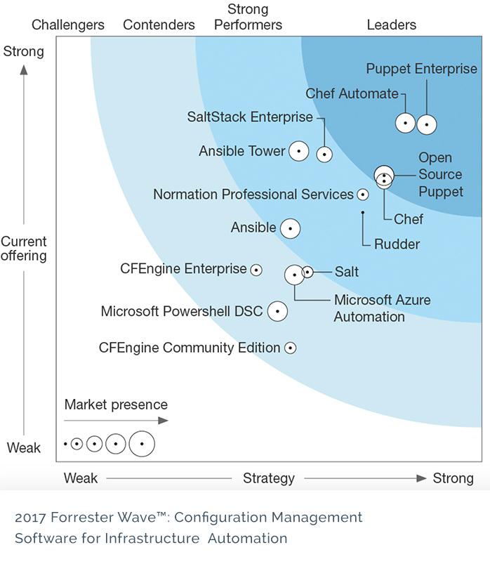

---

## The State Machine Approach

##### Receive client requests

- Multiple solutions
- e.g. Bitcoin transactions

--

## Bitcoin - Anatomy of transactions

##### Important meta-data (except [coinbase transactions](https://bitcoin.org/en/glossary/coinbase-transaction))

<small> 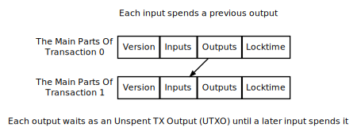 </small>

- Transaction (global) ID
- Version number (protocol evolution)
- Locktime
  * Earliest time TX can be added to the block chain
  * Time-locked transactions only valid in the future
  * Cancellations

--

## Bitcoin - Anatomy of transactions

##### Inputs and outputs

<small>  </small>

- Output(s) : Implicit array index
  * Amount (satoshis)
  * Pubkey script ( Unlock to spend )
- Input(s)
  * Spent output (Transaction ID + Output index)
  * Sequence number (related to locktime)
  * Signature script (params to unlock Pubkey script)

> **Bitcoin** is a public distributed ledger.

--

## Bitcoin - Sending transactions

##### Pay-To-Public-Key-Hash (P2PKH) setup

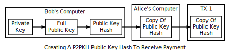

- ECDSA secp256k1 (elliptic) curve
  * Deterministic public key (hash) generation

--

## Bitcoin - Sending transactions

##### Pay-To-Script-Hash (P2SH) setup

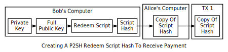

- Redeem script hash instead of public key hash
  * Supports [PubKey scripts opcodes](https://bitcoin.org/eb/developer-reference#opcodes)

--

## Bitcoin - Sending transactions

##### Finalize TX

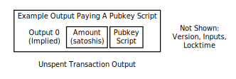

- Sender creates UTXO with PubKey script
  * ... using the public key hash of the receiver
- Sender broadcasts transaction (P2P network)
- Miners add it to a block (... more details later ...)
- Wallet : UTXO amount as spendable balance

--

## Bitcoin - Spending P2PKH outputs

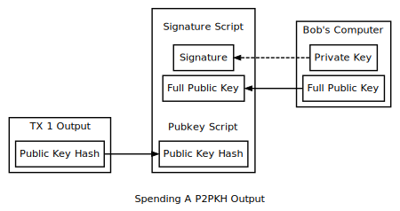

- Lookup transaction ID and index for UTXO
- Sender creates TX input and also add:
  * Sequence number
  * Signature & PubKey (script params)

--

## Bitcoin - Spending P2SH outputs

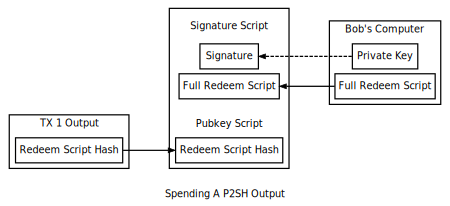

- Lookup transaction ID and index for UTXO
- Sender creates TX input and also add:
  * Sequence number
  * Signature & PubKey (script params)

--

## Bitcoin - Spending outputs

##### Last steps

- Sender prepares UTXO for recipient (as before)
- Sender broadcasts transaction (P2P network)
- Miners add it to a block
  * Script validation ! ( A-ha! )
- Wallet : Update balance

--

## Bitcoin - Standard P2PKH public script

##### Execution stack timeline

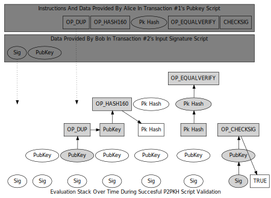

---

## The State Machine Approach

##### Ordering of inputs

- Mutiple solutions
- [Blockchain](https://en.wikipedia.org/wiki/Blockchain_database) ?
- Bitcoin transactions !

--

## Bitcoin - Transaction spending

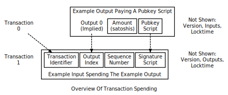

Causal ordering

---

## The State Machine Approach

##### Execute the state machine

- Execute inputs in the chosen order on each replica
  * 

--

## Bitcoin - Transaction propagation

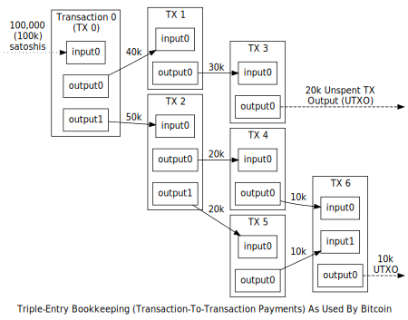

---

## Fault tolerance (in theory)

- Tolerance for F random independent failures
  * memory errors, hard-drive crash, ...
  * Requires `2F + 1` replicas
- Failed replica can stop without generating outputs
  * Only `F + 1` replicas required
  * ... no existing systems achieve this limit
- [Byzantine failures](https://en.wikipedia.org/wiki/Byzantine_fault_tolerance)
  * random, spurious faults => `2F + 1`
  * malicious, intelligent attacks => `3F + 1`

---

## Proofs

- Metric of reference to take decisions about changes in a DApp
- Require *effort* 
- Examples
  * **Proof of work** (PoW)
  * **Proof of stake** (PoS)
  * **Proof of space** (PoSpace, PoC)
  * **Proof of replication** (PoR)
  * ...
- Can be used in parallel
  * e.g. [PeerCoin](http://peercoin.net) relies on PoW + PoS

--

## Proof of work

- *Driver* : Amount of computational work (CPU, GPU, NPU, ...) that contributed to the operation of the DApp.
- Resource intense (power, cooling, ...)
- The mechanism for establishing consensus through POW is commonly called mining.

> <small> *Bitcoin* uses that approach for its day-to-day operation. </small>

--

## Proof of stake

- *Driver* : percent ownership that various stakeholders have over the application.

> <small> *OmniLayer* is based on the POS mechanism. </small>

---

## Nakamoto consensus

- Watch it live at [nodecounter.com](http://nodecounter.com/) !

---

# General Theory of DApps

---

## Definition of a DApp - Open source

- It must operate autonomously
- No entity controlling the majority of its tokens
- Data and records in a public, decentralized block chain.

> <small> e.g. **Bitcoin** apps are open-source, no entity controls Bitcoin and its records are open and public. </small>

---

## Definition of a DApp - Generation of tokens

- The purpose of a token is to allow access to the DApp application.
- Must generate tokens according to a standard algorithm
  * Possibly distribute tokens at the beginning of operation
- Tokens must be necessary for the use of the application
- Contribution from users rewarded by payment in the application's tokens.

> <small> e.g. **Bitcoin** generates bitcoins (tokens) with a predetermined algorithm that cannot be changed. Tokens are necessary for Bitcoin to function. Bitcoin miners are rewarded with bitcoins for their contributions in securing the Bitcoin network. </small>

---

## Definition of a DApp - Consensus

- Protocol may be adapted in response to
  * proposed improvements
  * market feedback
- Changes decided by majority consensus of its users.

> <small> e.g. All changes to **Bitcoin** must be approved by a majority consensus of its users through the proof-of-work mechanism. </small>

---

## Classification of DApps - Type I

##### According to use of blockchain

- They have their own block chain.

> <small> *Bitcoin*, *Litecoin* and other [alt-coins](https://en.wikipedia.org/wiki/List_of_cryptocurrencies) </small>

---

## Classification of DApps - Type II

##### According to use of blockchain

- Use the block chain of a type I decentralized application.
- They are protocols
  * Tokens that are necessary for their function.

> <small> *OmniLayer* (formerly *Master Protocol*) and *Blockstack* are examples of type II decentralized application. </small>

---

## Classification of DApps - Type III

##### According to use of blockchain

- They use the protocol of a type II decentralized application.
- They are protocols and have tokens that are necessary for their function.

> <small> *Omni* (formerly *Mastercoin*), and *Blockstack* apps are examples of type III decentralized applications. </small>

---

## Foundational steps of a DApp

- Publication of whitepaper
- Distribution of initial tokens
- Delegation of ownership

---

## Sections of the DApp whitepaper

- Intentions and goals of the DApp
- Plans for token distribution
- Mechanism for establishing consensus
- Oversight of the DApp
- Management of developer bounties
- Technical description of the DApp

---

## Distributing tokens - Mining

- Tokens are distributed to those who contribute most work to the operation of a DApp.

> <small> Taking *Bitcoin* as an example, bitcoins are distributed through a predetermined algorithm to the miners that verify transactions and maintain the Bitcoin block chain. </small>

---

## Distributing tokens - Fund raising

- Tokens are distributed to those who fund the initial development of the DApp.

> <small> Taking the *Master Protocol* as an example, Mastercoins were initially distributed to those who sent bitcoins to a given address at the rate of 100 Mastercoins per bitcoin sent. The bitcoins collected were then used to fund the development of applications that promoted the development of the Master Protocol. </small>

---

## Distributing tokens - Development

- Tokens are generated using a predefined mechanism and are only available for the development of the DApp.

> <small> In addition to its fund-raising mechanism, the Master Protocol used the collaboration mechanism to fund its future development. Some Mastercoins are distributed via a community-driven bounty system based on the PoS mechanism.

---

## Wrapping Up

- Thank you for coming!
- We'd love your feedback: [bit.ly/blockstack-cuba-feedback](http://bit.ly/blockstack-cuba-feedback)

