## Docker for Developers - Introduction

#### [Festival of Software UNISS](http://www.uniss.edu.cu), 21 March 2017
#### [Labs Docker Cuba](http://docker.cuban.tech), 22 March 2017

###### [Olemis Lang](http://www.linkedin.com/in/olemis) / [@olemislc](http://twitter.com/olemislc)
###### [The CubanTech Group](http://cuban.tech) / [@TheCubanTech](http://twitter.com/TheCubanTech)
________________________

###### Get them: [online presentation](http://slides.cuban.tech/uniss_20170321.html) / [source code](http://git.cuban.tech/slides.cuban.tech) / [docker image](http://hub.docker.com/r/tplcom/docker-presentation/)

###### Under [Attribution 4.0 International](http://creativecommons.org/licenses/by/4.0/) license.

--

### Acknowledgements

#### Organizers of the Festival of Software UNISS (Thanks)
#### Based on slides for presentation in [Python Meetup Thessaloniki](http://www.meetup.com/PyThess/), 15 April 2016

###### [TheodorosPloumis.com](http://www.theodorosploumis.com/en) / [@theoploumis](http://twitter.com/theoploumis)

---

### Who am I?

- Chairman of SciPyLA 2017
  * Science + Python + Latin America
- Maintainer of a few Trac plugins
- Apache Bloodhound project
- Python-Cuba WG, Python Software Foundation
- Brython committer

--

### Who I used to be? 

- Graduated from ISPJAE (CUJAE) ... few years ago
- Fields of competence
  * Antivirus
  * TVC / ICRT
  * Programming (web, desktop, Android, Smart TV, wearables)
  * DevOps support

--

### Who I used to be? (contd.) 

- Fields of competence (contd.)
  * Fieldbus (Modbus, DNP3, radio, CANbus, Profibus)
  * Big data (Apache Hadoop / Spark, Machine learning)
  * Makers
    + 3D printer, CNC, DRO
    + DIY (Raspberry Pi, Beaglebone Black, ODROID, MicroPython, Arduino)

---

### Talk overview

- History and background
- Docker overview
- Docker use cases
- Understanding Docker
- Docker examples
- Docker ecosystem
- Events coming soon

---

### First contact with Docker - PyCon 2014

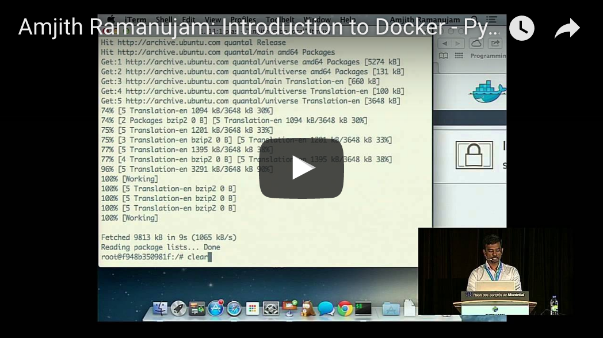

---

### The origins

|      |      |
|:----:|:----:|
|  |  |
| PyCon 2013 | DjangoCon 2013 |

---

### Docker History

 - Solomon Hykes ([@solomonstre](http://twitter.com/solomonstre))
 - dotCloud (now Docker Inc)
 - March 2013
 - Apache 2.0 license
 - 30k stars on Github
 - 260k public repositories on hub.docker.com
 - Docker Inc acquires everyone <small><sup>TM</sup></small>
 - Docker joins the "[Open Container Initiative](http://www.opencontainers.org/)", June 2015

---

### What about today ?

|     |      |
|:-----:|:------:|
| 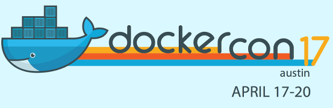 |  |
| DockerCon 2017 | PyCon 2017 |
| 5 tracks | 4 tutorials / 4 talks |
| 5,000 attendees | 3,000 attendees |

---

### Docker Birthday #4

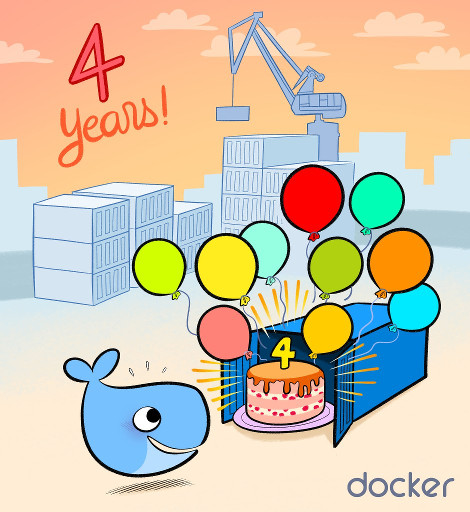

---

### Let me ask you

- Who knows about [Docker](http://docker.com)?
- Who uses Docker for development?
- Who uses Docker in production?
- Who tried but could not do it?

---

### What is Docker (v17.03)

> Docker is an open platform for developing, shipping, and running applications.

> Docker allows you to package an application with all of its dependencies into a standardized unit for software development.

--

### Docker in ICT ecosystem

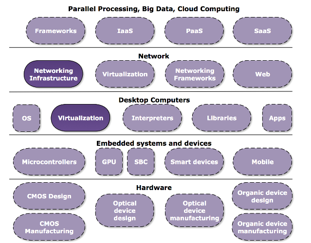

---

### Docker vs VMs

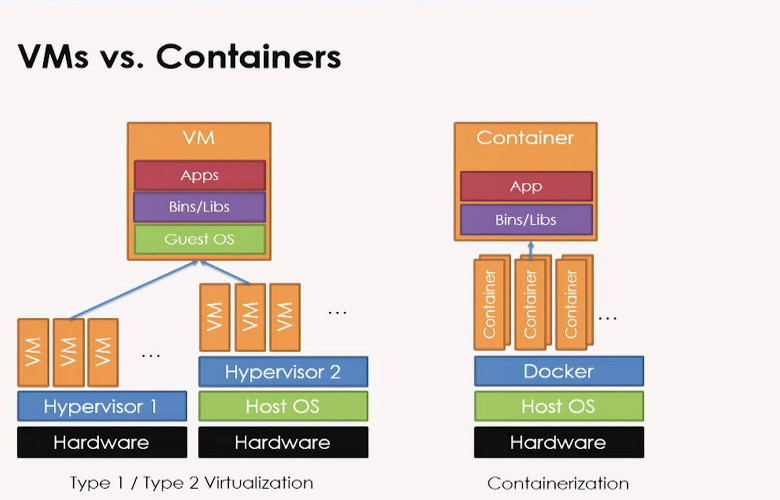

---

### Docker Benefits

 - Fast (deployment, migration, restarts)
 - Secure
 - Lightweight (save disk & CPU)
 - Open Source
 - Portable software
 - Microservices and integrations (APIs)
 - Simplify DevOps
 - Version control capabilities

--

### Micro-what ? Services ?


---

### Common Docker usages

 - Sandbox environment (develop, test, debug, educate)
 - Continuous Integration & Deployment
 - Scaling apps
 - Development collaboration
 - Infrastructure configuration
 - Local development
 - Multi-tier applications
 - PaaS, SaaS

###### See the [survey results for 2016](http://www.docker.com/survey-2016)

--

### Development environment


--

### Education JupyterHub software


--

### Education - JupyterHub deployment

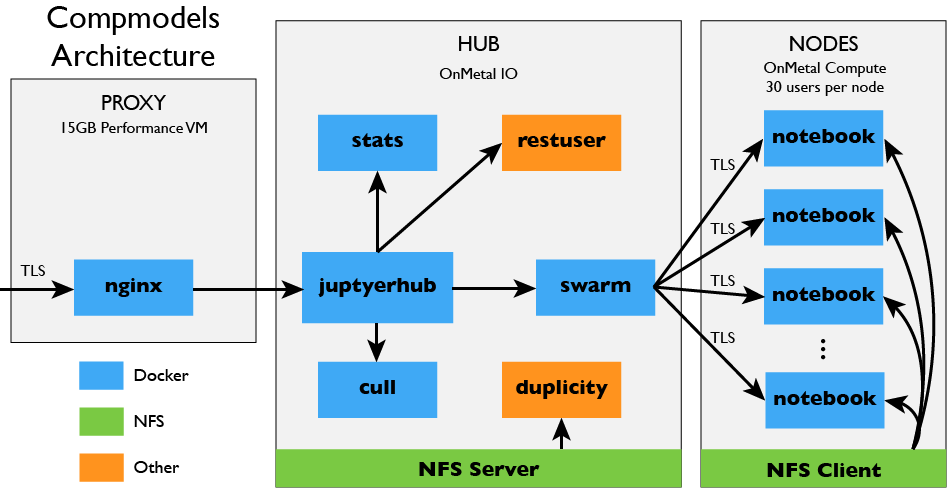

--

### Continuous integration

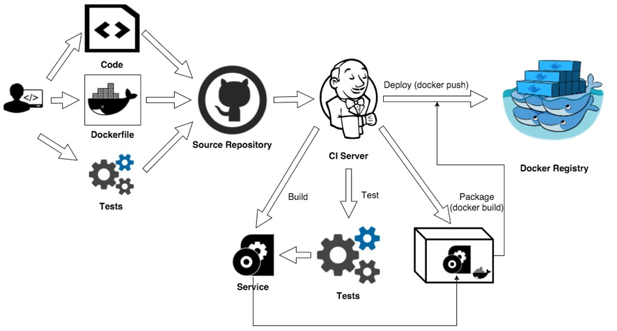

--

### Continuous delivery - Joomla

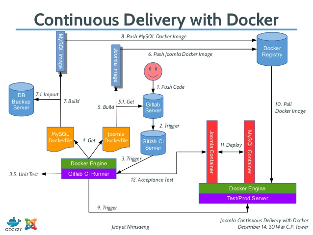

--

### Scaling - from 10's to 1000's

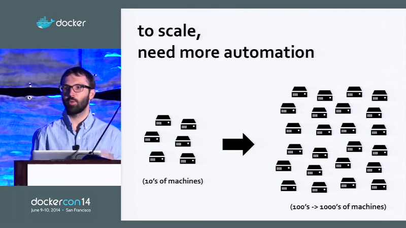

###### Benjamin Hindman (Twitter) - DockerCon 2014 [video](http://youtu.be/F1-UEIG7u5g)

--

### Scaling - app server regions

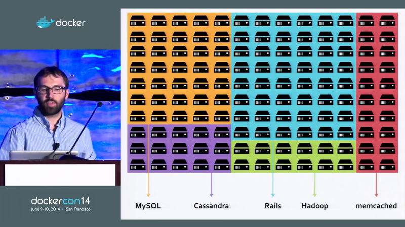

###### Benjamin Hindman (Twitter) - DockerCon 2014 [video](http://youtu.be/F1-UEIG7u5g)

--

### Scaling - ouch !

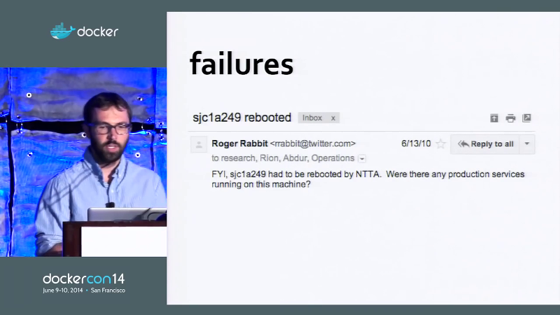

###### Benjamin Hindman (Twitter) - DockerCon 2014 [video](http://youtu.be/F1-UEIG7u5g)

--

### Scaling - problem amplified

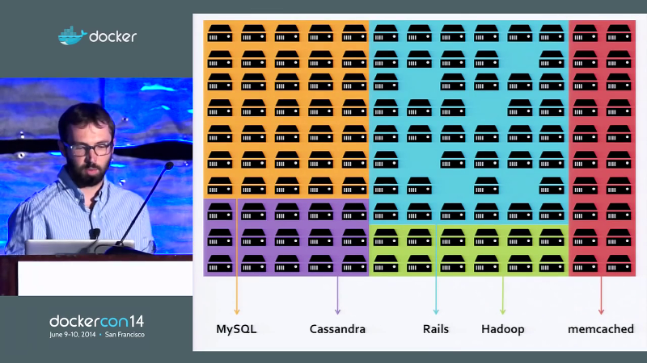

###### Benjamin Hindman (Twitter) - DockerCon 2014 [video](http://youtu.be/F1-UEIG7u5g)

--

### Scaling - Utilization

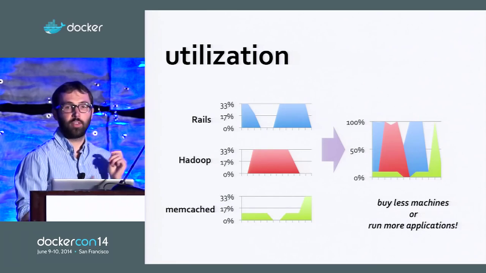

###### Benjamin Hindman (Twitter) - DockerCon 2014 [video](http://youtu.be/F1-UEIG7u5g)

--

### Scaling - Cluster Manager

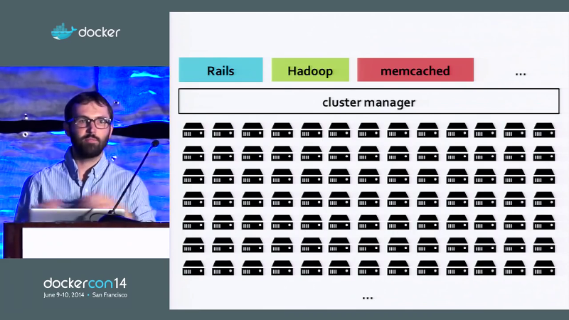

###### Benjamin Hindman (Twitter) - DockerCon 2014 [video](http://youtu.be/F1-UEIG7u5g)

--

### Scaling - Execution

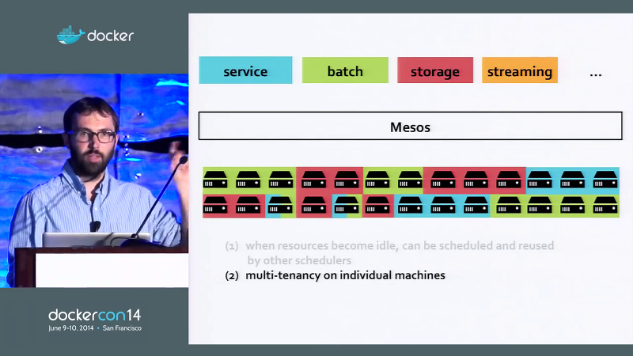

###### Benjamin Hindman (Twitter) - DockerCon 2014 [video](http://youtu.be/F1-UEIG7u5g)

--

### Scaling - Apache Mesos supports Docker since 2014

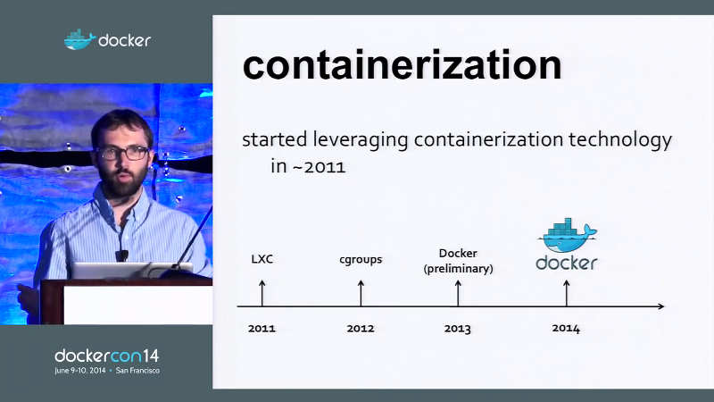

###### Benjamin Hindman (Twitter) - DockerCon 2014 [video](http://youtu.be/F1-UEIG7u5g)

--

### Containers in Google Cloud Platform

|     |     |
|-----|-----|
| 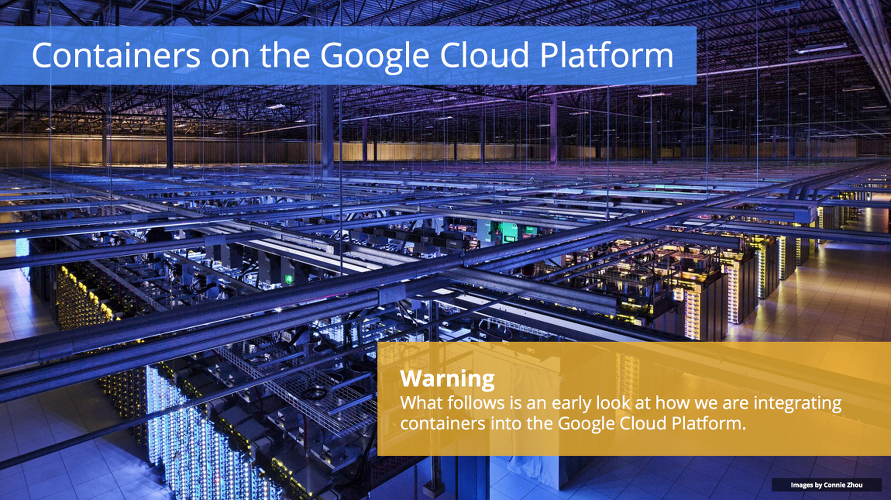 | 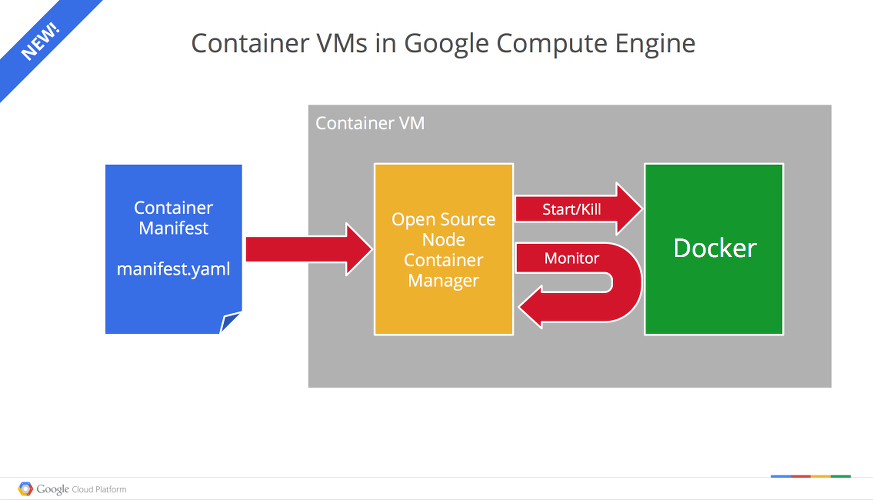 |

- Everything at Google runs in a container
  * [LMCTFY](https://github.com/google/lmctfy) and Docker
- +2 billion containers per week

--

### Big data powered by Docker

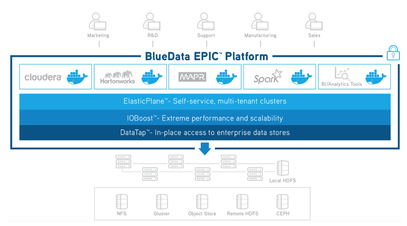

-----------------

###### Joe Beda, Senior Staff Software Engineer, Google Cloud Platform
###### GlueCon - May 22, 2014

---

### Technology behind Docker

 - Linux [x86-64](http://www.wikiwand.com/en/X86-64)
 - [Go](http://golang.org/) language
 - [Client - Server](http://www.wikiwand.com/en/Client%E2%80%93server_model) (deamon) architecture
 - Union file systems ([UnionFS](http://www.wikiwand.com/en/UnionFS): AUFS, btrfs, vfs etc)
 - [Namespaces](http://en.wikipedia.org/wiki/Cgroups#NAMESPACE-ISOLATION) (pid, net, ipc, mnt, uts)
 - Control Groups ([cgroups](http://www.wikiwand.com/en/Cgroups))
 - Container format ([libcontainer](http://github.com/opencontainers/runc/tree/master/libcontainer "Libcontainer provides a native Go implementation for creating containers with namespaces, cgroups, capabilities, and filesystem access controls. It allows you to manage the lifecycle of the container performing additional operations after the container is created."))

###### See more at [Understanding docker](http://docs.docker.com/engine/understanding-docker/)

--

### Docker code written in Go

|    |    |
|----|----|
| [](http://golang.org/) | [](http://golang.org/) |

--

### Linux namespaces

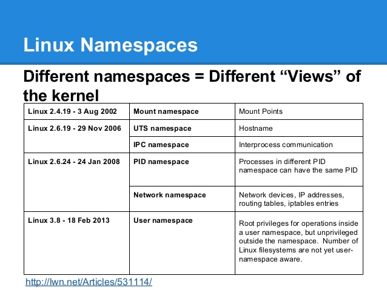

--

### Resource allocation with cgroups

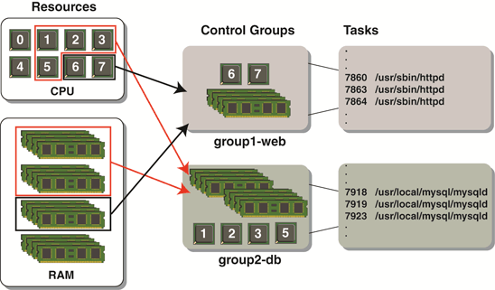

--

### Resource allocation with cgroups

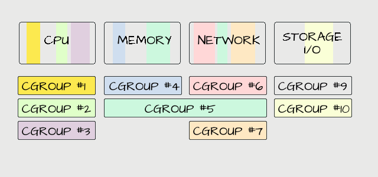

---

### The Docker architecture


###### See more at [Understanding docker](http://docs.docker.com/engine/understanding-docker/)

---

### Docker components

 - (Docker) client
 - daemon
 - engine
 - machine
 - compose
 - swarm
 - registry

---

### Docker client

It is the primary user interface to Docker. It accepts commands from the user
and communicates back and forth with a Docker daemon.

---

### Docker daemon

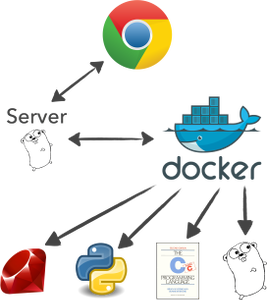

It runs on a host machine. The user does not directly interact with the daemon,
but instead through the Docker client with the RESTful api or sockets.

---

### Docker engine

A Client with a Daemon as also as the docker-compose tool. Usually referred simply as "docker".

---

### Docker machine

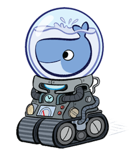

A tool which makes it really easy to create Docker hosts on your computer,
on cloud providers and inside your own data center.
It creates servers, installs Docker on them, then configures the client to talk to them.

---

### Docker compose

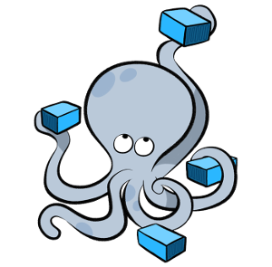

A tool for defining and running complex applications with Docker
(eg a multi-container application) with a single file.

--

### Container orchestration example

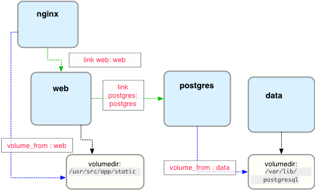

---

### Docker swarm

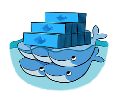

A native clustering tool for Docker. Swarm pools together several Docker
hosts and exposes them as a single virtual Docker host. It scale up to multiple hosts.

---

### Docker distribution

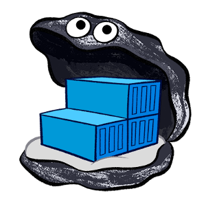

A (hosted) service containing repositories of images which responds to the Registry API.

---

### Steps of a Docker workflow

```
docker run -i -t -d ubuntu:15.04 /bin/bash
```

 - Pulls the ubuntu:15.04 [image](http://docs.docker.com/engine/userguide/containers/dockerimages/ "A read-only layer that is the base of your container. It can have a parent image to abstract away the more basic filesystem snapshot.") from the [registry](http://docs.docker.com/registry/ "The central place where all publicly published images live. You can search it, upload your images there and when you pull a docker image, it comes the repository/hub.")
 - Creates a new [container](http://docs.docker.com/engine/userguide/storagedriver/imagesandcontainers/ "A runnable instance of the image, basically it is a process isolated by docker that runs on top of the filesystem that an image provides.")
 - Allocates a filesystem and mounts a read-write [layer](http://docs.docker.com/engine/reference/glossary/#filesystem "A set of read-only files to provision the system. Think of a layer as a read only snapshot of the filesystem.")
 - Allocates a [network/bridge interface](http://www.wikiwand.com/en/Bridging_%28networking%29 "")
 - Sets up an [IP address](http://www.wikiwand.com/en/IP_address "An Internet Protocol address (IP address) is a numerical label assigned to each device (e.g., computer, printer) participating in a computer network that uses the Internet Protocol for communication.")
 - Executes a process that you specify (``` /bin/bash ```)
 - Captures and provides application output

---

### The docker image

|     |     |
|-----|-----|
| 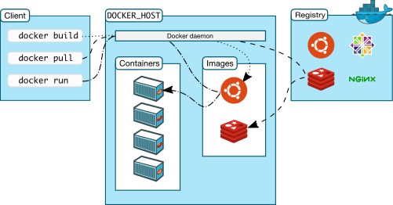 |  |

---

### The docker container

|     |     |
|-----|-----|
|  | .") |

--

### Union filesystem explained

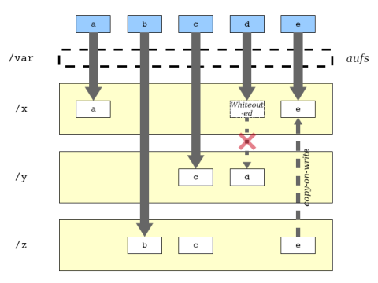

---

### The Dockerfile

> A Dockerfile is a text document that contains all the commands a user could call on the command line to create an image.

 - [This presentation](Dockerfile)
 - [Dockerfile with inline comments](http://github.com/cubantech/docker-presentation/blob/gh-pages/examples/dockerfile/Dockerfile) just for education
 - [Dockerfile reference](http://docs.docker.com/engine/reference/builder/) on docker docs
 - Official Dockerfiles ([rails](http://github.com/docker-library/rails/blob/master/Dockerfile), [nodejs](http://github.com/ReadyTalk/nodejs-docker/blob/master/base/Dockerfile), [django](http://github.com/docker-library/django/blob/master/3.4/Dockerfile), [Drupal](http://github.com/docker-library/drupal/blob/master/8.1/fpm/Dockerfile))

--

### Dockerfile for these slides

```
FROM bitnami/apache
MAINTAINER Olemis Lang <olemis@cuban.tech>

# Add the whole repo.
ADD . /opt/bitnami/apache/htdocs/

# Set this as initial path when logging in via ssh.
WORKDIR /opt/bitnami/apache/htdocs/
```

--

### Docker image trees

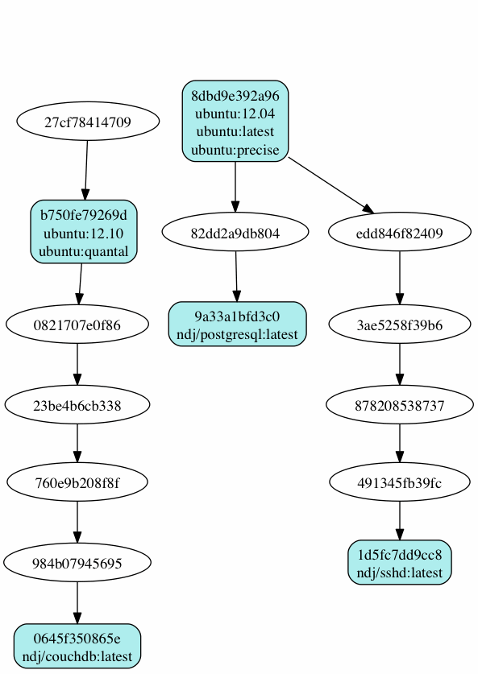

---

### Common Docker Commands

```
// General info
man docker // man docker-run
docker help // docker help run
docker info
docker version
docker network ls

// Images
docker images // docker [IMAGE_NAME]
docker pull [IMAGE] // docker push [IMAGE]

// Containers
docker run
docker ps // docker ps -a, docker ps -l
docker stop/start/restart [CONTAINER]
docker stats [CONTAINER]
docker top [CONTAINER]
docker port [CONTAINER]
docker inspect [CONTAINER]
docker inspect -f "{{ .State.StartedAt }}" [CONTAINER]
docker rm [CONTAINER]

```

---

### Docker examples

- SSH into a container
- Build an image
- Docker [Volume](http://docs.docker.com/engine/userguide/containers/dockervolumes/)
- [Linked](http://docs.docker.com/engine/userguide/networking/default_network/dockerlinks/) containers
- Using [docker-compose](http://docs.docker.com/compose/)
- Scale containers with docker-compose
- Share an image (share this presentation)
- Package an app with its environment
- Screen and sound within containers (x-forward)

--

### Example: SSH into a container

```
docker pull ubuntu
docker run -it --name ubuntu_example ubuntu /bin/bash
```

--

### Example: Run Jenkins standalone

Let's run the [official jenkins image](http://hub.docker.com)

```
docker pull jenkins

// Test it
docker run -d -p 8098:8080 --name jenkins_example_1 jenkins
// Open http://localhost:8098
```

--

### Example: Build an Image

Let's build a [jenkins image](http://github.com/komljen/dockerfile-examples/blob/master/jenkins/Dockerfile)

```
cd ~/Docker-presentation
git clone git@github.com:komljen/dockerfile-examples.git.git
cd dockerfile-examples/jenkins
docker build -t jenkins-local .

// Test it
docker run -d -p 8099:8080 --name jenkins_example_2 jenkins-local
// Open http://localhost:8099
```

--

### Example: Docker volume

Let's use [Apache server](http://bitbucket.org/EdBoraas/apache-docker/src/)

```
cd ~/Docker-presentation
mkdir apache-example
cd apache-example

docker pull bitnami/apache
docker run --name apache_volume_example \
           -p 8180:80 -p 443:443 \
           -v $(pwd):/opt/bitnami/apache/htdocs/ \
           -d bitnami/apache

// Locally create an index.html file
echo "It works using mount." >> index.html

// Open http://localhost:8180 to view the html file
```

--

### Example : Drupal + MariaDB w/ network isolation

Bitnami offers preconfigured, zero-conf containers

```
docker pull bitnami/mariadb:latest bitnami/drupal:latest

docker network create drupal-tier
docker run -d --name mariadb --net drupal-tier bitnami/mariadb:latest
docker run -d -p 8081:80 -p 443:443 --name drupal --net drupal-tier bitnami/drupal:latest
```

--

### Example: Docker link containers

Let's create a [Drupal app](http://hub.docker.com/_/drupal/) (apache, php, mysql, drupal)

```
cd ~/Docker-presentation
mkdir drupal-link-example
cd drupal-link-example

docker pull drupal:8.0.6-apache
docker pull mysql:5.5

// Start a container for mysql
docker run --name mysql_example \
           -e MYSQL_ROOT_PASSWORD=root \
           -e MYSQL_DATABASE=drupal \
           -e MYSQL_USER=drupal \
           -e MYSQL_PASSWORD=drupal \
           -d mysql:5.5

// Start a Drupal container and link it with mysql
// Usage: --link [name or id]:alias
docker run -d --name drupal_example \
           -p 8280:80 \
           --link mysql_example:mysql \
           drupal:8.0.6-apache

// Open http://localhost:8280 to continue with the installation
// On the db host use: mysql

// There is a proper linking
docker inspect -f "{{ .HostConfig.Links }}" drupal_example
```

--

### Example: Using Docker Compose

Let's create a Drupal app with [docker-compose.yml](http://github.com/cubantech/docker-presentation/blob/gh-pages/examples/docker-compose/docker-compose.yml)

```
cd ~/Docker-presentation
git clone git@github.com:cubantech/docker-presentation.git
cd docker-presentation/examples/docker-compose

// Run docker-compose using the docker-compose.yml
cat docker-compose.yml
docker-compose up -d
```

--

### Example: Share a public Image

```
cd ~/Docker-presentation
git clone git@github.com:cubantech/docker-presentation.git
cd docker-presentation

docker pull bitnami/apache
docker build -t olemis/docker-presentation .

// Test it
docker run -itd --name docker_presentation \
           -p 8480:80 \
           olemis/docker-presentation

// Open http://localhost:8480, you should see this presentation

// Push it on the hub.docker.com
docker push olemis/docker-presentation
```

--

### Example: Export/Save/Load etc

```
docker pull nimmis/alpine-apache
docker run -d --name apache_example \
           nimmis/alpine-apache

// Create a file inside the container.
// See http://github.com/nimmis/docker-alpine-apache for details.
docker exec -ti apache_example \
            /bin/sh -c 'mkdir /test && echo "This is it." >> /test/test.txt'

// Test it. You should see message: "This is it."
docker exec apache_example cat /test/test.txt

// Commit the change.
docker commit apache_export_example myapache:latest

// Create a new container with the new image.
docker run -d --name myapache_example myapache

// You should see the new folder/file inside the myapache_example container.
docker exec myapache_example cat /test/test.txt

// Export the container as image
cd ~/Docker-presentation
docker export myapache_example > myapache_example.tar

// Import a new image from the exported files
cd ~/Docker-presentation
docker import myapache_example.tar myapache:new

// Save a new image as tar
docker save -o ~/Docker-presentation/myapache_image.tar myapache:new

// Load an image from tar file
docker load < myapache_image.tar

```

--

### Example: GUI with Docker

See examples at [hub.docker.com/u/jess](http://hub.docker.com/u/jess/)

```
// Before staring we should grant access to everyone on the X Server (locally)
// Otherwise the containers below will never start and they will not be able to use x11
xhost +

// Libreoffice
docker run  -d \
            -v /etc/localtime:/etc/localtime:ro \
            -v /tmp/.X11-unix:/tmp/.X11-unix \
            -e DISPLAY=unix$DISPLAY \
            -e GDK_SCALE \
            -e GDK_DPI_SCALE \
            --name libreoffice \
            jess/libreoffice

// SublimeText 3
docker run -it \
           -v $HOME/.config/sublime-text-3/:/root/.config/sublime-text-3 \
           -v /tmp/.X11-unix:/tmp/.X11-unix \
           -e DISPLAY=$DISPLAY \
           --name sublime_text \
           jess/sublime-text-3

// Audacity (sound in docker container)
docker run  -d \
            -v /etc/localtime:/etc/localtime:ro \
            -v /tmp/.X11-unix:/tmp/.X11-unix \
            -e DISPLAY=unix$DISPLAY \
            -e QT_DEVICE_PIXEL_RATIO \
            --device /dev/snd \
            --group-add audio \
            --name audacity \
            jess/audacity

// Disable access to x11
xhost -

```

---

### Docker tips

There are known best practices (see a list at [examples/tips](http://github.com/cubantech/docker-presentation/tree/gh-pages/examples/tips))

- Optimize containers (check [fromlatest.io](http://www.fromlatest.io/) and [imagelayers.io](http://imagelayers.io))
- Create your own tiny base
- Containers are not Virtual Machines
- Full stack Images VS 1 process per Container
- Create your private registry
- Create shortcut commands
- Use docker-compose.yml templates (see why at [lorry.io](http://lorry.io/))
- Be aware of the hub.docker.com docker agent version

---

### The Docker war

| Type | Software |
|:----:|----------|
| Clustering/orchestration | [Swarm](http://docs.docker.com/swarm/), [Kubernetes](http://kubernetes.io/), [Marathon](http://mesosphere.github.io/marathon/), [MaestroNG](http://github.com/signalfx/maestro-ng), [decking](http://decking.io/), [shipyard](http://shipyard-project.com/), [Apache Mesos](http://mesos.apache.org) |
| Docker registries | [Portus](http://port.us.org/), [Docker Distribution](http://github.com/docker/distribution), [hub.docker.com](http://hub.docker.com), [quay.io](http://quay.io), [Google container registry](http://cloud.google.com/tools/container-registry/), [Artifactory](http://www.jfrog.com/artifactory/), [projectatomic.io](http://www.projectatomic.io/) |
| PaaS with Docker | [Rancher](http://rancher.com/), [Tsuru](http://tsuru.io/), [dokku](http://github.com/dokku/dokku), [flynn](http://flynn.io/),  [Octohost](http://octohost.io/), [DEIS](http://deis.io/) |
| OS made of Containers | [RancherOS](http://rancher.com/rancher-os/) |

--

### Benchmarking & stats


###### See the [survey results for 2016](http://www.docker.com/survey-2016)

---

### Docker Alternatives

- [Rocket, rkt](http://github.com/coreos/rkt)
- [Linux Containers, LXC](http://linuxcontainers.org/)
- [Linux container hypervisor, LXD](http://www.ubuntu.com/cloud/lxd)
- [BSD Jails](http://www.freebsd.org/doc/handbook/jails.html)
- [Solaris Zones](http://oracle.com/solaris)
- [drawbridge](http://research.microsoft.com/en-us/projects/drawbridge/)

---

### Instead of Resources

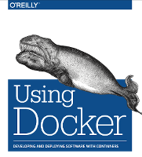

 - [Awesome Docker](http://github.com/veggiemonk/awesome-docker) (list of Docker resources & projects)
 - [Docker cheat sheet](http://github.com/wsargent/docker-cheat-sheet)
 - [Docker in Practice](http://www.manning.com/books/docker-in-practice), [The Docker Book](http://www.dockerbook.com/), [Using Docker](http://bit.ly/using-docker)
 - [Docker aliases/shortcuts](http://github.com/cubantech/docker-presentation/tree/gh-pages/examples/shortcuts/docker-aliases.sh)
 - Docker [case studies](http://www.docker.com/customers)

---

### Future events - Docker Cuba

|     |     |
|-----|-----|
| [](http://docker.cuban.tech) | [](http://forms.cuban.tech/volunteer/es) |

###### Join us - [forms.cuban.tech/volunteer/es](http://forms.cuban.tech/volunteer/es)

 - Docker Cuba meetups [docker.cuban.tech](http://docker.cuban.tech)
   * Docker birthday #4 celebration in all provinces

---

### Future events - SciPyLA 2017

|     |     |
|-----|-----|
| [](http://scipyla.org/conf/2017) | [](http://scipyla.org/conf/2017/tracks/tech) |

 - [Emergent Computing Technologies Workshop](http://scipyla.org/conf/2017/tracks/tech)
   * Infrastructure for Reproducible Research
   * ... with Docker ! \o/

--

### Call for papers / reviewers

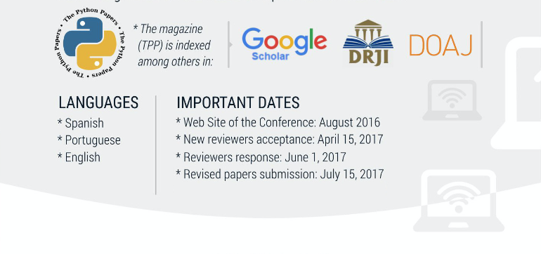

- Submission deadline 30th September 2017
- [Apply as referee](http://scipyla.org/conf/2017/forms/reviewers/)
- [Instructions for authors](http://scipyla.org/conf/2017/tracks/tech)

--

### Participate

- Submit your talks / workshops [bit.ly/scipyla2017-actividades-tech](http://bit.ly/scipyla2017-actividades-tech)
- [Submit posters](http://scipyla.org/conf/2017/forms/poster)

---

### Questions?


[Review this presentation](http://goo.gl/lkau9t)

> Next: Docker in production, Scaling, Private registries, PaaS.

###### In this presentation I have used [oh my zsh](http://ohmyz.sh/), [docker 17.03](http://github.com/docker/docker/releases/tag/v1.12.5), [wharfee](http://github.com/j-bennet/wharfee) and [dry](http://github.com/moncho/dry).

