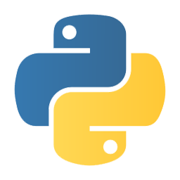

## CubanTech Meetups

- [Intro to meetups](intro_20170121.html)
  * [CubanTech meetup #4](http://docker.cuban.tech/events/236654894/) - Santa Clara, Cuba 2017/01/21
- [Intro to meetups](intro_20170819.html)
  * [CubanTech meetup #17](http://docker.cuban.tech/events/241708287/) - Isla de la Juventud, Cuba 2017/08/19
- [Intro to Blockstack Cuba #1 meetup](intro_20171119.html)
  * [Blockstack Cuba meetup #1](http://blockstack.cuban.tech/events/244120891/) - Havana, Cuba 2017/11/19

---

--

- [Intro to Docker Birthday #4 Celebration](intro_20170304.html)
  * [CubanTech meetup #8](http://docker.cuban.tech/events/238007254/) - Havana, Cuba 2017/03/04
- [Intro to Docker for programmers and DevOps](docker-intro.html)
  * Opening keynote and labs for Festival of Software, University of Sancti Spiritus, Cuba 2017/03/21
- [Hands-on lab Docker for ARM IoT devices - Raspberry Pi & ODROID](docker-stuff/hypriot)
  * FLISoL 2017, Joven Club, Havana, Cuba 2017/04/22
  * [CubanTech meetup #14](http://docker.cuban.tech/events/240871128/) - Hypriot hands-on tutorial Joven Club, Cienfuegos, Cuba 2017/06/16
  * [CubanTech meetup #15](http://docker.cuban.tech/events/240872505/) - Hypriot hands-on tutorial, Havana, Cuba 2017/07/22

---

# PYTHON CUBA

--

- State of Python . Applications
  * PyDay #1 , Havana
- Introduction to Brython. Sample Tizen application
  * Joven Club, Cienfuegos, Cuba
- [Getting started with MicroPython on ESP8266](micropython.html)
  * [CubanTech meetup #13](http://meetup.cuban.tech/events/240871291/) - PyDay Joven Club, Cienfuegos, Cuba 2017/06/16
  * [CubanTech meetup #19](http://meetup.cuban.tech/events/242499554/) - PyDay Isla de la Juventud, Cuba 2017/08/20
- [Python y Pandas para periodismo de datos](pandas-ddj.html)
  * [CubanTech Meetup #16 ](http://meetup.cuban.tech/events/240372001/)- PyDay Havana Cuba 2017/07/29

---

# NODEBOTS CUBA

--

- [Nodebots with CubanTech](nodebots.html)
  * [CubanTech meetup #3](#) - Holgu&iacute;n Cuba 2016/12/25
  * [CubanTech meetup #18](http://meetup.cuban.tech/events/241706888/) - Isla de la Juventud Cuba 2017/08/21
  * [CubanTech meetup #20](http://meetup.cuban.tech/events/242652841/) - Havana Cuba 2017/08/26

---

# BLOCKSTACK CUBA

--

- [Blockchain, DApps, and Blockstack](dapps.html)
  * [Blockstack Cuba meetup #1](http://blockstack.cuban.tech), Havana, Cuba, 2017/11/19 

