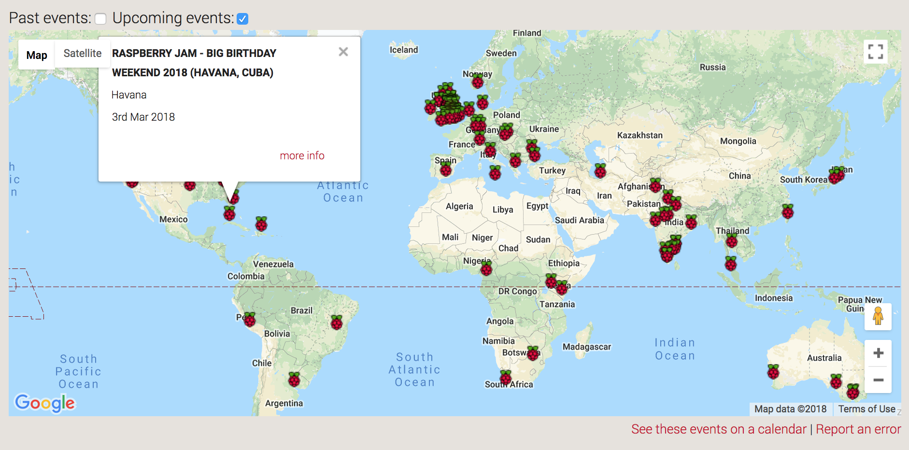
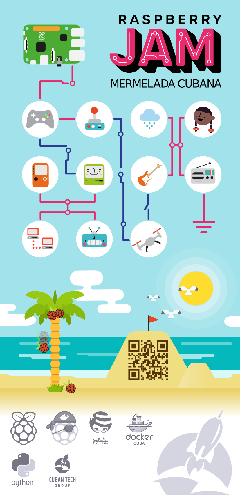
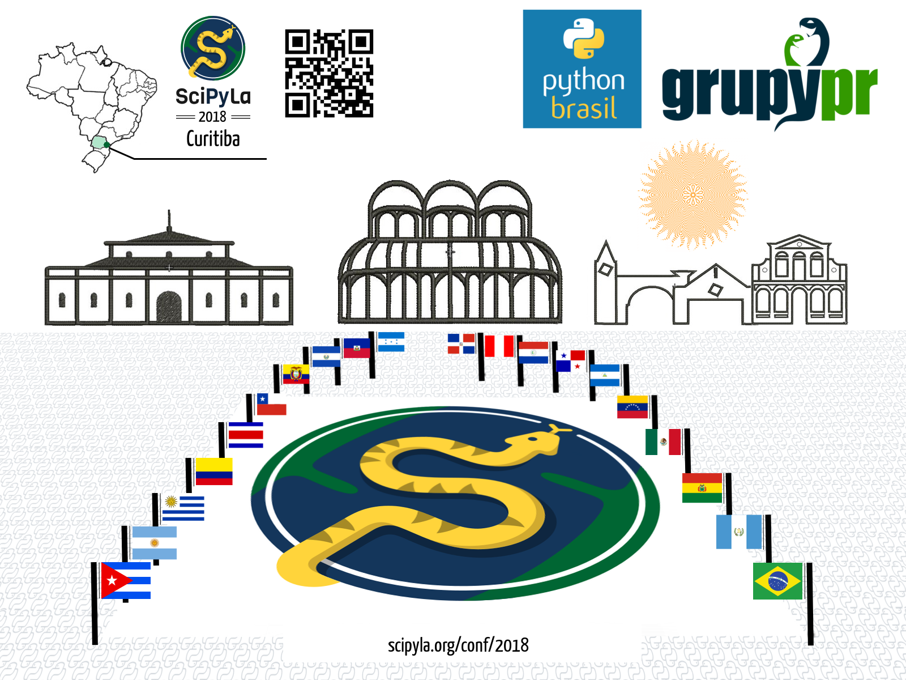

## RASPBERRY JAM, HAVANA 2018
#### Mermelada Cubana

----------------

#### These slides: [slides.cuban.tech/intro_20180113.html](http://slides.cuban.tech/intro_20180113.html)

------------

Author: Olemis Lang (olemis@cuban.tech)

Network: cubantech

Password: meet-ups

------------

#### SOCIALIZING ADVANCED FREE SOFTWARE TECHNOLOGIES

[cuban.tech website](http://cuban.tech)

---

## WHAT IS THE CUBANTECH GROUP?

A group of Cuban entrepeneurs with a social vision

--

- Socializing knowleage across educational activities
- Teaching natural language digital evolution and programming language
- Promoting a sustainable network of cooperation and promotion of cuban tech innovation
- A complement to help common non-programming people to get tech into their lives healthily

---

## MEETUP RULES

#### HARASSMENT-FREE COMMUNITY FOR EVERYONE, REGARDLESS OF:

- [Code of conduct](https://github.com/nodeschool/havana/blob/master/Code_of_Conduct.md)
- sex, gender identity or expression, sexual orientation, disability,
- physical appearance, age, body size, race, nationality or religious beliefs

--

## HOST EXTRA-RULES

- Preserve the place, low voice, etc.

--

## OTHER BASIC RULES FOR AN ENGAGING EXPERIENCE:

- Respect time limit of your keynote.
- Ask no matter when, but PLEASE ASK!!!
- Share with attendants all you can.

---

## RASPBERRY JAMS

---

## THANKS!

- Raspberry Pi Foundation
- Python Software Foundation
- HypriotOS team

---

## DO YOU LIKE OUR BANNER?

---

## THIS MEETUP AGENDA

- What is a Raspberry Jam?
- Using Raspberry Pi as infrastructure for meetups
- Talks
- Proposals
- Break
- Vote
- Hands-on lab : HypriotOS - Docker on ARM Boards [slides](docker-stuff/hypriot)
- More talks

---

## RESOURCES

- Videos [media.cuban.tech](http://media.cuban.tech)
  * [Adafruit DIY videos](http://videos.cuban.tech/Adafruit.Liked.videos/)
- [Documentation](ftp://qnap01.local/Public/docs/)
  * [MagPi magazine](ftp://qnap01.local/Public/docs/magpi)
- Raspbian packages
  * [archive.raspberrypi.org/](http://archive.raspberrypi.org/)
  * [archive.raspbian.org/](http://archive.raspbian.org/)
- OS images
  * [HypriotOS images](ftp://qnap01.local/Public/os/hypriot)
  * Raspberry Pi images (... some subfolders in [here](ftp://qnap01.local/Public/os/) )

--

## MORE RESOURCES

- CubanTech skills matrix [forms.cuban.tech/dev-matrix](http://forms.cuban.tech/dev-matrix)
  * Job offers ... we'll call you back!

--

## COMING SOON

- UEFA champions league predictions challenge
- FIFA World Cup predictions challenge
- NBA finals predictions challenge

---

## PEOPLE INVITED

---

## TOPICS FOR NEXT MEETUPS

- Python and Julia in Physics
- Python in bio-informatics
- Computational economics

--

## TOPICS FOR NEXT MEETUPS

- Blockchain and DApps powered by Python
- Virtual reality and hardware
- Geographic information systems
- Python in science
- Pitch your project idea

---

### SCIPYLA 2018

#### &iexcl; Nos vamos para Curitiba ! - [Talk in CubanTech meetups](http://forms.cuban.tech/cubantech-speak)

---

## CHANNELS OF COMMUNICATION

[CUBAN.TECH](http://cuban.tech) WEBSITE

- Twitter [http://twitter.cuban.tech](http://twitter.cuban.tech)
- Linkedin [http://in.cuban.tech](http://in.cuban.tech)
- Facebook [http://fb.cuban.tech](http://fb.cuban.tech)
- Telegram [http://im.cuban.tech](http://im.cuban.tech)
- Youtube [http://videos.cuban.tech](http://videos.cuban.tech)
- Meetups [http://meetup.cuban.tech](http://meetup.cuban.tech)
- Google+ [http://plus.cuban.tech](http://plus.cuban.tech)
- Slides [http://slides.cuban.tech](http://slides.cuban.tech)
- Version control [http://git.cuban.tech](http://git.cuban.tech)

