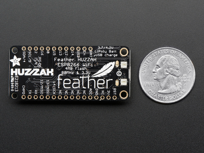

## Intoduction to MicroPython

#### These slides: [slides.cuban.tech/micropython.html](http://slides.cuban.tech/micropython.html)

----------------

### Wifi Info

Network: cubantech

Password: meet-ups

--

- Slides are based on a [talk](http://todayispotato.github.io/micropython-talk/#/25) by [Lars de Ridder](https://github.com/todayispotato)
- The workshop is based heavily on a workshop by [NY-Javascript](http://www.meetup.com/NY-Javascript) (see [bit.ly/nyjs-nodebots](http://bit.ly/nyjs-nodebots))
- ... which is based heavily on a workshop by [Francis Gulotta](https://twitter.com/reconbot) and [Rick Waldron](https://twitter.com/rwaldron)
- You can find the slides for that workshop at [gul.ly/3tjj](http://gul.ly/3tjj)
- You can sign up for one of their workshops on the [Nodebots NYC Meetup page](http://www.meetup.com/nodebots/)

---

## Our community guidelines

[Be excellent to each other](https://github.com/nodeschool/havana/blob/master/Code_of_Conduct.md)

---

Upcoming CubanTech Events

- [CubanTech meetups](http://meetup.cuban.tech)
- [Docker Cuba meetups](http://docker.cuban.tech)
- [Blockstack Cuba meetups](http://blockstack.cuban.tech)
- [SciPyLA 2017](http://scipyla.org/conf/2017)
  * ##### Universidad de Sancti Spiritus, November 22nd - 25th 2017

---

# Huge thanks to our host

---

## So, MicroPython

Who had heard of it before?

And who used it before?

For something serious?

For something that is running right now?

---

## Microcontrollers + Python = MicroPython


MicroPython is a lean and fast implementation of the Python (version 3) programming language that is optimised to run on a microcontroller.

--

## Really ... ?

- Kickstarted in November 2013
- Original kickstarter ended April 2015
  * $ XXX first round
  * $ XXX in total
- Code open source : [github.com/micropython](https://github.com/micropython)

---

## But why?

- Existing community (that includes you)
- Easy to learn, with powerful features
- Good separation between int and float (unlike JS/Lua)
- Native bitwise operations on 1's and 0's (unlike Lua)
- Ideal for rapid prototyping
- Bridge between web-world and IoT world
- Lots of opportunities for optimization!

--

## ... and why not CPython?

Mainly due to RAM usage. Examples:

- Preallocation of 257 + 5 ints = 4k RAM
- Method calls: led.on() creates a bound method object = 20 bytes RAM

--

## Theoretical minimum system requirements

128kb ROM / 8kb RAM (after subtracting other software)

##### UNIX port around 280kb flash

---

# How so Micro ?

--

## Mainly RAM optimizations

- Many strings predefined in ROM (led, on, read, ...)
- Optimised method calls
- Everything that can be in ROM, is in ROM
- Garbage collection: Mark-and-sweep (no reference counts)

--

## Tagged pointers

A tagged pointer is a pointer (concretely a memory address) with additional data associated with it

- Integer - xxxx xxxx xxxx xxx1
- String - xxxx xxxx xxxx xx10
- Object - xxxx xxxx xxxx xx00

---

# Some supported boards

---

## The PyBoard


- Reference implementation
- Initially only on the pyboard, now on multiple chips
- ARM 32bit Cortex M4 @ 168Mhz, 1Mb flash, 192kb RAM
- Accerelometer, RTC, 4 LEDs, 2 switches, 30 GPIO

---

## BBC Micro:Bit


16kb RAM, 256kb flash, Cortex M0 @ 16 MHz

--

## BBC Micro:Bit

Supplied to *1 million* school children

- 25 LEDs
- Two programmable buttons
- Accelerometer & magnetometer
- Bluetooth
- 5 GPIO

--

### ... comes with:

- Online Python editor
- Mobile app to upload code
- Tons of documentations, teaching material, etc.

--

### ... comes with:


- Graphical drag-and-drop editor

--

## Recent versions


Note: TODO : Specs of recent micro:bit boards

---

## The WiPy


256kb RAM, 2Mb flash, 25 GPIO, Cortex M4 @ 80 MHz

#### "Small and light to fit in any cavity"

---

## LoPy


LoRa + Python

--

## LoRa ... hmmm ?

Note: TODO: Info about LoRa

---

##CircuitPython


--

## CircuitPython

|                             |                        |
|-----------------------------|------------------------|
|  |  |

--

## CircuitPython - features

Note: TODO: Features of Circuit Playground boards

--

### ... comes with

- Online Python and Javascript editor
- Tons of [documentations](http://adafru.it/wpE), teaching material, etc.

--

### ... comes with:


- Graphical drag-and-drop editor

---

## ESP8266 and NodeMCU



... also runs on ESP8266 and NodeMCU (i.e. a lot of) chips 

---

# Excuse me ... 

# What is MicroPython ?

---

## It's Python! (3.4-ish)

```python

>>> print('Hello world!')
Hello world!

>>> with open('pygrunn.txt', 'w') as f:
>>>     f.write('Hello PyGrunn!')

>>> try:
>>>     1/0
>>> except ZeroDivisionError as e:
>>>     print("Oh, you!")
Oh, you!
```

---

## ... but not all of it

```python

>>> import functools
Traceback (most recent call last):
    File "<stdin>", line 1, in <module>
ImportError: no module named 'functools'
>>> import this
Traceback (most recent call last):
    File "<stdin>", line 1, in <module>
ImportError: no module named 'this'
```

---

## Supported modules

- `sys`
- `time`
- `struct`
- `machine` - functions related to the board
- `micropython` - internals
- Specific ports provides specific hooks, REPL and custom modules

---

## Supports async / await syntax

```python

async def ping_pygrunn():
    return await ping_server('pygrunn.org')
```

---

## External Standard Library

Written in Python (remember PyPy?)

```sh

$ micropython -m upip install micropython-functools
$ ./micropython 
MicroPython v1.7-116-g8dd704b on 2016-04-19; linux version
Use Ctrl-D to exit, Ctrl-E for paste mode
>>> import functools
>>> dir(functools)
['__name__', 'reduce', 'partial', 'update_wrapper', '__file__', 'wraps']
https://github.com/micropython/micropython-lib
```

---

# Hardware APIs

--

## Your Micro-superpowers include:

- Disable interrupts
- Trigger and disable GC
- Write inline assembler
- Emit bytecode or machine code

--

## Inline Assembler

```python

@micropython.asm_thumb
def led_on():
    movwt(r0, stm.GPIOA)
    movw(r1, 1 << 13)
    strh(r1, [r0, stm.GPIO_BSRRL])
```

--

## Native code emitter

```python

@micropython.native
def foo(self, arg):
    # code
```

Roughly twice as fast, but larger binary

--

## Viper is Python embedded in realtime

```python

@micropython.viper
def foo(self, arg: int) -> int:
    # code
```

Now actually called Zerynth and kind of confusing

---

# Current state of MicroPython

---

## Development

- One full time developer, two core contributors
- Partly funded by the European Space Agency
- Kickstart in May 2016 for proper ESP8266 sockets support
- Feels like it's maturing

---

## Is it production ready?

It depends on your board

But it's amazing for prototyping!

Or for embedding in games and apps

--

## Embedding Python in games ?


... has happened before, not MicroPython though ...

--

### Embedded Python for video games

##### Civilization IV


All internal logic, including AI. The API is available .

--

### Embedded Python for video games

##### The Temple of Elemental Evil


Almost everything except the rendering engine , [according to Steve Moret](http://www.pygame.org/interview/stevemoret.shtml)

--

### Embedded Python for video games

##### Star Trek Bridge Commander


Scripts of the missions

--

### Embedded Python for video games

##### Crystal Space


All internal logic, including AI. The API is available .

--

### Embedded Python for video games

##### Battlefield 2


Gameplay , scores , team stats

---

# Let's get started!

---

## Our hardware

[](http://www.seeedstudio.com/depot/ARDX-The-starter-kit-for-Arduino-p-1153.html)

---

## Our hardware

[](http://www.seeedstudio.com/depot/ARDX-The-starter-kit-for-Arduino-p-1153.html)

---

## Kits may be missing equipment

------------

If you have trouble finding a component, let us know and we'll get you a replacement

---

## Not working?

## Probably hardware!

---

## Components We're Covering

- LEDs (Light Emitting Diodes)
- Buttons
- Servos
- Network programming with ESP8266

---

Feel free to select the components you like most and complete the challenges that most interest you

---

# Getting started PyBoard

Zero conf


---

# Getting started - ESP8266

```sh

pip install esptool
```

Since Version 1.3 supports both Python 2.7 and 3.4 <br/> (or higher)

--

## Identify USB port (Ubuntu, Debian, ...)

```sh
$ lsusb

$ ls /dev/ttyUSB*

```

--

## Identify USB port (Mac OS X)

```sh
$ ioreg -p IOUSB
+-o Root  <class IORegistryEntry, id 0x100000100, retain 15>
  +-o Root Hub Simulation Simulation@14000000  <class AppleUSBRootHubDevice, id 0x100000300, registered, matched, active, busy 0 (1450 ms), retain 16>
    +-o Apple Internal Keyboard / Trackpad@14400000  <class AppleUSBDevice, id 0x10001ad77, registered, matched, active, busy 0 (1202 ms), retain 21>
    +-o BRCM20702 Hub@14300000  <class AppleUSBDevice, id 0x10001ada0, registered, matched, active, busy 0 (1632 ms), retain 18>
      +-o Bluetooth USB Host Controller@14330000  <class AppleUSBDevice, id 0x10001aded, registered, matched, active, busy 0 (4557 ms), retain 23>
```

--

## Identify USB port (Windows)

???

--

## Erase and deploy firmware

```sh

esptool.py --port /dev/ttyUSB0 erase_flash
esptool.py --port /dev/ttyUSB0 --baud 460800 write_flash --flash_size=detect 0 esp8266-20170526-v1.9.bin
```

#### Specify the device name identified earlier after `--port`
#### Reduce the baudrate if you get errors when flashing (e.g. down to 115200)

--

## ... if it still does not work ...

For some NodeMCU boards specify `-fm dio` option

```sh
esptool.py --port /dev/ttyUSB0 --baud 460800 write_flash --flash_size=detect -fm dio 0 esp8266-20170526-v1.9.bin
```

---

## Make project directory

```sh
mkdir micropython
cd micropython
```

---

## Install WebREPL if you haven't already

```sh
git clone https://github.com/micropython/webrepl
```

[Download WebREPL from the Internet](https://github.com/micropython/webrepl)

[Download WebREPL from LAN](ftp://qnap01.local/Public/soft/micropython)

---

## Connect the board


---

Create the file

1. Go to your nodebots directory
2. Create a file called test.js
3. Copy the code below to it and save

```js
var five = require("johnny-five");
var board = new five.Board();

board.on("ready", function() {

  var led = new five.Led(13);

  led.blink(500);
});
```

---

Run the code

```sh
node test.js
```

---

## This LED should be blinking every .5 seconds


---

If it works, continue on! &rarr;

------------

If not, press &darr; for instructions on flashing your Arduino with Standard Firmata

--


## How to flash your Arduino with Standard Firmata (Plus)

1. Download the [Arduino IDE](https://www.arduino.cc/en/main/software)
2. Make sure your Arduino is connected via USB
3. Open the Arduino IDE
4. Select: `File > Examples > Firmata > StandardFirmataPlus`
5. Select: `Tools > Board > Arduino/Genuino Uno`
6. Select: `Tools > Port > <your Arduino>`
7. Click the Upload Button 
8. Retry making that LED blink

---

## Components We're Covering

- <span style="color:yellow"> LEDs (Light Emitting Diodes) </span>
- Buttons
- Servos

---

## LEDs

#### <span class="red-led">LIGHT</span> <span class="green-led">EMITTING</span> <span class="blue-led">DIODES</span>


---

## Identifying LED Pins

- Long pin is positive (and goes to power)
- Short pin is negative (and goes to ground)


---

## Build This


---

Save this to a file and run it

```js
var five = require("johnny-five");
var board = new five.Board();

board.on("ready", function() {

  var led = new five.Led(11);

  // "blink" the led in 500ms on-off phase periods
  led.blink(500);
});
```
`node blinky.js`

---

## If successful, you should see this


---

## Changing the Blink Rate

- You probably noticed the light blinks about every .5 seconds
- Change the code to blink at a different rate and then rerun it to make sure it works
- If you're stuck, press &darr; to see a potential solution

--

```js
var five = require("johnny-five");
var board = new five.Board();

board.on("ready", function() {

  var led = new five.Led(11);

  // "blink" the led in 3000ms on-off phase periods
  led.blink(3000);
});
```

`node blinky.js`

---

## The REPL

- Stands for Read Evaluate Print Loop
- Allows us to type code in our terminal and see it affect our robots

---

## Write and run this. Then, go on to the next slide.

```js
var five = require("johnny-five");
var board = new five.Board();

board.on("ready", function() {
  var led = new five.Led(11);

  this.repl.inject({
    led: led
  });
});
```

`node led-boss.js`

---

## Type these commands in the REPL and watch how the LED changes

```
> led.on();

> led.off();

> led.blink();

> led.stop();

> led.pulse();
```

---

## REPL Inject

The reason we're able to access the led object in the REPL is because of this bit of code in the previous example. It exposes the led object to our REPL session.

```js
this.repl.inject({
  led: led
});
```

---

## Breadboards: Solderless wiring

#### Breadboards allow us to quickly wire components together for prototyping


---

## Breadboards: Electrical Connections

- #### Here you can see how the different rows and columns are connected.
- #### If unclear, don't hesitate to do some Googling or ask a volunteer to explain them further.


## Use your breadboard and a couple of wires (color doesn't matter) to build this


---

Now run one of your programs from before and make sure the LED still blinks

---


## LED Challenges

Now that you've got the basics of LEDs, you can either move on to the next component, or work on some LED challenges

- Press &rarr; to move on to the next component
- Press &darr; to scroll through the LED challenges

--

## LED Challenges

*Try to solve them yourself before looking at the solution!*

Press &darr; to scroll through the following challenges (and potential solutions)

1. Multiple Lights
2. Holiday Lights
3. Binary Counter

--

### 1. Multiple Lights

Have 2 (or more) lights alternate blinking


--

### Potential Multiple Lights Solution - Hardware


--

### Potential Multiple Lights Solution - Code

```js
var five = require("johnny-five");
var board = new five.Board();

board.on("ready", function() {

  var led1 = new five.Led(10);
  var led2 = new five.Led(11);
  var flag = false;

  setInterval(function() {
    if (flag) {
      led1.on();
      led2.off();
    } else {
      led1.off();
      led2.on();
    }

    flag = !flag;
  }, 500);
});
```

--

### 2. Holiday Lights

#### Make an LED (or multiple LEDs) go through different settings like some holiday lights do. It should change the setting every few seconds. Below are some example settings. You can see an example on the next slide.

- Off
- Solid
- Blinking
- Pulsing (fading in and out)
- Different speeds of blinking, pulsing, or alternating
- Alternating which lights are on

--

### 2. Holiday Lights


--

### Potential Holiday Lights Solution - Hardware


--

### Potential Holiday Lights Solution - Code

```js
var five = require("johnny-five");
var board = new five.Board();

board.on("ready", function() {
  var led = new five.Led(11);
  var setting = 0;

  setInterval(function() {
    led.stop();  // If we call pulse, we need to stop it
    switch (setting) {
      case 0:
        led.pulse();
        break;
      case 1:
        led.off();
        break;
      case 2:
        led.on();
        break;
    }
    setting = (setting + 1) % 3;
  }, 3000);
});
```

--


### 2. Holiday Lights (Bonuses)

1. Expose a function to the REPL that allows you to switch to the next setting from the REPL
2. Add a button that when pressed will go to the next setting (N.B: you should complete the Button Component slides before attempting this)

--

### Potential Holiday Lights Bonus 1 Solution - Hardware


--

### Potential Holiday Lights Bonus 1 Solution - Code

```js
var five = require("johnny-five");
var board = new five.Board();

board.on("ready", function() {
  var led = new five.Led(11);
  var setting = 0;

  function changeSetting() {
    led.stop();  // If we call pulse, we need to stop it
    switch (setting) {
      case 0:
        led.pulse();
        break;
      case 1:
        led.off();
        break;
      case 2:
        led.on();
        break;
    }
    setting = (setting + 1) % 3;
  }

  this.repl.inject({
    cs: changeSetting  // Now we can call cs() from the REPL
  });
});
```

--

### Potential Holiday Lights Bonus 2 Solution

You're on your own for this one!

--

### 3. Binary Counter

Using 3 LEDs, count from 0 to 7 in binary as shown below. On represents 1 and off repesents 0.


--

### Potential Binary Counter Solution - Hardware


--

### Potential Binary Counter Solution (alt 1) - Code

```js

var five = require("johnny-five");
var board = new five.Board();

board.on("ready", function() {
  var led1 = new five.Led(9);
  var led2 = new five.Led(10);
  var led3 = new five.Led(11);
  var num = 0;

  setInterval(function() {
    var binary = (num).toString(2);

    binary.slice(-1)     === "1" ? led1.on() : led1.off();
    binary.slice(-2, -1) === "1" ? led2.on() : led2.off();
    binary.slice(-3, -2) === "1" ? led3.on() : led3.off();

    num = (num + 1) % 8;
  }, 1000);
});
```

--

### Potential Binary Counter Solution (alt 2) - Code

```js

var five = require("johnny-five");
var board = new five.Board();

board.on("ready", function() {
  var leds = [new five.Led(9), new five.Led(10), new five.Led(11)];
  var num = 0;

  setInterval(function() {
    var mask = 1;

    for (var i = 0; i < leds.length; ++i, mask <<= 1) {
      var led = led[i];
      num & mask? led.on() : led.off();
    }

    num = (num + 1) % 8;
  }, 1000);
});
```

--

### 3. Binary Counter (Bonus)

Allow the user to enter a number through the REPL and display it in binary on the LEDs

--

### Potential Binary Counter Bonus Solution

You're on your own for this one!

---

## Components We're Covering

- LEDs (Light Emitting Diodes)
- <span style="color: yellow">Buttons</span>
- Servos

---

## Buttons


---

## Build This


---

## Save this to a file and run it

```js
var five = require("johnny-five");
var board = new five.Board();

board.on("ready", function() {
  var button = new five.Button(2);

  button.on("press", function() {
    console.log("Button Pressed!");
  });

  button.on("hold", function() {
    console.log("Button Held!");
  });

  button.on("release", function() {
    console.log("Button Released!");
  });
});
```

`node button.js`

---

Try pressing, releasing, and holding the button

You should see some output like this in the REPL

```

>> Button Pressed!
Button Released!
Button Pressed!
Button Released!
Button Pressed!
Button Held!
Button Held!
Button Released!
```

---

## Let's add an LED!


---

## Save this to a file and run it

```js
var five = require("johnny-five");
var board = new five.Board();

board.on("ready", function() {
  var led = new five.Led(11);
  var button = new five.Button(2);

  button.on("press", function() {
    led.on();
  });

  button.on("hold", function() {
    led.blink(50);
  });

  button.on("release", function() {
    led.stop().off();
  });
});
```

`node button_led.js`

---

The LED should go on when you press, off when you release, and blink when you hold

---

## Button Challenges

Now that you've got the basics of buttons, you can either move on to the next component, or work on some button challenges

- Press &rarr; to move on to the next component
- Press &darr; to scroll through the button challenges

--

## Button Challenges

*Try to solve them yourself before looking at the solution!*

Press &darr; to scroll through the following challenges (and potential solutions)

1. Light Switch
2. Passcode
3. Holiday Lights

--

### 1. Light Switch

Have pressing a button alternate turning an LED on and off

--

### Potential Light Switch Solution - Hardware


--

### Potential Light Switch Solution - Code

```js
var five = require("johnny-five");
var board = new five.Board();

board.on("ready", function() {
  var led = new five.Led(11);
  var button = new five.Button(2);
  var on = false;

  button.on("press", function() {
    if (on) {
      led.off();
    } else {
      led.on();
    }

    on = !on;
  });
});
```

--

### 2. Passcode

Have 2 buttons and 1 LED. Make it so you have to press the buttons in a certain order to turn the LED on.

--

### Potential Passcode Solution - Hardware


--

### Potential Passcode Solution - Code

```js
var five = require("johnny-five");
var board = new five.Board();

board.on("ready", function() {
  var led = new five.Led(11);
  var button1 = new five.Button(2);
  var button2 = new five.Button(4);

  var passcode = "12112";
  var presses = "";

  button1.on("press", function() {
    presses += "1";
    if (presses.indexOf(passcode) > -1) {
      led.on();
    }
  });

  button2.on("press", function() {
    presses += "2";
    if (presses.indexOf(passcode) > -1) {
      led.on();
    }
  });
});
```

--

### 3. Holiday Lights

#### Make an LED (or multiple LEDs) go through different settings like some holiday lights do. It should change the setting every time the button is pressed. Below are some example settings.

- Off
- Solid
- Blinking
- Pulsing (fading in and out)
- Different speeds of blinking, pulsing, or alternating
- Alternating which lights are on

--

### Potential Holiday Lights Solution

You're on your own for this one!

---

## Components We're Covering

- LEDs (Light Emitting Diodes)
- Buttons
- <span style="color: yellow"> Servos </span>

---

## <span class="spin">S</span><span class="spin">E</span><span class="spin">R</span><span class="spin">V</span><span class="spin">O</span><span class="spin">S</span>


---

Take your servo and add one of the attachments to it


---

## Build This


---

## Save this to a file and run it

```js

var five = require("johnny-five");
var board = new five.Board();

board.on("ready", function() {

  var servo = new five.Servo(11);

  this.repl.inject({
    servo: servo
  });
});
```

`node servo.js`

---

Type these commands in the REPL and watch how the servo reacts

```js

> servo.to(10);   // Move to 10 degrees

> servo.to(200);  // Move to 200 degrees

> servo.value;    // Get current position

> servo.min();

> servo.max();

> servo.range;

> servo.center();

> servo.sweep();
```

---

## Servo Challenges

Now that you've got the basics of servos, you can either move on to the next component, or work on some servo challenges

Press &rarr; to move on to the next component
Press &darr; to scroll through the servo challenges

--

## Servo Challenges

*Try to solve them yourself before looking at the solution!*

Press &darr; to scroll through the following challenges (and potential solutions)

1. Sprinkler
2. Arrows
3. Button

--

### 1. Sprinkler

Make the servo rotate back and forth like a sprinkler


--

### Potential Sprinkler Solution - Hardware


--

### Potential Sprinkler Solution - Code

```js
var five = require("johnny-five");
var board = new five.Board();

board.on("ready", function() {

  var servo = new five.Servo(11);
  var min = servo.range[0];
  var max = servo.range[1];
  var value = min;

  function step() {
    servo.to(value);
    value = (value + 45) % max;
    setTimeout(step, 500);
  }

  step();
});
```

--

### 2. Arrows

Make pressing the left arrow button rotate the servo one way and pressing the right arrow button rotate the other way


--

### Potential Arrows Solution - Hardware


--

### Potential Arrows Solution - Code

```js

var five = require("johnny-five");
var keypress = require("keypress");
var board = new five.Board();

board.on("ready", function() {

  var servo = new five.Servo(11);

  process.stdin.on("keypress", function(ch, key) {
    if (key && key.name === "left") {
      servo.min();
    } else if (key && key.name === "right") {
      servo.max();
    }
  });

  process.stdin.setRawMode(true);
  process.stdin.resume();
});
```

--

### 3. Button

Have the servo sweep while a button is held down


-- 

### Potential Button Solution - Hardware


--

### Potential Button Solution - Code

```js

var five = require("johnny-five");
var board = new five.Board();

board.on("ready", function() {
  var servo = new five.Servo(11);
  var button = new five.Button(2);

  button.on("press", function() {
    servo.sweep();
  });

  button.on("release", function() {
    servo.stop();
  });
});
```

---

Uh oh! We ran out of slides! Feel free to try out some of the other components in your kit while we add more!

---

## Wrapping Up

- Thank you for coming!
- We'd love your feedback: [bit.ly/nodebots-feedback](http://bit.ly/nodebots-feedback)
- Please put away kits (you can buy your own [here](http://www.seeedstudio.com/depot/ARDX-The-starter-kit-for-Arduino-p-1153.html))


