## Introducci&oacute;n a pandas y Jupyter Notebook
##### *para manipulaci&oacute;n de datos en periodismo*

#### [CubanTech Meetup #16](http://meetup.cuban.tech/events/240372001/), 29 de julio de 2017

###### [Barbara Maseda](https://www.linkedin.com/in/barbara-maseda-8006935a) / [@barbaramaseda](http://twitter.com/barbaramaseda)
###### [Rachel Dom&iacute;nguez](https://www.linkedin.com/in/rachel-dom%C3%ADnguez-b5271891/) / [@racheldrojas](http://twitter.com/racheldrojas)
###### [Olemis Lang](http://www.linkedin.com/in/olemis) / [@olemislc](http://twitter.com/olemislc)
###### [The CubanTech Group](http://cuban.tech) / [@TheCubanTech](http://twitter.com/TheCubanTech)

--

###### Esta presentaci&oacute;n ha sido creada con [reveal.js](https://travis-ci.org/hakimel/reveal.js). Descargue las [diapositivas](http://slides.cuban.tech/pandas-ddj.html) / [c&oacute;digo fuente](http://github.com/cubantech/slides.cuban.tech)

###### Licencia [Attribution 4.0 International](http://creativecommons.org/licenses/by/4.0/).

---

* Periodismo de datos
* Jupyter Notebooks
* Python (pandas)

---

### Programa para el d&iacute;a de hoy

- Intro al evento
- Periodismo de datos y programaci&oacute;n
  * Aplicaciones de Python en periodismo
- Jupyter Notebook
- Introducci&oacute;n a pandas

--

### Introducci&oacute;n a pandas
- Conceptos b&aacute;sicos
- Operaciones b&aacute;sicas
- Importaci&oacute;n y exploraci&oacute;n de datos
- Procesamiento y an&aacute;lisis de datos
- Actividad pr&aacute;ctica
- Algunas operaciones m&aacute;s avanzadas
  * Tablas din&aacute;micas
  * Crear un data frame desde cero
  * Combinar conjuntos de datos

---

### Proceso de producci&oacute;n

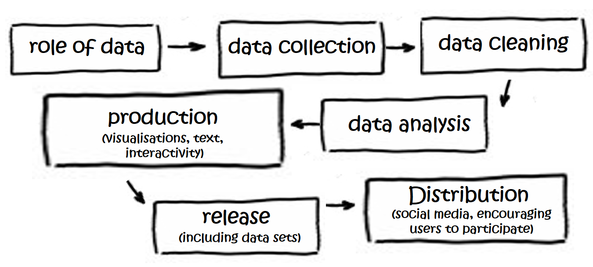

###### *Etapas de la producci&oacute;n de un proyecto de periodismo de datos seg&uacute;n Aitamurto, Sirkkunen y Lehtonen (2011)*

--

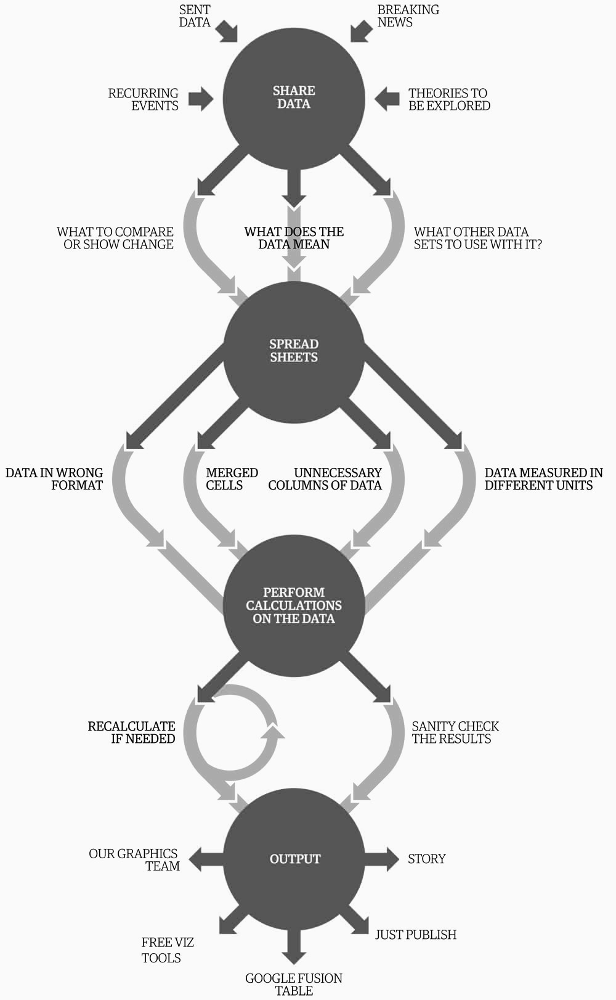

*Flujo de trabajo en periodismo de datos. Mark McCormick. Tomado de “A data journalism workflow” de Simon Rogers (2013)*

--

 

 --

 

---

### Formato de datos

* pdf
* txt, odf, doc, 
* CSV, TSV, *SV
* xls, xlsx, ods 
* Html, xml
* Jpeg, png, tiff 
* gis
* db 
* Json
* geojson, osm, kml

---

### Tama&ntilde;o de los datos

Hojas de c&aacute;lculo limitadas a procesar 1 mill&oacute;n de filas
  * Excel (1.048.576 x 16384)
  * Calc (1.048.576 x 1024)

--

### Tama&ntilde;o de los datos

* 2015 - Emails del servidor privado de Clinton - 50,547 p&aacute;ginas de         documentos - 7,570 enviados por Clinton 
* 2015 - Panama Papers
* 2016 - Informe Chilcot +2.6 millones de palabras

--

### Tama&ntilde;o de los datos

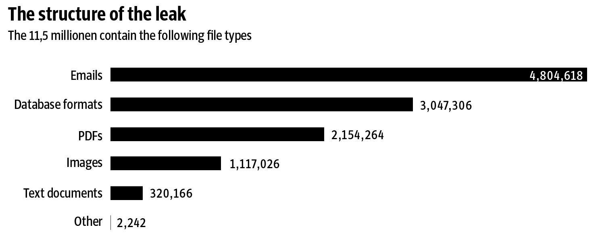

---

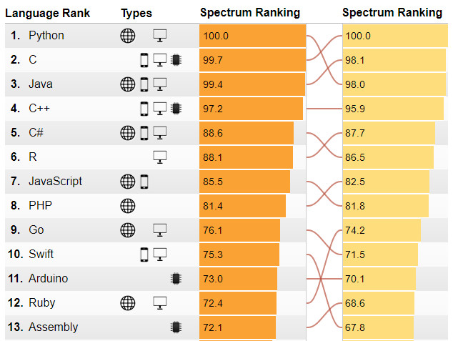

Ranking del grupo de investigaci&oacute;n IEEE Spectrum. 
Ver metodolog&iacute;a [aqu&iacute;](http://spectrum.ieee.org/ns/IEEE_TPL_2017/methods.html).

--

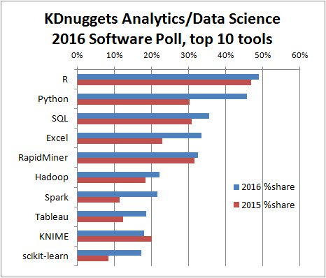

---

##### Principales librer&iacute;as de Python para an&aacute;lisis de datos en 2017, seg&uacute;n kdnuggets.com

* Numpy (Commits: +15000, Contributors: 522)
* SciPy (Commits: +17000, Contributors: 489)
* Pandas (Commits: 15089, Contributors: 762)
* Matplotlib (Commits: +21000, Contributors: 588)
* Seaborn (Commits: 17000, Contributors: 71)
* Bokeh (Commits: +15000, Contributors: 223)

--

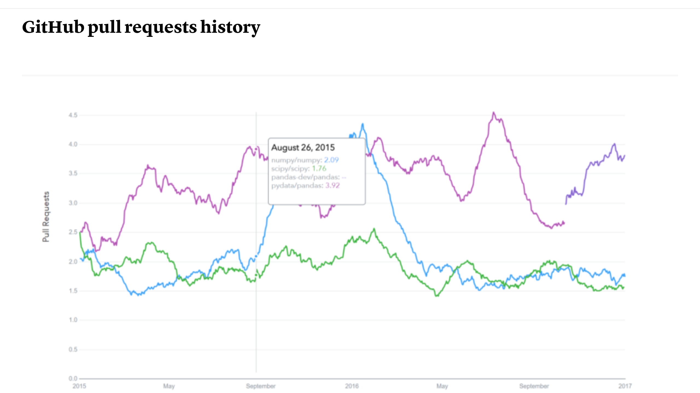

--

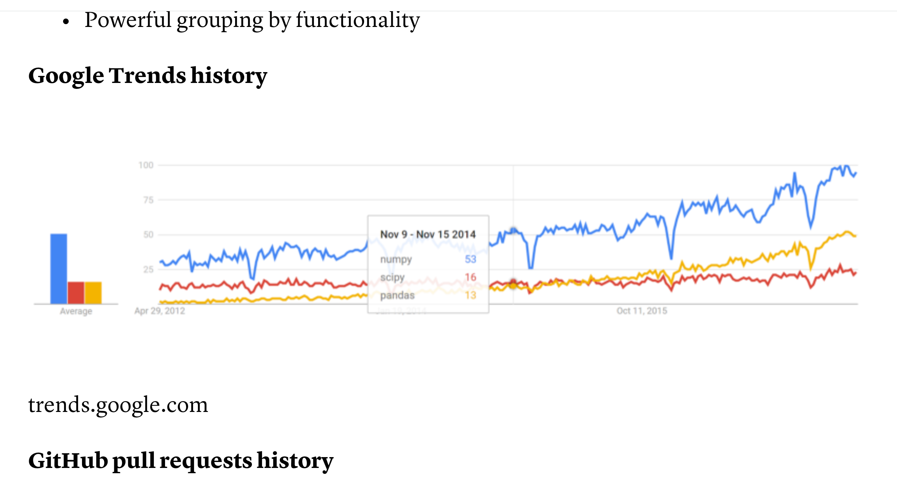

---

##### Lenguajes de programaci&oacute;n populares entre periodistas

* Python
* R
* JavaScript
* Pearl
* PHP
* Ruby

---

##### Ventajas de Python para periodistas

* Vers&aacute;til
* F&aacute;cil de aprender
* Intuitivo / Sintaxis clara
* Buena documentaci&oacute;n
* Muchas opciones de librer&iacute;as
* Opciones de librer&iacute;as para integraci&oacute;n con tecnolog&iacute;as de terceros
* Amplia adopci&oacute;n en la industria

--

##### Desventajas

* Curva de aprendizaje 
* Incompatibilidad de versiones 2.x y 3.x

---

##### Liber&iacute;as de Python populares en periodismo

* pandas
* numpy
* matplotlib
* re
* BeautifulSoup
* scrapy, tweepy
* NLTK
* SciKit-learn

---

##### pandas

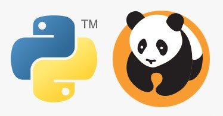

### pandas = &laquo;PANel  DAta&raquo;

*Concepto de Estad&iacute;stica y Econometr&iacute;a que designa datos multidimensionales medidos en diferentes intervalos de tiempo*

--

### pandas

|    |    |
|::::|::::|
|Autor original   |  Wes McKinney |
|Desarrolladores   |  Comunidad |
|&Uacute;ltima versi&oacute;n estable  |  0.20.2/ 4 junio de 2017 |
|Respositorio  |  https://github.com/pydata/pandas, https://github.com/pydata/pandas.git |
|Lenguaje   |  Python |
|Sistema operativo  |  Multiplataforma |
|Licencia |  BSD |
|Sitio web  |  pandas.pydata.org |

--

### Caracter&iacute;sticas

* Dataframes para manipulaci&oacute;n de datos con indexaci&oacute;n integrada
* Herramientas para importar y exportar datos entre estructuras de datos en memoria y diferentes formatos de archivo
* Gesti&oacute;n integrada de datos en blanco
* Modificaci&oacute;n y dinamizaci&oacute;n de conjuntos de datos

--

### Caracter&iacute;sticas (cont.)

* Subdivisi&oacute;n de grandes conjuntos de datos usando etiquetado e indexaci&oacute;n
* Inserci&oacute;n y eliminaci&oacute;n de columnas en estructuras de datos
* Agrupaci&oacute;n y combinaci&oacute;n de conjuntos de datos
* Funcionalidades para trabajo con series de tiempo

---

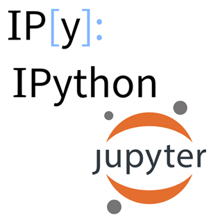

* Herramienta que permite utilizar c&oacute;digo, texto, expresiones matem&aacute;ticas, gr&aacute;ficos, e im&aacute;genes
* Interacci&oacute;n v&iacute;a navegador

--

Jupyter = JUlia + PYThon + R

--

&laquo;Los cultores de la programaci&oacute;n ilustrada pueden ser considerados ensayistas, cuya preocupaci&oacute;n principal es la exposici&oacute;n y la excelencia del estilo. Estos autores, con diccionario en mano, eligen cuidadosamente los nombres de sus variables y explican lo que significa cada una. Se esfuerzan para crear un programa que sea comprensible porque sus conceptos se han introducido en un orden que se aviene mejor al entendimiento humano, usando una mezcla de m&eacute;todos formales e informales que se refuerzan mutuamente.&raquo;

*Tomado de Donald E. Knuth (2009), Literate Programming. The Computer Journal* 

---

--

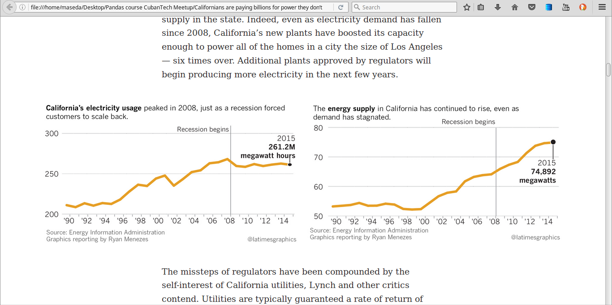

--

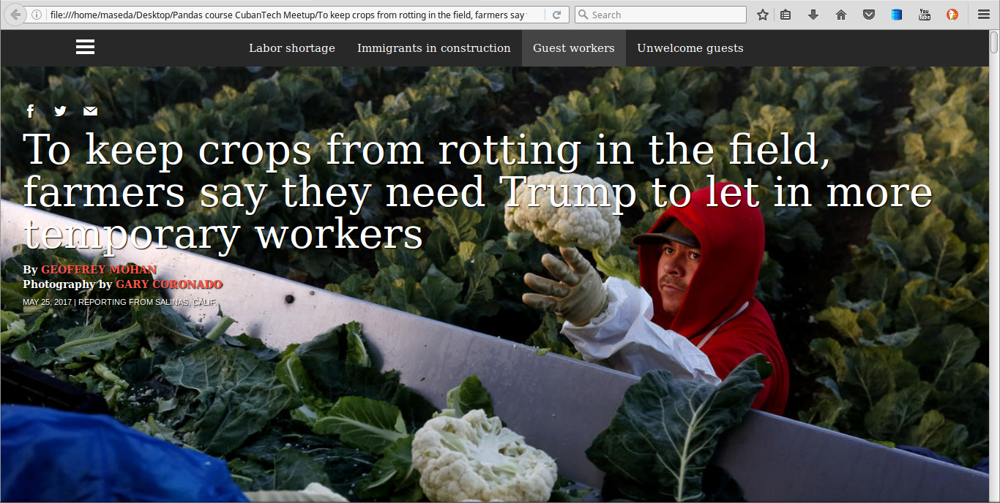

--

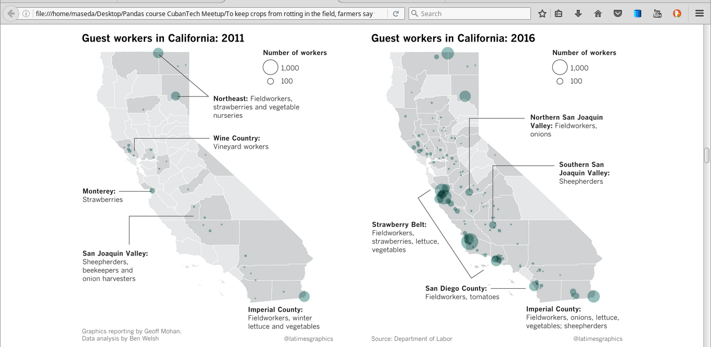

--

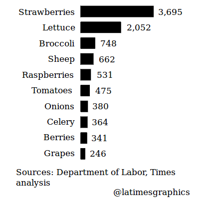

