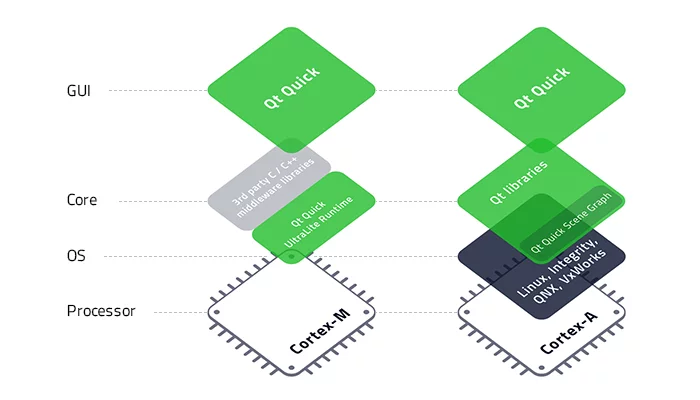
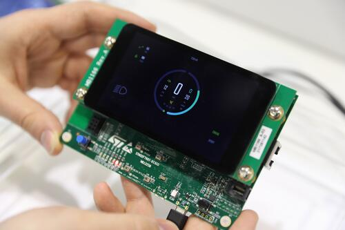
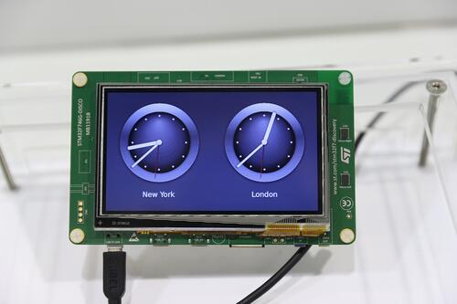
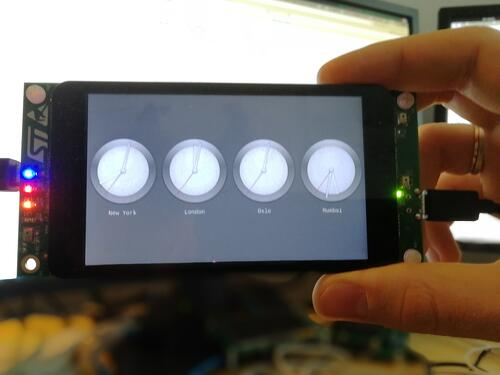
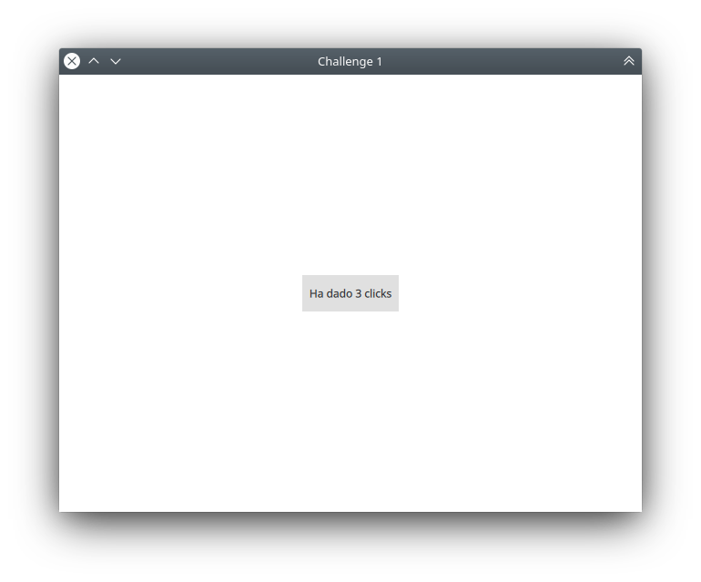
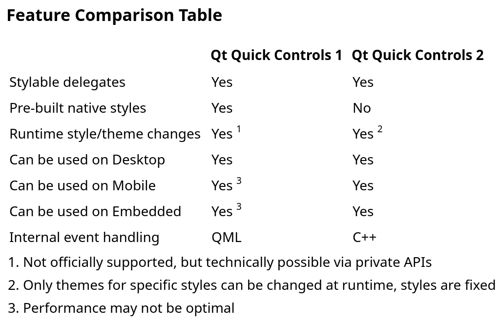
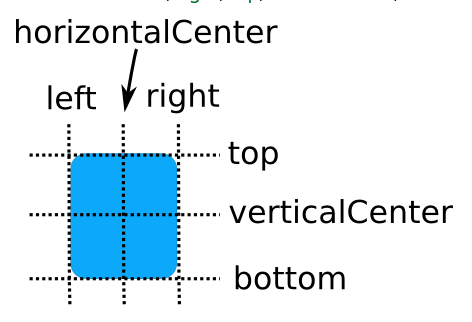
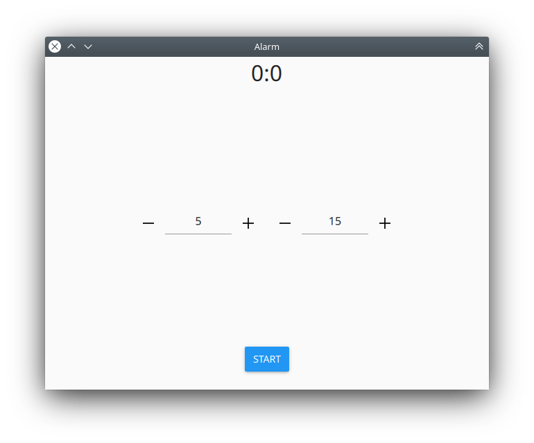

## Visual Programming with QML and Qt Quick

### Meetup #1: Basics

--------------

###### by Carlos Enrique Pérez Sánchez

---

# Let's get started!

---

## What we are covering?

- QML
	- What's that?
  - QML Syntax Basics
  - QML Object Attributes
  - **Property Binding**
  - Signal and Handler Event System

--

- Qt Quick
    - What's that?
    - Qt Quick 1? Qt Quick 2?
    - Visual types in QML
    - Responding to User Input in QML
    - Animations in QML
    - Displaying Text in QML
    - Layouts and positioners in QML
    - Style and Theme Support

--

- Advanced Application Development Topics
    - Best Practices for QML and Qt Quick
        - QML Coding Conventions
        - Performance Considerations And Suggestions
        - Scalable User Interfaces

---

# QML

--------------

### Qt Meta-Object Language

*Consult "The QML Reference" in Qt Help*

---

## What is QML?
*Consult "QML Applications" in Qt Help*

QML is a user interface specification and programming language

--

Is a declarative language that allows user interfaces to be described in terms of their visual components and how they interact and relate with one another

--

It allows developers and designers alike to create highly performant, fluidly animated and visually appealing applications

--

QML offers a highly readable, declarative, JSON-like syntax with support for imperative JavaScript expressions combined with dynamic property bindings

---

### What can we do with QML?

**Building applications for:**
- Desktop devices (Linux, MacOS, Windows)
- Mobile platforms (Android, iOS/tvOS/watchOS, WinRT)
- Embedded platforms (Embedded Linux, INTEGRITY, QNX, VxWorks)

---

### Embedded platforms?



--

#### STM32F769



--

#### STM32F746



--

#### STM32F469



--

[Qt for MCUs (download link)](img/Qt-for-MCUs-Ultimate-Performance-Tiny-Footprint.mkv "Qt for MCUs")

---

## Syntax basics
*Consult "Syntax basics" in Qt Help*

- Imports  
- Object declarations  
- Child objects  
- Comments  

--

```qml
import QtQuick 2.12
import QtQuick.Controls 2.12

/*
 Creating an ApplicationWindow is a lot
 better than creating just a Window.
*/

ApplicationWindow {
    id: app

    width: 400
    height: 500

    color: 'plum' // This is a HTML color
}
```

---

## QML Object Attributes
*Consult "QML Object Attributes" in Qt Help*

- The *id* Attribute
- Property Attributes
- Signal Attributes
- Signal Handler Attributes
- Method Attributes
- Enumeration Attributes

---

## Property Binding
*Consult "Property Binding" in Qt Help*

- Creating bindings
- Removing bindings

---

## Signal and Handler Event System
*Consult "Signal and Handler Event System" in Qt Help*

- Receiving signals with signal handlers
- Property change signal handlers
- Attached signal handlers
- Adding signals to custom QML types
- Connecting signals to methods and signals

---

## Challenge 1



--

```qml
import QtQuick 2.12
import QtQuick.Controls 2.12

ApplicationWindow {
    visible: true
    width: 640
    height: 480
    title: qsTr("Challenge 1")

    Button {
        id: myButton

        property int numberOfClicks: 0

        anchors.centerIn: parent
        text: "Ha dado " + numberOfClicks + " clicks"

        onClicked: {
            numberOfClicks++
        }
    }
}
```

--

### Challenge 1.1

* Bind the `height` of the button to `40 * (numberOfClicks + 1)`
* Set the `highlighted` property of the button to `true` if the number of clicks is even

--

```qml
import QtQuick 2.12
import QtQuick.Controls 2.12

ApplicationWindow {
    visible: true
    width: 640
    height: 480
    title: qsTr("Challenge 1.1")

    Button {
        id: myButton

        property int numberOfClicks: 0

        anchors.centerIn: parent
        height: 40 * (numberOfClicks + 1)
        text: "Ha dado " + numberOfClicks + " clicks"
        highlighted: numberOfClicks % 2 === 0

        onClicked: {
            numberOfClicks++
        }
    }
}
```

---

# Qt Quick

---

## What is Qt Quick?
*Consult "QML Applications" in Qt Help*

Qt Quick is the standard library of types and functionality for QML

--

It includes visual types, interactive types, animations, models and views, particle effects and shader effects. A QML application developer can get access to all of that functionality with a single import statement

---

## Qt Quick 1 vs Qt Quick 2

Qt Quick Controls 1 was originally developed to support desktop platforms, with mobile and embedded support coming shortly afterwards

--

They have a very broad scope, in that they provide a styling system flexible enough to allow the development of applications that have either a platform-dependent or platform-independent style

--

On embedded systems, where the hardware has limited resources, this approach can be inefficient. Qt Quick Controls 2 was designed to solve this problem

---

### QML vs C++

In many cases, the internal state of a control can be more efficiently processed in C++. For example, handling input events in C++ makes a difference for controls that would otherwise need to create internal `MouseAreas` and attached `Keys` objects

---

### Styles

Not only does handling events and logic in C++ increase performance, but it allows the visual QML layer to be a simple, declarative layer on top. This is reflected in the structure of the controls project: all visual implementations sit in the imports folder, so that users who want to create their own complete style can copy the folder and start tweaking

--

In Qt Quick Controls 2, styles no longer provide components that are dynamically instantiated by controls, but controls themselves consist of item delegates that can be replaced

--

### Modularity and Simplicity

In Qt Quick Controls 1:
```qml
ScrollView {
    horizontalScrollBarPolicy: Qt.ScrollBarAlwaysOff
    Flickable {
        // ...
    }
}
```

In Qt Quick Controls 2:

```qml
Flickable {
    // ...
    ScrollBar.vertical: ScrollBar { }
}
```

--

*The API of Qt Quick Controls 2 aims to be clean and simple. Common operations are easy, and more advanced ones are liberally documented with snippets that can be copied into your code*

*-- Qt Docs*

--



---

## Visual Types in QML
*Consult "Qt Quick", "Qt Quick Controls 2", "Use Case - Visual Elements In QML", "Qt Quick QML Types" and "Qt Quick Controls Examples" in Qt Help*

---

## Responding to User Input in QML
*Consult "Button", "Qt Quick Controls Guidelines" and "First Steps with QML" in Qt Help*

---

## Style and Theme Support
*Consult "Styling Qt Quick Controls 2" and related styles, and "Qt Quick Controls Configuration File" in Qt Help*

--

Qt Quick Controls Configuration File:

```
[Controls]
Style=Material

[Material]
Theme=Light
Accent=Blue
Primary=BlueGray
Foreground=Brown
Background=Grey

Variant=Dense
```

---

## Animations in QML
*Consult "Use case - Animations In QML", "Important Concepts in Qt Quick - States, Transitions and Animations" and "Animations and Transitions In Qt Quick" in Qt Help*

--

### Fluid UIs

Animations are a primary concept in QML

--

QML was designed to facilitate the creation of fluid UIs. These are user interfaces where the UI components animate instead of appearing, disappearing, or jumping abruptly.

--

Qt Quick provides two simple ways to have UI components move with animation instead of instantly appearing at their new location:

- States and Transitions
- Animating Property Changes (behaviors)

--

* **PropertyAnimation**
* NumberAnimation
* ColorAnimation
* RotationAnimation

... and more

--

#### States and Transitions

```qml
Rectangle {
    id: button
    anchors.centerIn: parent
    width: 75; height: 75
    state: "RELEASED"

    MouseArea {
        anchors.fill: parent
        onPressed: button.state = "PRESSED"
        onReleased: button.state = "RELEASED"
    }

    states: [
        State {
            name: "PRESSED"
            PropertyChanges { target: button; color: "blue"}
        },
        State {
            name: "RELEASED"
            PropertyChanges { target: button; color: "#BBBBFF"}
        }
    ]

    transitions: [
        Transition {
            from: "PRESSED"
            to: "RELEASED"
            ColorAnimation { target: button; duration: 200 }
        },
        Transition {
            from: "RELEASED"
            to: "PRESSED"
            ColorAnimation { target: button; duration: 200 }
        }
    ]
}
```

--

#### Behavior

```qml
Rectangle {
    id: button
    anchors.centerIn: parent
    width: 75; height: 75
    color: mouseArea.pressed ? "red" : "yellow"
    Behavior on color { ColorAnimation {} }

    MouseArea {
        id: mouseArea
        anchors.fill: parent
    }
}
```

--

## Challenge 2

Animate all changes to the `height` property of the button of the previous challenge

--

#### Applying animations in a sequence and/or in parallel

```qml
SequentialAnimation {
    id: someAnimation

    NumberAnimation { /* ... */ }
    PauseAnimation { duration: 1000 }
    ColorAnimation { /* ... */ }
    // ...
}
```

```qml
ParallelAnimation {
    id: someAnimation

    NumberAnimation { /* ... */ }
    ColorAnimation { /* ... */ }
    // ...
}
```

--

## Challenge 3

Design the following UI:


--

- Square side: `100`
- Square position: `Centered`
- Square color: `"teal"`
- Square border color: `Qt.darker("teal")`
- Square border width: `10`
- Button text: `"Start"`
- Button horizontal position: `Horizontally centered`
- Button vertical position: `Bottom`, `margin=10`
- Style: `Material`
- Material theme: `Light`
- Material accent: `Blue`

--

```qml
import QtQuick 2.12
import QtQuick.Controls 2.12

ApplicationWindow {
    id: applicationWindow
    visible: true
    width: 640
    height: 480
    title: qsTr("Challenge 3")

    Rectangle {
        id: square

        anchors.centerIn: parent
        width: 100
        height: width
        color: "teal"
        border { color: Qt.darker("teal"); width: 10 }
    }

    Button {
        id: button

        anchors { horizontalCenter: parent.horizontalCenter; bottom: parent.bottom; bottomMargin: 10 }

        text: "Start"
        highlighted: true
    }
}
```

--

Make the button smoothly ascend and disappear (at the same time) in 0.5 seconds when clicked

--

This can be done by adding the following lines to the button's code:


```qml
onClicked: {
    buttonAnimation.start()
}

ParallelAnimation {
    id: buttonAnimation

    NumberAnimation { target: button; property: "anchors.bottomMargin"; to: 30; duration: 500 }
    NumberAnimation { target: button; property: "opacity"; to: 0.0; duration: 500 }
}
```

--

Make the square grow to 200 pixels of side and then back to 100, repeatedly. All every second, after the button is clicked.

--

This can be done by adding the following code to the square's code:

```qml
SequentialAnimation {
    id: animation

    loops: Animation.Infinite

    NumberAnimation { target: square; property: "width"; to: 200; duration: 500 }
    NumberAnimation { target: square; property: "width"; to: 100; duration: 500 }
}
```

or...

```qml
SequentialAnimation on width {
    id: animation

    loops: Animation.Infinite
    running: false // necessary when applying over a property ("on width") to make it not running from the beginning

    NumberAnimation { to: 200; duration: 500 }
    NumberAnimation { to: 100; duration: 500 }
}
```

--

And adding the following function to the square to run the animation:

```qml
function runAnimation() {
    animation.start()
}
```

And calling it when the button is clicked (in the button's code):

```qml
onClicked: {
    square.runAnimation()
    buttonAnimation.start()
}
```

--

Make the button rotate 360º over itself every second, indefinitely.

--

This can be done by enclosing the square animation into a `ParallelAnimation`:

```qml
ParallelAnimation {
    id: animation

    RotationAnimation { target: square; to: from + 360; duration: 1000; loops: Animation.Infinite }

    SequentialAnimation {
        loops: Animation.Infinite

        NumberAnimation { target: square; property: "width"; to: 200; duration: 500 }
        NumberAnimation { target: square; property: "width"; to: 100; duration: 500 }
    }
}
```

--

Create two new components: `Square` and `AnimatedButton` and put the respective objects there.

---

## Displaying Text in QML
*Consult "Text", "Use Case - Displaying Text In QML" and "Supported HTML Subset" in Qt Help*

- Text properties
- HTML

--

```qml
Text {
    text: "Hello World!"
    color: "#9C27B0"
    font { pointSize: 24; bold: true; italic: true }
}
```

```qml
Text {
    text: "<i>Hello <b>World!</b></i>"
}
```

---

## Layouts and positioners in QML
*Consult "Use Case - Positioners and Layouts In QML" and all the links provided in that page in Qt Help*

- Manual Positioning
- Anchors
- Layouts

--

### Anchors



--

### Layouts

```qml
import QtQuick 2.12
import QtQuick.Controls 2.12

ApplicationWindow {
    RowLayout {
        anchors.fill: parent
        spacing: 6
        Rectangle {
            color: 'azure'
            Layout.preferredWidth: 100
            Layout.preferredHeight: 150
        }
        Rectangle {
            color: "plum"
            Layout.fillWidth: true
            Layout.fillHeight: true
        }
    }
}
```

---

# Advanced Application Development Topics
*Consult "Best Practice Guides" in Qt Help*

---

## Best Practices for QML and Qt Quick
*Consult "Best Practices for QML and Qt Quick" in Qt Help*

---

### QML Coding Conventions
*Consult "QML Coding Conventions" in Qt Help*

--

#### QML Object Declarations
Throughout our documentation and examples, QML object attributes are always structured in the following order:

- id
- property declarations
- signal declarations
- JavaScript functions
- object properties
- child objects
- states
- transitions

For better readability, we separate these different parts with an empty line.

---

#### Grouped Properties

If using multiple properties from a group of properties, consider using group notation instead of dot notation if it improves readability

--

For example, this:

```qml
Rectangle {
    anchors.left: parent.left
    anchors.top: parent.top
    anchors.right: parent.right
    anchors.leftMargin: 20
}
```

could be written like this:

```qml
Rectangle {
    anchors {
      left: parent.left
      top: parent.top
      right: parent.right
      leftMargin: 20
    }
}
```

---

#### Lists

If a list contains only one element, we generally omit the square brackets

--

For example, it is very common for a component to only have one state. In this case, instead of

```qml
states: [
    State {
        name: "open"
        PropertyChanges { target: container; width: 200 }
    }
]
```

We will write this:

```qml
states: State {
    name: "open"
    PropertyChanges { target: container; width: 200 }
}
```

---

#### JavaScript Code

If the script is a single expression, we recommend writing it inline:

```qml
Rectangle { color: "blue"; width: parent.width / 3 }
```

--

If the script is only a couple of lines long, we generally use a block:

```qml
Rectangle {
    color: "blue"
    width: {
        var w = parent.width / 3
        console.debug(w)
        return w
    }
}
```

--

If the script is more than a couple of lines long or can be used by different objects, we recommend creating a function and calling it like this:

```qml
function calculateWidth(object)
{
    var w = object.width / 3
    // ...
    // more javascript code
    // ...
    console.debug(w)
    return w
}

Rectangle { color: "blue"; width: calculateWidth(parent) }
```

--

For long scripts, we will put the functions in their own JavaScript file and import it like this:

```qml
import "myscript.js" as Script

Rectangle { color: "blue"; width: Script.calculateWidth(parent) }

```

---

### Performance Considerations And Suggestions
*Consult "Performance Considerations And Suggestions" in Qt Help*

QML is more or less an interpreted programming language. This will radically change in Qt 6, as we want to make the QML core based on C++ instead of JavaScript

--

Currently, as Qt 5 uses a JavaScript backend for QML, there are some performance considerations that developers must take in account, mainly when targeting low-power devices such as mobile or embedded systems

---

#### Timing Considerations

As an application developer, you must strive to allow the rendering engine to achieve a consistent 60 frames-per-second refresh rate. 60 FPS means that there is approximately 16 milliseconds between each frame in which processing can be done, which includes the processing required to upload the draw primitives to the graphics hardware

--

In practice, this means that the application developer should:
- use asynchronous, event-driven programming wherever possible
- use worker threads to do significant processing
- never manually spin the event loop
- never spend more than a couple of milliseconds per frame within blocking functions

Failure to do so will result in skipped frames, which has a drastic effect on the user experience.

--

**Note**: A pattern which is tempting, but should *never* be used, is creating your own `QEventLoop` or calling `QCoreApplication::processEvents()` in order to avoid blocking within a C++ code block invoked from QML. This is dangerous, because when an event loop is entered in a signal handler or binding, the QML engine continues to run other bindings, animations, transitions, etc. Those bindings can then cause side effects which, for example, destroy the hierarchy containing your event loop.

---

#### JavaScript Code

Most QML applications will have a large amount of JavaScript code in them, in the form of dynamic functions, signal handlers, and property binding expressions

--

Due to the deep link between QML and JavaScript, loading a JS function can be faster than loading a C++ method. However, executing JS code is many times slower than executing C++ code. You should not use JS for long-time processing, use C++ instead.

--

Things to avoid in binding expressions to maximize optimizability:
- declaring intermediate JavaScript variables
- accessing "var" properties
- calling JavaScript functions
- constructing closures or defining functions within the binding expression
- accessing properties outside of the immediate evaluation scope
- writing to other properties as side effects

---

#### Common UI elements

- **Text:**
  - Use the `PlainText` format instead of `StyledText` wherever possible, setting it explicitly
  - Use only `StyledText` only if you want to use HTML tags
  - You should only use AutoText if the text might be (but probably isn't) `StyledText` as this mode will incur a parsing cost

--

- **Images:**
  - Use `asynchronous` loading on large images
  - Set an explicit `sourceSize` to keep in memory a smaller image
  - Avoid smoothing images by enabling `image.smooth` only if the size of the image is not equal to its `sourceSize`
  - Avoid run-time composition by providing the pre-composed image resource with your application (for example, providing elements with shadow effects)

---

#### Animations

Avoid running JavaScript during animation. For example, running a complex JavaScript expression for each frame of an `x` property animation should be avoided. Developers should be especially careful using script animations, as these are run in the main thread (and therefore can cause frames to be skipped if they take too long to complete).

--

*Consult "Performance Considerations And Suggestions" in Qt Help*

---

### Scalable User Interfaces
*Consult "Scalability", "High DPI Displays" and "High-DPI Support in Qt Quick Controls 2" in Qt Help*

**Warning:** Qt Quick Controls 1 are not compatible with Qt's automatic high-DPI scaling. There is currently no available solution for high-DPI support in applications wishing to mix Qt Quick Controls 1 and Qt Quick Controls 2.

--

- **Text:**
  - Use `font.pointSize` instead of `font.pixelSize`

- **Images and Icons:**
  - Use SVG for icons and small images

---

## Challenge

#### A Timer:


--

* Set the minutes and seconds in the `SpinBox`
* Click the *START* button to begin the countdown using a `Timer`
* Show the remaining time in the upper `Label`
* The text of the button must be *STOP* while the timer is running or the alarm is active
* When the timeout comes, activate the alarm by animating the color of the window from "red" to "white" every 1s until the user clicks *STOP* to bring the application to the initial state

---

## Upcoming events

* Integrating QML with a backend language
  - C++
  - Python
  - Go (no officially supported)
* Model/View Programming with QML
  - Model
  - Delegates

---

# Wrapping up

Thank you for coming!