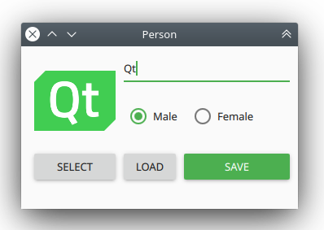
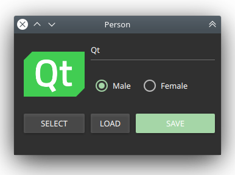
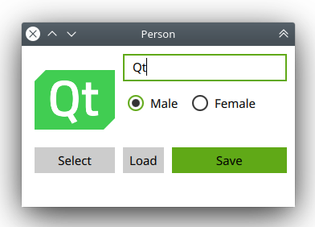
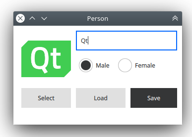
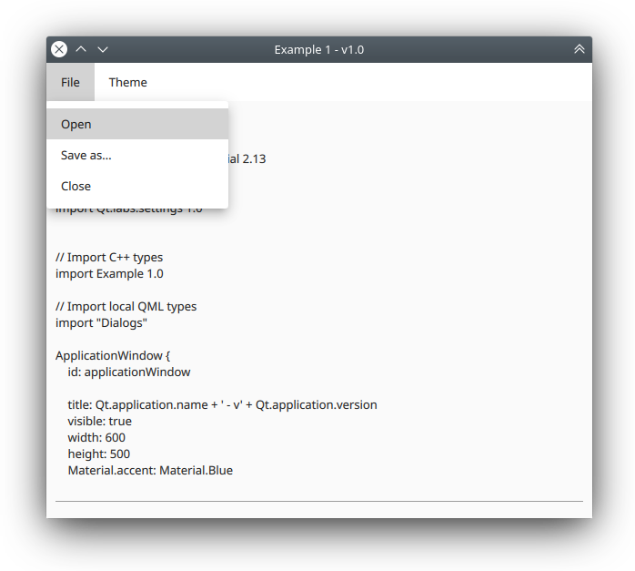

## Visual Programming with QML and Qt Quick

### Meetup #2: Integrating QML with a backend language

--------------

###### by Carlos Enrique Pérez Sánchez

---

# Let's get started!

---

## What we are covering?

- The Qt Meta-Object System
	- MOC vs Templates
		- Performance implications
- Integrating QML and JavaScript
- Integrating QML and C++
- Integrating QML and Python

---

# The Qt Meta-Object System

*Consult "The Meta-Object System", "Why Does Qt Use MOC for Signals and Slots?" in Qt Help*

--

Qt's meta-object system provides the signals and slots mechanism for inter-object communication, run-time type information, and the dynamic property system

--

The meta-object system is based on three things:
1. The `QObject` class
2. The `Q_OBJECT` macro
3. The Meta-Object Compiler - `moc`

---

## MOC vs Templates

**Pros of using templates against MOC**
* Allows the compiler to generate code on the fly
* Are very fast

**Cons of using templates against MOC**
* code size
* readability
* usability
* extensability
* robustness
* ultimately design beauty

--

### Performance implications

* Emmiting a signal is approximately the cost of **four** ordinary function calls with common template implementations
* Qt requires effort comparable to about **ten** function calls

--

### Why?

Qt's signals & slots mechanism includes:
* A generic marshaller
* Introspection
* Queued calls between different threads
* Unmatched **runtime safety**

--

## Calling performance is not everything

---

# Integrating QML and JavaScript

*Consult "Integrating QML and JavaScript", "Use Case - Integrating JavaScript in QML" in Qt Help*

--

The QML language uses a JSON-like syntax and allows various expressions and methods to be defined as JavaScript functions.  
It also allows users to import JavaScript files and use the functionality those imports provide.

--

## JavaScript Expressions

- Signals handlers

```qml
Button {
    id: myButton

    onClicked: {
        // ...
    }
}
```

--

- Functions

```qml
function foo(x, y) {
    // ...
}
```

--

- Property bindings

```qml
height: 100

height: parent.height / 2

height: Math.min(parent.width, parent.height)

height: parent.height > 100 ? parent.height : parent.height/2

height: {
    if (parent.height > 100)
        return parent.height
    else
        return parent.height/2
}

height: someMethodThatReturnsHeight()
```

--

- JS resources

```qml
// MyButton.qml
import QtQuick 2.0
import "my_button_impl.js" as Logic

Rectangle {
    id: rect
    width: 200
    height: 100

    MouseArea {
      id: mouseArea
      anchors.fill: parent
      onClicked: Logic.onClicked(rect)
    }
}
```

---

# Integrating QML and C++

--







--

*person.h*

```c++
#ifndef PERSON_H
#define PERSON_H

#include <QObject>
#include <QFileDialog>
#include <QFile>
#include <QDataStream>

class Person : public QObject
{
    Q_OBJECT

    Q_PROPERTY(QString name READ getName WRITE setName NOTIFY nameChanged)
    Q_PROPERTY(bool isMale READ getIsMale WRITE setIsMale NOTIFY isMaleChanged)
    Q_PROPERTY(QString imagePath READ getImagePath WRITE setImagePath NOTIFY imagePathChanged)

public:
    explicit Person(QObject *parent = nullptr);

    QString getName() const;
    void setName(const QString &value);

    bool getIsMale() const;
    void setIsMale(bool value);

    QString getImagePath() const;
    void setImagePath(const QString &value);

signals:
    void nameChanged(const QString &value);
    void isMaleChanged(bool value);
    void imagePathChanged(const QString &value);

public slots:
    QString selectImage();
    bool save();
    bool load();

private:
    QString name;
    bool isMale = true;
    QString imagePath;
};

#endif // PERSON_H
```

--

*person.cpp*

```c++
#include "person.h"

Person::Person(QObject *parent) : QObject(parent)
{

}

QString Person::getName() const
{
    return name;
}

void Person::setName(const QString &value)
{
    if (name != value) {
        name = value;
        emit nameChanged(value);
    }
}

bool Person::getIsMale() const
{
    return isMale;
}

void Person::setIsMale(bool value)
{
    if (isMale != value) {
        isMale = value;
        emit isMaleChanged(value);
    }
}

QString Person::getImagePath() const
{
    return imagePath;
}

void Person::setImagePath(const QString &value)
{
    if (imagePath != value) {
        imagePath = value;
        emit imagePathChanged(value);
    }
}

QString Person::selectImage()
{
    QString path = QFileDialog::getOpenFileName();
    if (!path.isEmpty()) {
        setImagePath(path);
    }

    return path;
}

bool Person::save()
{
    QString path = QFileDialog::getSaveFileName();
    if (!path.isEmpty()) {
        QFile f(path);
        if (!f.open(QFile::WriteOnly)) {
            return false;
        }

        QDataStream out(&f);
        out << name << isMale << imagePath;
        f.close();
        return true;
    }
    return false;
}

bool Person::load()
{
    QString path = QFileDialog::getOpenFileName();
    if (!path.isEmpty()) {
        QFile f(path);
        if (!f.open(QFile::ReadOnly)) {
            return false;
        }

        QDataStream in(&f);
        QString tempName;
        bool tempIsMale;
        QString tempImagePath;
        in >> tempName >> tempIsMale >> tempImagePath;
        setName(tempName);
        setIsMale(tempIsMale);
        setImagePath(tempImagePath);
        f.close();
        return true;
    }
    return false;
}
```

--

*main.cpp*

```c++
#include <QApplication>
#include <QQmlApplicationEngine>

#include "Person/person.h"

int main(int argc, char *argv[])
{
    QCoreApplication::setAttribute(Qt::AA_EnableHighDpiScaling);

    QApplication app(argc, argv);
    app.setOrganizationName("Cubantech");
    app.setApplicationName("Person");
    app.setApplicationVersion("1.0");

    qmlRegisterType<Person>("Backend", 1, 0, "Person");

    QQmlApplicationEngine engine;
    const QUrl url(QStringLiteral("qrc:/main.qml"));
    QObject::connect(&engine, &QQmlApplicationEngine::objectCreated,
                     &app, [url](QObject *obj, const QUrl &objUrl) {
        if (!obj && url == objUrl)
            QCoreApplication::exit(-1);
    }, Qt::QueuedConnection);
    engine.load(url);

    return app.exec();
}

```

--

*main.qml*

```qml
import QtQuick 2.13
import QtQuick.Controls 2.13
import QtQuick.Layouts 1.13

import Backend 1.0

ApplicationWindow {
    id: applicationWindow

    visible: true
    width: 340
    height: 200
    title: Qt.application.name + ' - v' + Qt.application.version

    Person {
        id: person

        name: textFieldName.text
        isMale: radioButtonMale.checked
    }

    Image {
        id: image

        width: 100
        height: 100
        anchors.left: parent.left
        anchors.leftMargin: 16
        anchors.top: parent.top
        anchors.topMargin: 16
        source: person.imagePath ? ("file:///" + person.imagePath) : ""
        fillMode: Image.PreserveAspectFit
    }

    Button {
        id: buttonSelectImage

        text: qsTr("Select")
        anchors.top: image.bottom
        anchors.topMargin: 10
        anchors.right: image.right
        anchors.rightMargin: 0
        anchors.left: image.left
        anchors.leftMargin: 0

        onClicked: {
            person.selectImage()
        }
    } // Button (select image)

    TextField {
        id: textFieldName

        text: qsTr("")
        anchors.top: parent.top
        anchors.topMargin: 10
        anchors.right: parent.right
        anchors.rightMargin: 10
        anchors.left: image.right
        anchors.leftMargin: 10
        placeholderText: "Name"
        focus: true
    }

    RowLayout {
        id: rowLayout

        anchors.left: textFieldName.left
        anchors.leftMargin: 0
        anchors.top: textFieldName.bottom
        anchors.topMargin: 10

        RadioButton {
            id: radioButtonMale
            text: qsTr("Male")
            checked: true
        }

        RadioButton {
            id: radioButtonFemale
            text: qsTr("Female")
        }
    } // RowLayout

    Button {
        id: buttonSave

        text: qsTr("Save")
        anchors.left: buttonLoad.right
        anchors.leftMargin: 10
        anchors.top: buttonLoad.top
        anchors.right: parent.right
        anchors.rightMargin: 10
        highlighted: true

        onClicked: {
            person.save()
        }
    } // Button (save)

    Button {
        id: buttonLoad

        text: qsTr("Load")
        anchors.left: textFieldName.left
        anchors.leftMargin: 0
        anchors.top: buttonSelectImage.top
        anchors.topMargin: 0

        onClicked: {
            if (person.load()) {
                textFieldName.text = person.name
                if (person.isMale) {
                    radioButtonMale.checked = true
                } else {
                    radioButtonFemale.checked = true
                }
            }
        }
    } // Button (load)
}
```

--

qtquickcontrols2.conf

```ini
; This file can be edited to change the style of the application
; Read "Qt Quick Controls 2 Configuration File" for details:
; http://doc.qt.io/qt-5/qtquickcontrols2-configuration.html

[Controls]
Style=Material

[Material]
Accent=Green
Variant=Dense
; Theme=Dark

[Universal]
Accent=Green
; Theme=Dark

```

---

### Challenge 1

***A simple text editor***
- Open file
- Save file
- Customize theme



--

*filemanager.h*

```c++
#ifndef FILEMANAGER_H
#define FILEMANAGER_H

#include <QObject>
// File dialogs are widget-based. If you add `Qt += widgets` to your .pro file you can just #include <QFileDialog>
#include <QFileDialog>
#include <QFile>
#include <QTextStream>

class FileManager : public QObject
{
    Q_OBJECT
public:
    explicit FileManager(QObject *parent = nullptr);

signals:

public slots:
    QString open();
    bool saveAs(const QString &textToSave);
};

#endif // FILEMANAGER_H
```

--

*filemanager.cpp*

```c++
#include "filemanager.h"

FileManager::FileManager(QObject *parent) : QObject(parent)
{
   // Initialization function
}

QString FileManager::open()
{
    QString path = QFileDialog::getOpenFileName(); // show a dialog to peek a file
    if (!path.isEmpty()) { // if the path is not empty (i.e. the user do not rejected the dialog)
        QFile f(path); // initialize a file with the selected path
        if (f.open(QFile::ReadOnly)) { // open the file for reading, return true on success, false otherwise
            QTextStream in(&f); // create a stream of text pointing to the file above
            QString content = in.readAll(); // read the whole file as a text stream
            f.close(); // close the file
            return content; // return the content
        }
    }

    return QString(); // return an empty string if something fails
}

bool FileManager::saveAs(const QString &textToSave)
{
    bool ok = false;
    QString path = QFileDialog::getSaveFileName(); // show a dialog to save a file
    if (!path.isEmpty()) { // if the path is not empty (i.e. the user do not rejected the dialog)
        QFile f(path); // initialize a file with the selected path
        if (f.open(QFile::WriteOnly)) { // open the file for writing, return true on success, false otherwise
            QTextStream out(&f); // create a stream of text pointing to the file above
            out << textToSave; // write the whole text as a text stream to the file
            ok = true; // all is OK, update the result
            f.close(); // close the file
        }
    }

    return ok; // return a result
}
```

--

*main.cpp*

```c++
// QGuiApplication requires less initialization, but you must must include
// QApplication if you want to show widget-based controls like QFileDialog.
#include <QApplication>
#include <QQmlApplicationEngine>

// Include the C++ classes you want to expose to QML
#include "src/core/FileManager/filemanager.h"

int main(int argc, char *argv[])
{
    // Enable High DPI Scaling
    QCoreApplication::setAttribute(Qt::AA_EnableHighDpiScaling);

    QApplication app(argc, argv); // Create a QApplication with the parameters pased
    // The following is required to manage configuration files with QSettings and Settings
    app.setOrganizationName("Cubantech"); // Set the name of your organization
    app.setApplicationName("Example 1"); // Set the name of your application
    app.setApplicationVersion("1.0"); // Set the version of the application

    // Register C++ types to QML
    qmlRegisterType<FileManager>("Example", 1, 0, "FileManager");

    QQmlApplicationEngine engine; // Create the QML engine
    const QUrl url(QStringLiteral("qrc:/qml/ui/main.qml")); // URL of the root QML component (must be an ApplicationWindow or Window)
    // Check errors after object creation
    QObject::connect(&engine, &QQmlApplicationEngine::objectCreated,
                     &app, [url](QObject *obj, const QUrl &objUrl) {
        if (!obj && url == objUrl)
            QCoreApplication::exit(-1);
    }, Qt::QueuedConnection);
    engine.load(url); // Load the selected root component

    return app.exec(); // Enter the event loop and exit the application when it ends, returning its error code
}
```

--

*main.qml*

```qml
import QtQuick 2.13
import QtQuick.Controls 2.13
import QtQuick.Controls.Material 2.13

// Qt Labs imports
import Qt.labs.settings 1.0


// Import C++ types
import Example 1.0

// Import local QML types
import "Dialogs"

ApplicationWindow {
    id: applicationWindow

    title: Qt.application.name + ' - v' + Qt.application.version
    visible: true
    width: 600
    height: 500
    Material.accent: Material.Blue

    function loadUiSettings() {
        applicationWindow.Material.theme = ~~settings.value("ui/theme", Material.Light)
    }

    Component.onCompleted: {
        loadUiSettings()
    }

    menuBar: ApplicationMenuBar { }

    ScrollView {

        anchors.margins: 10
        anchors.fill: parent
        clip: true

        TextArea {
            id: textArea

            focus: true
            selectByMouse: true
        }
    }

    FileManager {
        id: fileManager
    }

    MessageDialog {
        id: messageDialog

        anchors.centerIn: Overlay.overlay
        width: applicationWindow.width > 300 ? 300 - 40 : applicationWindow.width - 40
        height: applicationWindow.height > 250 ? 250 - 40 : applicationWindow.height - 40
        modal: true
        title: "Message"
    }

    Settings {
        id: settings
    }
}
```

--

*ApplicationMenuBar.qml*

```qml
import QtQuick 2.13
import QtQuick.Controls 2.13
import QtQuick.Controls.Material 2.13

MenuBar {
    Menu {
        title: "File"
        
        MenuItem {
            text: "Open"
            onTriggered: {
                textArea.text = fileManager.open()
            }
        }
        
        MenuItem {
            text: "Save as..."
            onTriggered: {
                var result = fileManager.saveAs(textArea.text)
                messageDialog.message = result ? "Saved" : "Error"
                messageDialog.open()
            }
        }
        MenuItem { text: "Close"; onTriggered: Qt.quit() }
    } // Menu (File)
    
    Menu {
        title: "Theme"
        
        MenuItem {
            text: "Material Light"
            enabled: Material.theme !== Material.Light
            
            onTriggered: {
                applicationWindow.Material.theme = Material.Light
                settings.setValue("ui/theme", Material.Light)
            }
        }
        MenuItem {
            text: "Material Dark"
            enabled: Material.theme !== Material.Dark
            
            onTriggered: {
                applicationWindow.Material.theme = Material.Dark
                settings.setValue("ui/theme", Material.Dark)
            }
        }
    } // Menu (theme)
}
```

--

*MessageDialog.qml*

```qml
import QtQuick 2.13
import QtQuick.Controls 2.13

Dialog {
    id: messageDialog

    property alias message: labelMessage.text
    
    standardButtons: Dialog.Ok
    
    Label {
        id: labelMessage

        anchors.fill: parent
        wrapMode: Text.Wrap
    }
}
```

---

# Integrating QML and Python

--

## Qt for Python (PySide2)


--

*The **Qt for Python** project aims to provide a complete port of the PySide module to Qt 5. The development started on GitHub in May 2015. The project managed to port PySide to Qt 5.3, 5.4 & Qt 5.5.*

--

*The **PySide2** module was released mid June 2018 as a Technical Preview (supporting Qt 5.11), and it has been fully supported since Qt 5.12.*

--

*&nbsp;**Qt for Python** is available under LGPLv3/GPLv2 and commercial license for the following platforms*

&nbsp;     | Linux  |        | macOS  |        | Windows | &nbsp;
---------- | ------ | ------ | ------ | ------ | ------- | ------
           | x86    | x64    | x86    | x64    | x86     | x64
Python 2.7 | No*    | Yes    | No*    | Yes    | No**    | No**
Python 3.5 | No*    | Yes    | No*    | Yes    | Yes     | Yes

&nbsp;* No Qt release

&nbsp;** MSVC issue with Python 2.7 and Qt

---

* Install python:

```bash
$ sudo apt install python3
```

* Install PySide2

```bash
$ pip3 install pyside2
```

---

### Challenge 2 (again)

***A simple text editor***
- Open file
- Save file
- Customize theme


--

*filemanager.py*

```python
# This Python file uses the following encoding: utf-8
from PySide2.QtCore import QObject, QFile, QTextStream, Slot
from PySide2.QtWidgets import QFileDialog

class FileManager(QObject):
    # Initialization function
    def __init__(self, parent = None):
        QObject.__init__(self, parent)

    # if the slot returns something, its type must be explicitly set in the decorator
    @Slot(result=str)
    def open(self):
        path = QFileDialog.getOpenFileName()[0] # show a dialog to peek a file
        if path != str(): # if the path is not empty (i.e. the user do not rejected the dialog)
            f = QFile(path) # initialize a file with the selected path
            opened = f.open(QFile.ReadOnly) # open the file for reading, return True on success, False otherwise
            if opened:
                stream = QTextStream(f) # create a stream of text pointing to the file above
                content = stream.readAll() # read the whole file as a text stream
                f.close() # close the file
                return content # return the content
        return str() # return an empty string if something fails

    # if the slot returns something, its type must be explicitly set in the decorator
    @Slot(str, result=bool)
    def saveAs(self, text):
        ok = False # to check for errors, default to False (i.e. errors found)
        path = QFileDialog.getSaveFileName()[0] # show a dialog to save a file
        if path != str(): # if the path is not empty (i.e. the user do not rejected the dialog)
            f = QFile(path) # initialize a file with the selected path
            opened = f.open(QFile.WriteOnly) # open the file for writing, return True on success, False otherwise
            if opened:
                stream = QTextStream(f) # create a stream of text pointing to the file above
                stream << text # write the whole text as a text stream to the file
                ok = True # all is OK, update the result
                f.close() # close the file
        return ok # return a result

```

--

*main.py*

```python
# This Python file uses the following encoding: utf-8

# Python imports
import sys
from os.path import dirname, join

# Modify the sys.path environment variable
current_dir = dirname(__file__)
src_dir = join(current_dir, "src")
core_dir = join(src_dir, "core")
qml_dir = join(src_dir, "qml")
ui_dir = join(qml_dir, "ui")

sys.path.append(core_dir)
sys.path.append(qml_dir)

# PySide2 imports
from PySide2.QtWidgets  import QApplication
from PySide2.QtQml      import QQmlApplicationEngine
from PySide2.QtCore     import QUrl, Qt, QCoreApplication
from PySide2.QtQml      import qmlRegisterType

# Import compiled resource files
import qml_rc # QML files
import qt_rc  # Qt Quick Controls 2 Configuration File

# Import Python types to expose to QML
from FileManager import FileManager

# Function to check errors in the QML engine after object creation
def checkQmlObjectsCreation(obj, objUrl):
    if not obj and objUrl == url:
        QApplication.exit(-1)

# main function, the entry point
if __name__ == "__main__":
    # Enable High DPI Scaling
    QCoreApplication.setAttribute(Qt.AA_EnableHighDpiScaling)

    app = QApplication(sys.argv) # Create a QApplication with the parameters pased
    # The following is required to manage configuration files with QSettings and Settings
    app.setOrganizationName("Cubantech") # Set the name of your organization
    app.setApplicationName("Example 1") # Set the name of the application
    app.setApplicationVersion("0.1") # Set the version of the application

    # Register Python types to QML
    qmlRegisterType(FileManager, 'Example', 1, 0, 'FileManager');

    engine = QQmlApplicationEngine() # Create the QML engine
    url = QUrl("qrc:/qml/ui/main.qml") # URL of the root QML component (must be an ApplicationWindow or Window)
    engine.objectCreated.connect(checkQmlObjectsCreation, Qt.QueuedConnection) # Check errors after object creation
    engine.load(url) # Load the selected root component

    sys.exit(app.exec_()) # Enter the event loop and exit the application when it ends, returning its error code
```

--

The QML files are **the same** of the ones used in the C++ example (challenge 1)

---

## Upcoming events

* Model/View Programming with QML
  - Model
  - Delegates
* Technical vision for **Qt 6**

---

# Wrapping up

Thank you for coming!