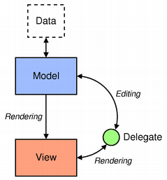
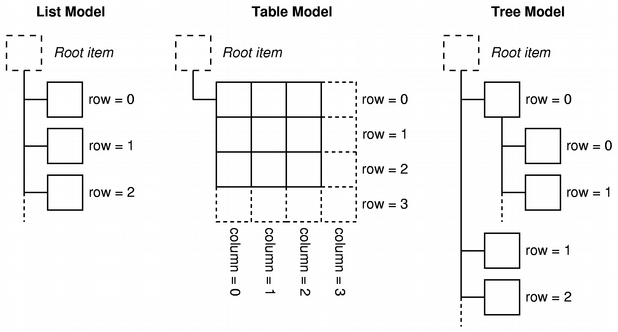

## Visual Programming with QML and Qt Quick

### Meetup #3: Models and views

--------------

###### by Carlos Enrique Pérez Sánchez

---

# Let's get started!

---

## What we are covering?

- Model/View programming
    - The Model/View architecture
	- Models
    - Delegates
    - Using a QML model
    - Using a backend model
- Technical vision for Qt 6

---

# Model/View programming

*Consult "Model/View Programming" in Qt Help*

--

Qt contains a set of item view classes that use a model/view architecture to manage the relationship between data and the way it is presented to the user

---

## The Model/View architecture

Model-View-Controller (MVC) is a design pattern originating from Smalltalk that is often used when building user interfaces

--

**In *Design Patterns*, the author writes:**

*"MVC consists of three kinds of objects. The Model is the application object, the View is its screen presentation, and the Controller defines the way the user interface reacts to user input. Before MVC, user interface designs tended to lump these objects together. MVC decouples them to increase flexibility and reuse."*

--

If the view and the controller objects are **combined**, the result is the **model/view** architecture. This still separates the way that data is stored from the way that it is presented to the user, but provides a simpler framework based on the same principles. This separation makes it possible to display the same data in several different views, and to implement new types of views, without changing the underlying data structures.

--

To allow flexible handling of user input, we introduce the concept of the **delegate**. The advantage of having a delegate in this framework is that it allows the way items of data are rendered and edited to be customized.

--



* The **model** communicates with a source of data, providing an interface for the other components in the architecture.
* The **view** obtains model indexes from the model; these are references to items of data.
* The **delegate** dictates how the data should appear in the view.

--

**Some models...**



--

Generally, the model/view classes can be separated into the three groups described above: **models**, **views**, and **delegates**. Each of these components is defined by abstract classes that provide common interfaces and, in some cases, default implementations of features.

--

Models, views, and delegates communicate with each other using signals and slots:

* Signals from the model inform the view about changes to the data held by the data source.
* Signals from the view provide information about the user's interaction with the items being displayed.
* Signals from the delegate are used during editing to tell the model and view about the state of the editor.

---

## Models

*Consult "Models and Views in Qt Quick" and "Using C++ Models with Qt Quick Views" in Qt Help*

---

### QML models

* Integers as models:

```qml
Item {
    width: 200; height: 250

    ListView {
        anchors.fill: parent
        model: 5
        delegate: Text { text: "I am item number: " + index }
    }
}
```

**Note**: The limit on the number of items in an integer model is 100,000,000.

--

* List Model

```qml
ListModel {
    id: fruitModel

    ListElement {
        name: "Apple"
        cost: 2.45
    }
    ListElement {
        name: "Orange"
        cost: 3.25
    }
    ListElement {
        name: "Banana"
        cost: 1.95
    }
}
```

--

The above model has two roles, `name` and `cost`. These can be bound to by a `ListView` delegate, for example:

```qml
ListView {
    anchors.fill: parent
    model: fruitModel
    delegate: Row {
        Text { text: "Fruit: " + name }
        Text { text: "Cost: $" + cost }
    }
}
```

--

* Object Model

`ObjectModel` contains the visual items to be used in a view. When an `ObjectModel` is used in a view, the view does not require a delegate because the `ObjectModel` already contains the visual delegate (items).

--

The example below places three colored rectangles in a ListView:

```qml
import QtQuick 2.0
import QtQml.Models 2.1

Rectangle {

    ObjectModel {
      id: itemModel
      Rectangle { height: 30; width: 80; color: "red" }
      Rectangle { height: 30; width: 80; color: "green" }
      Rectangle { height: 30; width: 80; color: "blue" }
    }

    ListView {
      anchors.fill: parent
      model: itemModel
    }
}
```

---

### Simple C++ models

`QStringList`

*A model may be a simple QStringList, which provides the contents of the list via the `modelData` role.*

```c++
QStringList dataList;
dataList.append("Item 1");
dataList.append("Item 2");
dataList.append("Item 3");
dataList.append("Item 4");
```

--

`QVariantList`

*A model may be a simple `QVariantList`, which provides the contents of the list via the `modelData` role.*

**Note**: The API works just like with `QStringList`, as shown in the previous section.

--

`QObjectList`

A list of `QObject*` values can also be used as a model. A `QList<QObject*>` provides the properties of the objects in the list as roles:

The following application creates a `DataObject` class with `Q_PROPERTY` values that will be accessible as named roles when a `QList<DataObject*>` is exposed to QML:

```c++
class DataObject : public QObject
{
    Q_OBJECT

    Q_PROPERTY(QString name READ name WRITE setName NOTIFY nameChanged)
    Q_PROPERTY(QString color READ color WRITE setColor NOTIFY colorChanged)
    // ...
};
```

--

The `QObject*` is available as the `modelData` property. As a convenience, the properties of the object are also made available directly in the delegate's context. The following code snippet references the `DataModel` properties in the `ListView`'s delegate:

```qml
ListView {
    width: 100; height: 100

    model: myModel
    delegate: Rectangle {
        height: 25
        width: 100
        color: model.modelData.color
        Text { text: name }
    }
}
```

--

**Pros**:
- Simple implementation

**Cons**:
- Very inefficient

-------------------------

*Why it is inefficient?*

There is no way for the view to know that the contents of a `QStringList`, `QVariantList`, or `QObjectList` have changed. If it changes, it will be necessary to **reset** the model.

---

### QAbstractItemModel subclass

*A model can be defined by subclassing `QAbstractItemModel`. This is the best approach if you have a more complex model that cannot be supported by the other approaches*

*A `QAbstractItemModel` can also automatically notify a QML view when the model data changes.*

The roles of a `QAbstractItemModel` subclass can be exposed to QML by reimplementing `QAbstractItemModel::roleNames()`

--

Here is an application with a `QAbstractListModel` subclass named `AnimalModel`, which exposes the type and sizes roles. It reimplements `QAbstractItemModel::roleNames()` to expose the role names, so that they can be accessed via QML:

```c++
class Animal
{
public:
    Animal(const QString &type, const QString &size);
        // ...
};

class AnimalModel : public QAbstractListModel
{
    Q_OBJECT
public:
    enum AnimalRoles {
        TypeRole = Qt::UserRole + 1,
        SizeRole
    };
    Q_ENUM(AnimalRoles) // exposes the enum to QML

    AnimalModel(QObject *parent = nullptr);
        // ...
};

QHash<int, QByteArray> AnimalModel::roleNames() const
{
    return { {TypeRole, "type"}, {SizeRole, "size"} }; // C++11 feature
}

//...

```

--

This model is displayed by a `ListView` delegate that accesses the `type` and `size` roles:

```qml
ListView {
    width: 200; height: 250

    model: myModel
    delegate: Text { text: "Animal: " + type + ", " + size }
}
```

**QML views are automatically updated when the model changes.**

---

## About delegates

* The **delegate** dictates how the data should appear in the view.
* In most cases the delegate is able to access the model's roles directly.
* They are recycled
    - When a delegates comes out of the view port, it is recycled to build the next delegate that enters

**That means that delegates cannot store states**

---

# Technical vision for Qt 6

--

* **What makes Qt valuable?**
    - **Cross-platform** nature
    - **Scalability** from low-end devices to complex desktop apps
    - **Tools** and **documentation**
    - **Maintainability**, **stability** and **compatibility**
    - A large **developer ecosystem**

-----------------------------------------------

A new version of Qt must keep and improve this features while adjusting to the new market demands

---

## Hot points

* Embedded and connected (cloud-based) devices
* Touch screens
* Low-end chipsets
* Microcontrollers
* Multi-screen desktop devices
* Artificial intelligence
* Qt tooling

------------------------------------------------

As such, the focus will be on those items that require architectural changes within Qt and cannot be done without breaking compatibility with Qt 5.

---

## Next-generation QML

* Introduce strong typing
* Compile QML to efficient C++ native code
* Make JavaScript an optional feature of QML
* Remove QML versioning
* Remove the duplication of data structures between C++ and QML
* Avoid runtime generated data structures
* Support hiding implementation details
* Better tooling integration

---

## Next-generation graphics

* Lot of changes since Qt 5
    - *Vulkan* has been designed as successor of *OpenGL*
    - Apple is pushing for *Metal*
    - Microsoft got *Direct 3D*

Qt must work seamlessly with all those APIs

To make that possible, a new layer abstracting the graphics APIs called the ***Rendering Hardware Interface*** (HRI) has to be defined

--

With Qt 5, there is no unified solution for creating UIs that contain both 2D and 3D components, and it is impossible to sync animations and transitions frame-by-frame between 2D and 3D content. Qt 6 will solve this problem.

--

Qt 6 aims to bring an unified theming/styling engine, which will allows us to get a native look and feel on desktop and mobile platforms to both Qt Widgets and Qt Quick.

---

## Unified and consistent tooling

* Qt Design Studio will be well integrated with tools like Photoshop, Sketch, Illustrator, Maya, 3D Max and others.
* Best-class tooling for C++, QML and Python
* Deprecate QMake in favor of CMake

---

## Enhance C++

* Migrate codebase from C++11 to C++17

---

# Wrapping up

Thank you for coming!