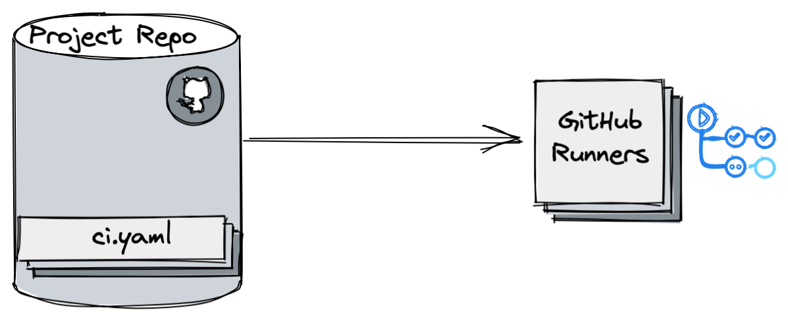
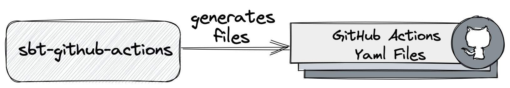
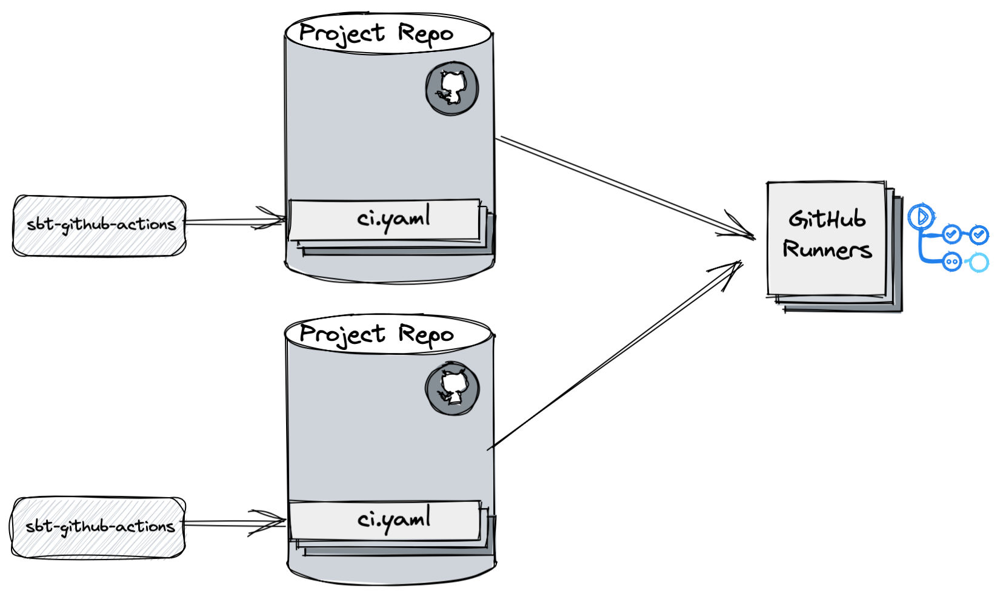
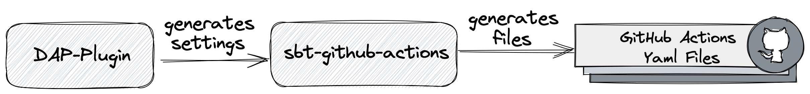
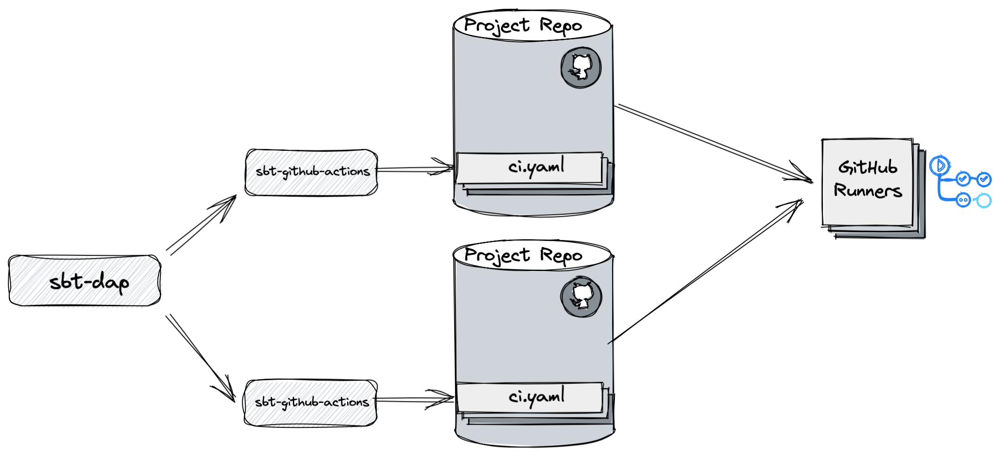

## The magical world of
# Scava
### Matan Keidar


---

## Outline
- What is Scava?
- Effect management
  - Nulls
  - Exceptions
- Statement evaluation (return)
- If statement
- Pattern matching
- Immutability

---

# What is Scava?
<div class="r-stack">
  <span class="fragment fade-out" data-fragment-index="1"><h2>Scava</h2></span>
  <span class="fragment fade-in" data-fragment-index="1"><h2>Scala + Java</h2></span>
</div>

<!-- <span class="fragment" data-fragment-index="2">
Meaning: 
- Writing in Java style and 
- Not fully using Scala's features
</span> -->

- Writing in Java style and <!-- .element: class="fragment" -->
- Not fully using Scala's features <!-- .element: class="fragment" -->

---

# Avoid Nulls


## Avoid NULLs

### Why null is bad?
- Represents "nothing", but without any guarantee <!-- .element: class="fragment" -->
- Can do nothing with it (otherwise, NPE) <!-- .element: class="fragment" -->
- Hard to differ <!-- .element: class="fragment" -->
  - Expected vs. unexpected "nothing" 


## Avoid Nulls
- We would like to: 
  - Use the type-system to represent "nothing"
  - Use it safely
- Effect:  Wrapper/Context of a computation value <!-- .element: class="fragment" -->


## Avoid Nulls
- `Option[T]`: Scala's built-in effect for representing 
- Has 2 possible values:
  - `Some[T]` represents a concrete value of type `T`
  - `None` represents an empty value
- Example:
```scala
val num1: Option[Int] = Some(4) 
val num2: Option[Int] = None    
```

- Nice Scala feature: 
  ```scala
  Option(null) == None
  ```


## Avoid Nulls <!-- .slide: data-auto-animate -->
### Bad 😩
```scala
if (person.name != null && person.name == "matan") {
  // do something
}
```


## Avoid Nulls <!-- .slide: data-auto-animate -->
### Better 🙂
```scala
if (Option(person.name) == Some("matan")) {
  // do something
}
```


## Avoid Nulls <!-- .slide: data-auto-animate -->
### Good 😎
```scala
if (Option(person.name).exists(_ == "matan")) {
  // do something
}
```


## Avoid Nulls <!-- .slide: data-auto-animate -->
### Excellent 🤩
```scala
Option(person.name).collect {
  case "matan" =>  {
    // do something
}
```

---

# Exceptions Management


## Exceptions Management
Common Java expcetion management:
```scala
try {
  // unsafe piece of code
} catch (Exception ex) {
  // recover from error
} finally {

}
```
What are the possible problems with this approach?


## Exceptions Management
- We do not know if a function should fail or not <!-- .element: class="fragment" -->
  - Java's checked exceptions are not the way to go...
- Exception management can be done anywhere <!-- .element: class="fragment" -->
  - We do not know who handles the error
- Side effects <!-- .element: class="fragment" -->
  - Throwing exceptions is like breaking the call stack
  - And expensive solution


## Exceptions Management
- `Try[T]` has 2 possible values:
  - `Success[T]`:  a successful computation of type `T`
  - `Failure[Throwable]`: a failed computation
- Example:
```scala
val num1: Try[Int] = Success(4) 
val num2: Try[Int] = Failure(new Exception("oh my..."))    
```

- Nice Scala feature: 
  ```scala
  val result = Try { 5 / 0 }
  println(result) // Failure(ArithmeticException: / by zero)
  ```

---

# Early Returns


### Referential Transparancy
> A piece of code is referentially transparent if 
> we can safely replace
> that piece of code with the value it computes and vice-versa, anywhere where that piece is used, without changing the meaning or result of our program. 


## Early Returns
```scala [|2]
def isPositiveNumber1(number : Int) : Boolean = {
  val isTrue  = return true
  val isFalse = return false

  if(number > 0) isTrue else isFalse
}

def isPositiveNumber2(number : Int) : Boolean = {
  if(number > 0) return true else return false
}

isPositiveNumber1(-1) // true 😱
isPositiveNumber2(-1) // false
```


## Early Returns
The `return` keyword is <span style="color: red;">NOT</span> <span style="color: yellow;">referentially transparent </span>


## Early Returns
```java []
int indexOf(String string, char character) {
  if(string.isEmpty()) {
    return -1;
  } else {
    int index = -1;
    int i;
    char[] stringArray = string.toCharArray();
    
    for(i = 0; i <= string.length() - 1; i++){
      if (stringArray[i] == character) return i;
    }

    return index;
  }
}
```
How to implement early returns in Scala?


## Early Returns with Recursion
```scala []
def indexOf(string : String , char : Char) : Int = {
   @tailrec
   def loop(stringList: List[Char], index: Int) : Int = {
     stringList match {
       case Nil => -1
       case h :: _ if h == char => index + 1
       case _ :: t => loop(t , index + 1)
     }
   }
   
   if(string.isEmpty) -1 else loop(string.toList, -1)
```

---

# Abusing If statements 


## Abusing If statements
```scala []
def findUser(id: Int): Option[User] = ???

val res: Option[User] = findUser(id = 1)

res.map(user => user.name)
res.exists(_.name.size > 4) // excludes vacuous truth
res.forall(_.name.size > 4) // includes vacuous truth
res.foreach(println) // signal for a side effect
res.fold("empty-user")(_.name) // if-else
res.contains(User("matan")) // compare
```

---

# Absusing Pattern Matching


## Absusing Pattern Matching
- Pattern matching is a great tool
- Switch-case on steroids
- Provides simplicity 
- However, new Scala developers tend to overuse it


## The basic rule
Check if there are variables binding


## Example (bad)
```scala
val user = User(1, "matan")

user match {
  case u if u.id == 1 => // do something
  case u if u.id < 10 => // do something else
  case other => // do something completly different
}

if (user.id == 1) // do something
else if (user.id < 10) // do something else
else // do something completly different


## Example (Good)
```scala
val user = User(1, "matan")

if (user.id == 1 && user.name == "matan") // do something
else if (user.id < 10 ) // do something else
else // do something completly different

user match {
  case User(1, "matan") => // do something
  case User(id, _) if id < 10 => // do something else
  case other => // do something completly different
}

```

---

# Immutability


## Immutability
- A common pattern is to create an empty collection 
- And then populate it with values
- Why is it bad?
  - Not thread safe
- How to avoid it?


## Immutability
```scala
val users: List[User] = getAllUsers()

var managers = List.empty[User]

// Imperative
users.foreach { user => 
  if (user.isManager) {
    managers += user
  }
}

// Functional
val managers = users.filter(_.isManager)
```


## Immutability
```scala
// Imperative
var onePerRegion: Map[Region, User] = Map()
users.foreach { user => 
  if (!onePerRegion.contains(user)) {
    onePerRegion += (user.region -> user)
  }
}
```


## Immutability
```scala
// Functional
val onePerRegion = users.foldLeft( (Seq.empty[User], "") ) {
  case ((agg, region), user) if user.region != region => 
    (agg + user, user.region)

  case ((agg, region), _) =>   
    (agg, region)
}
```


## Immutability
- Always try to use an existing "builder" 
  - `toMap`, `toList`, `toSeq`, `toSet`

  ```scala
    users.map(user => (user.age -> user) )
      .toMap
  ```
- Or, manipulate an existing collection 


## Immutability: pros vs. cons
- Pros: 
  - Simple model 
    - Easier to reason about
    - Easier to refactor
  - Thread safety
  
- Cons: 
  - Increase memory consumption
  - GC works harder


# Scala/Java Converters


## Collection Converters
```scala
import scala.jdk.CollectionConverters._

val jList = java.util.List.of(1,2,3)
val sList = jList.asScala // there is also asJava
```


## Option Converters
```scala
import scala.jdk.CollectionConverters._

val sOption = Option(4)
val jOption = sOption.toJava // there is also toScala
```


## Another converter classes
- <span style="color: yellow;">`DurationConverters`</span>
  - converts between Scala and Java duration types
- <span style="color: yellow;">`FutureConverters`</span>
  - converts between Scala `Future` and Java `CompletionStage`
- <span style="color: yellow;">`FunctionConverters`</span>
  - converts between Scala and Java function types
- <span style="color: yellow;">`StreamConverters`</span>
  - converts between Scala and Java stream types  


## Who is Matan?
- Current: Staff Engineer at Pipl  <!-- .element: class="fragment" -->
- Scala enthusiast  <!-- .element: class="fragment" -->
- Likes to fully automate all things  <!-- .element: class="fragment" -->
- (Really!) likes to have a clean code  <!-- .element: class="fragment" -->
- Married, father of 2  <!-- .element: class="fragment" -->


## Who is Pipl? <!-- .slide: data-auto-animate -->


## Who is Pipl? <!-- .slide: data-auto-animate -->
Providing data and tools in order to understand who is a trustworthy person


notes:
Pipl's target is to provide data and tooling for helping its clients to better understand
who is a real person in the real world and moreover, who is a trustworthy person.

Why is it  Critical?
Most of the identitify verifications are in the internet.
We do not provide our ID card when performing online purchase or creating new account.
Because most of our interactions are happening in the virtual world, it is very hackable and
causes lots of mess due to huge number of digital identities. 
And this is the place where Pipl steps into.


## Who is Pipl? <!-- .slide: data-auto-animate -->
### Quality and Quantity of public Data


notes: 
Besides the products we build, what makes us successful: 
- Our ability to collect and process huge amounts of data, consistenly
- Be able to correctly cluster profiles
- Be able to show relations between data entities.

Use cases
- Identity verification
  - eCommerce, Insurance, Banking
- Investigation
  - Authorities, law enforcement

---

## Background: Data Systems Group <!-- .slide: data-visibility="hidden" -->
- Pipl owns many records of people <!-- .element: class="fragment" -->
- Creating profiles from various sources <!-- .element: class="fragment" -->
- Billions of records <!-- .element: class="fragment" -->
  - Multiple processes, running for several days
  - Creating new data records
  - Data cleaning and parsing
  - Merging: new records with existing records
- Build index (input to search engine) <!-- .element: class="fragment" -->
- Lean and fast microservices in production <!-- .element: class="fragment" -->

---

## Preface
- This talk is about a concept 
- Telling our GitHub action story
- Relevant for you if: <!-- .element: class="fragment" -->
  - You work with Scala and sbt stack
  - You work with other tech stack 😎 <!-- .element: class="fragment" -->

---

## Use Case
- Multiple kind of projects:
  - Microservices and Big-Data processes
  - All written in Scala/Java
- Multiple repositories must be constantly maintained <!-- .element: class="fragment" -->
- Multiple kind of build outputs: <!-- .element: class="fragment" -->
  - Publishing packaged libraries
  - Publishing Docker images
  - Publishing files to GCP buckets


## The Problem
<!-- .slide: data-auto-animate -->
## maintenance, maintenance and... maintenance! <!-- .element: class="fragment fade-in" style="color: yellow;"  -->


## maintenance, maintenance and... maintenance!  <!-- .slide: data-auto-animate  --> 
- Large number of project repositories           <!-- .element: class="fragment" style="list-style-type: '😱 ';" data-fragment-index="1" -->
- Different types of projects                    <!-- .element: class="fragment" style="list-style-type: '😱 ';" data-fragment-index="2" -->
- Builds have different complexity requirements     <!-- .element: class="fragment" data-fragment-index="3" style="list-style-type: '😱 ';" -->
  - Publishing docker image requires:           <!-- .element: class="fragment" data-fragment-index="4" -->
    - Login to GCP (`gcloud auth login`)
    - Login to Docker registry (`docker login`)
  - Some builds should be run on a private node <!-- .element: class="fragment" data-fragment-index="5" -->
- All the above should be managed by CI/CD       <!-- .element: class="fragment" style="list-style-type: '😱 ';" -->
- Less developer fricition as possible           <!-- .element: class="fragment" style="list-style-type: '😱 ';" -->

---

<!-- .slide: data-auto-animate -->
## First Step: 
## Jenkins <!-- .element data-id="title" -->


<!-- .slide: data-auto-animate -->
## Jenkins <!-- .element data-id="title" -->
- The Jenkins way: wrap everything in DSL
- Need to directly setup Jenkins machine
  - Install all dependencies
  - Management:  secrets, users
- Great visualization (especially *Blue Ocean*)  


<!-- .slide: data-auto-animate -->
## Jenkins: Pros <!-- .element data-id="title" -->
- Steep learning curve: <!-- .element style="list-style-type: '✅ ' ;" -->
  - Developer is productive after a very short time <!-- .element style="list-style-type: '✅ ' ;" -->
- Very popular back then <!-- .element class="fragment"  style="list-style-type: '✅ ' ;" -->
- Lots of plugins <!-- .element class="fragment"  style="list-style-type: '✅ ' ;" -->


## Jenkins: Cons <!-- .element data-id="title" -->
<!-- .slide: data-auto-animate -->
- Developer needs to learn a proprietary DSL <!-- .element style="list-style-type: '❌ ' ;" -->
- Jenkins is installed on-prem <!-- .element class="fragment" style="list-style-type: '❌ ' ;" -->
  - Cannot use a webhook on change
  - Only polling for repo changes... ⏳


## Jenkins: Cons <!-- .element data-id="title" -->
<!-- .slide: data-auto-animate -->
- Management is hard: <!-- .element class="fragment"  style="list-style-type: '❌ ' ;" -->
  - R&D team does not have full permissions <!-- .element style="list-style-type: '❌ ' ;" -->
  - Build process is not containered (or virtualized) <!-- .element style="list-style-type: '❌ ' ;" -->
- Flow was running on the host directly <!-- .element class="fragment" style="list-style-type: '❌ ' ;" -->
- Not so clear what is actually installed <!-- .element class="fragment" style="list-style-type: '❌ ' ;" -->


<!-- .slide: data-background="https://media.giphy.com/media/11tTNkNy1SdXGg/giphy.gif" -->

---

## Second step
<!-- .slide: data-auto-animate -->
## GitHub Actions <!-- .element data-id="title" -->


## GitHub Actions vs. Jenkins
- Every step runs within a Docker container <!-- .element class="fragment" style="list-style-type: '🐳 ' ;" -->
  - Build environment is set up by containers
  - Build errors can be reproduced on a local machine
- Simple DSL <!-- .element class="fragment" style="list-style-type: '👌 ' ;"-->
  - Use existing action or run shell script
  - And still, every action is a Docker image
- No need to define a build project <!-- .element class="fragment" style="list-style-type: '🚀 ' ;" -->
  - GitHub actions work out of the box 
- Developers are much more independent <!-- .element class="fragment" style="list-style-type: '💪 ' ;" -->


## Simple build management



## Lack of Support
- Does not have support out of the box: <!-- .element class="fragment" style="list-style-type: '❌ ' ;" -->
  - No SBT support
  - No Scala installation
- Need to support: <!-- .element class="fragment" style="list-style-type: '❌ ' ;" -->
  - Login to private cloud environment 
  - Docker login to org private registry
  - Install required dependencies on build machine


## Propietary GitHub Action
<!-- .slide: data-auto-animate -->
- Created a tailor-made GitHub action <!-- .element class="fragment" -->
  - Slim and fast, based on OpenJDK Alpine
  - https://github.com/matankdr/github-docker-sbt
  - External PRs were contributed to the project! 💪
- Responsible for: <!-- .element class="fragment" -->
  - Installing `sbt` 
  - Installing other required dependencies (e.g., git)
  - Injecting GitHub secrets as environment variables
  - docker-login to our private docker registry
  - Running given `sbt` command 


<!-- .slide: data-background="https://media.giphy.com/media/x8TrYlgGVCAytbcBgC/giphy.gif" -->
## Exactly what we need!


## Propietary GitHub Action: The good <!-- .element data-id="title" -->
<!-- .slide: data-auto-animate -->  
- Tailor-made action that exactly fits
- Flexible run: either on GitHub or on-premise node
- Each build step is containered


## Propietary GitHub Action: The bad <!-- .element data-id="title" -->
<!-- .slide: data-auto-animate -->  
- Configuration is not flexible <!-- .element class="fragment" -->
  - Manually updating build definition for each project
  - Cross compilation is complicated
  - Publish image for each dependency combination
- Build innaccuracy <!-- .element class="fragment" -->
  - Build tool and CI might run on different settings
  - For example: different Java/Scala versions


<!-- .slide: data-background="https://media.giphy.com/media/TPdoPTIMMBzDqPVKg3/giphy.gif" data-background-size="70%" data-background-opacity="0.7" -->
## Not Exactly what we need...

---

## Third Step
## Code Generation
<!-- .slide: data-auto-animate -->


## Code Generation
<!-- .slide: data-auto-animate -->
- Daniel Spiewak creates `sbt-github-actions` 
- https://github.com/djspiewak/sbt-github-actions
- Enables code generation GitHub Actions workflows 
  - Directly from the `sbt` build definition!
- Big improvement: `sbt` is now the *"source of truth"*!



### Ease of use
<!-- .slide: data-auto-animate --> 
#### Set Environment Variables

```scala
// build.sbt
githubWorkflowEnv := Map(
  "GITHUB_TOKEN"      -> "${{ secrets.BOT_TOKEN }}",
  "GITHUB_USERNAME"   -> "pipl-bot",
  "GITHUB_USER_EMAIL" -> "bot@pipl.com"
)
```


### Ease of use
<!-- .slide: data-auto-animate --> 
#### Set Environment Variables
```yml
# generated ci.yml
env:
  GITHUB_TOKEN: ${{ secrets.BOT_TOKEN }}
  GITHUB_USERNAME: pipl-bot
  GITHUB_USER_EMAIL: bot@pipl.com
```


### Ease of use
<!-- .slide: data-auto-animate --> 
#### Set Java versions
```scala
// build.sbt
githubWorkflowJavaVersions := Seq("openjdk@1.11", "openjdk@1.8")
```


### Ease of use
<!-- .slide: data-auto-animate --> 
#### Set Java versions
```yml[1,9|]
# generated ci.yml
jobs:
  build:
    name: Build and Test
    strategy:
      matrix:
        os: [ubuntu-latest]
        scala: [2.13.6]
        java: [openjdk@1.11, openjdk@1.8]
    runs-on: ${{ matrix.os }}
```


### Ease of use
<!-- .slide: data-auto-animate --> 
#### Execute shell commands
```scala
// build.sbt
WorkflowStep.Run(
  name = Some("Set Git Credentials"),
  id   = Some("git-credentials"),
  commands = List(
    "git config --global user.email ${GITHUB_USER_EMAIL}",
    "git config --global user.name ${GITHUB_USERNAME}",
    "git config --global user.password ${GITHUB_TOKEN}"
  )
)
```


### Ease of use
<!-- .slide: data-auto-animate --> 
#### Execute shell commands
```yml
# generated ci.yml
- name: Set Git Credentials
    id: git-credentials
    run: |
      git config --global user.email ${GITHUB_USER_EMAIL}
      git config --global user.name ${GITHUB_USERNAME}
      git config --global user.password ${GITHUB_TOKEN}
```


### Ease of use
<!-- .slide: data-auto-animate --> 
#### Using existing Github Actions
```scala
// build.sbt
WorkflowStep.Use(
  ref = UseRef.Public(
    owner = "elgohr",
    repo  = "gcloud-login-action",
    ref   = "master"
  ),
  id     = Some("gcloud"),
  name   = Some("Login to gcloud registry"),
  params = Map( "account_key" -> "${{ secrets.GCLOUD_KEY }}" )
)
```


### Ease of use
<!-- .slide: data-auto-animate --> 
#### Using existing Github Actions
```yml
# generated ci.yml
  - name: Login to gcloud registry
    id: gcloud
    uses: elgohr/gcloud-login-action@master
    with:
      account_key: ${{ secrets.GCLOUD_KEY }}
```

---

## Result
- Workflow is generated directly from the project's build definition!
- Specifically tailor made for each project
- On build definition update, the workflow is updated


## The build tool is
<!-- .slide: data-background="https://media.giphy.com/media/kiCXF8mL3j6Oe0vAm9/giphy.gif" data-background-opacity="0.9" -->
# Single source of truth!


<!-- .slide: data-background="https://media.giphy.com/media/10tIjpzIu8fe0/giphy.gif" data-background-opacity="0.7" -->
## Had to kill the open-sourced Action...


## Result
<!-- .slide: data-auto-animate -->
- Development cycle is significantly improved! 
- Yet, some of the problems still remain: 🤦‍♂️ <!-- .element class="fragment"  -->
  - No auto-update build definition for all projects
  - When creating a new repo, build definitions need to be copied <!-- .element class="fragment"  -->
    - Cannot use GitHub template (multiple project types)


## Result
<!-- .slide: data-auto-animate -->



## And then we found it...
<!-- .slide: data-background="https://media.giphy.com/media/XF3lU8cWrv4JcUeEmM/giphy.gif" -->

---

## Fourth Step
## Double Code Generation


## DAP sbt-plugin
<!-- .slide: data-auto-animate -->
- Create `sbt` plugin for generating common settings
- Settings are read by `sbt-github-actions` plugin
- On update, only need to upgrade the plugin version




## DAP sbt-plugin
<!-- .slide: data-auto-animate -->



<!-- .slide: data-background="https://media.giphy.com/media/WNwErIxqX18xmm92UX/giphy.gif" data-background-opacity="0.7" -->
## One plugin to rule them all!


## Features
- Generate Scala Steward GitHub workflow
  - (like `Dependabot` but for Scala)
  - Set auto merging commits created by our bot 
- Generate Authentication steps:
  - GCP, Docker, `sbt` credentials, `git` credentials
- Generate common workflow steps:
  - PR, publish and deployment


## Results
- So far, we are still experimenting 
- The plugin reduces the release cycle time
- Not easily debuggable:
  - Logic is encapsulated within the plugin  

---

## Conclusion
<!-- .slide: data-auto-animate -->
- Working with GitHub actions improved productivity <!-- .element: class="fragment" -->
  - Ease of use and evolving actions community
  - Build virtualization is a first class citizen
- GitHub actions enables flexible CI/CD <!-- .element: class="fragment" -->
  - Build definition can be easily updated
  - Within a few lines of code  


## Conclusion
<!-- .slide: data-auto-animate -->
- One source of truth is pure gold <!-- .element: class="fragment" -->
  - Enable the developers to avoid silly mistakes
- If no 3rd party solution available, use your own <!-- .element: class="fragment" -->
- Do not be afraid to kill your own projects 😩 <!-- .element: class="fragment" -->


<div>
      
      
    

</div>


# Questions <!-- .element: style="color: white; border: 10px; border-color: black;" -->
<!-- .slide: data-background="https://thehomebasedmom.com/wp-content/uploads/2019/05/Frequently-Asked-Questions.jpg"  data-background-opacity="0.7" -->

---

<!-- .slide: data-background="https://media.giphy.com/media/Pnh0Lou03fv92J4puZ/giphy.gif" data-background-size="50%" -->
