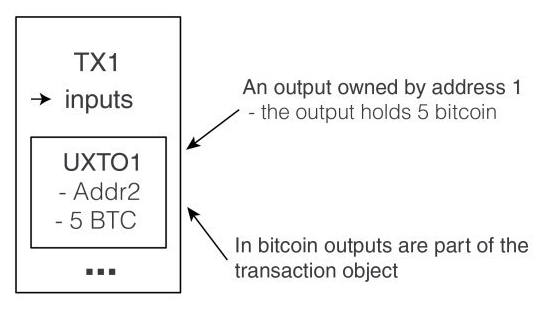
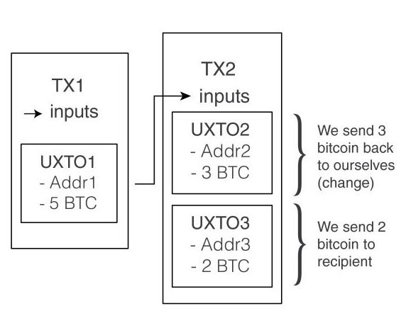

## Skycoin
#### Basic concepts to get started

----------------

#### These slides: [slides.cuban.tech/skycoin.intro.html](http://slides.cuban.tech/skycoin.intro.html)

----------------

### Wifi Info

Network: cubantech

Password: meet-ups

---

## Outline

- Why Skycoin?
- Understanding Skycoin transactions
- Core values
- Five pillars of Skycoin
- Skycoin ecosystem
- What's next?

<small> Notes about Bitcoin and Ethereum in-between </small>

--

## Recommended background

- Go programming language
- [Theory of distributed applications](dapps.html)
- Bitcoin and Ethereum

---

## [Why we built Skycoin](https://www.skycoin.net/blog/statement/why-we-built-skycoin/)

- Issues with Proof of Work
- Proof of Stake: More Centralization Problems
- Technical improvements
  * Security problems associated with other blockchain networks
  * Decouple coin creation from the "mining" process
  * Fast confirmation of transaction
- Inflationary policies
  * The supply of Skycoin is fixed

---

## Issues with proof of work

- Control of the network => economic power
- Monopolization of mining
- Incentivized the purchase of hashing power
  * Disproportionate control over the network.
  * Bitcoin => SlushPool , Bitmain , BTCC
  * revert and falsify transactions 51% attack
- Economic and environmental cost

--

## SlushPool

##### Hash rate distribution

--

## Bitcoin inflation

- Transaction fees and inflation bleeding users dry.
  * Over $50, and go to centralized mining pools.
- More expensive than international bank transfer

--

## Energy consumption of Bitcoin PoW

<small> ... according to [BitcoinEnergyConsumption.com](https://BitcoinEnergyConsumption.com)</small>

- Projected to be comparable to Denmark's in 2020 

---

## Proof of Stake

##### Solves 51% attacks, but ...

- Major stakeholder enjoy extensive control and authority
  * ... over technical and economic aspects of the network
  * Major monopoly problem
- Defeats the purpose of the decentralized ledger system

---

---

## Obelisk

##### Skycoin consensus

- Based on distributed influence (web of trust)
- Node subscribes to a list of other nodes
  * Network density determines node's influence.
- Prevents the development of centralized power.
- If some node fails to comply,
  * ... its actions will be visible (public) 
  * Network can then sever connections with that node

---

## Transaction models - Account

##### Ethereum, Ripple

- All transactions/objects belong to a single public key
- Complicates design
- Compromises privacy
  * Easily tracked and monitored account

---

##Transaction models - UXTO

##### Bitcoin

- Store UX objects as part of TX
  * referenced by index
  * Dust resource exhaustion attck
- Overcomplicated security & privacy
  * e.g. generate new address for each TX

--

## UXTO explained

--

## UXTO example

---

## UXTX

##### Skycoin

- Separate hash IDs for UX and TX
- UX objects independent of TX objects
- Simplifies design

--

    

---

## Skycoin Coin Hours

##### The Fuel for the Skycoin ecosystem

- Holding Skycoin in a wallet
  * ... automatically generates Coin Hours
  * 1 SKY * 1 hour = 1 Coin Hour.
- Keep the Skywire network free of transaction fees.
- Virtual cat games can’t skyrocket tx fees up 1600%
  * Recent issue in the Ethereum network.
- Users never pay to access and use the network

---

## Skycoin Coin Hours

### What if ... ?

- ... Coin Hours inflate dramatically
  * Max = 100 million Coin Hour per hour
  * Will be reached in decades
- ... no transactions ever took place on the network
  * max Coin Hours would not exceed `uint64` for centuries.

---

## Skycoin Spending transactions

##### Proof of burn

--

## Skycoin spend example

##### Comparison of number of purchases

--

## Skycoin spend example

##### After 1 hour

---

## Benefits

- Immune to 51% attack (no mining)
- Transactions are significantly faster
  * Occur in seconds.
- Decisions made through community consensus

---

## What's next?

- Next meetup : Skycoin projects explained !!!
- Telegram community : [https://t.me/Skycoin](https://t.me/Skycoin)
- Website: [https://www.skycoin.net](https://www.skycoin.net)
- Development - [https://github.com/skycoin](https://github.com/skycoin)
- News Channel: [https://t.me/skycoinnews](https://t.me/skycoinnews)
- Twitter: [https://twitter.com/Skycoinproject](https://twitter.com/Skycoinproject)
- Support: [https://t.me/skycoinsupport](https://t.me/skycoinsupport)

---

# Thank you for coming!

#### Questions?

