## Skycoin client libraries
#### Foundations of 3rd generation DApps

----------------

#### These slides: [slides.skycoin.net/skycoin.libs.html](http://slides.skycoin.net/skycoin.libs.html)

----------------

Copyright 2019 Skycoin project

---

## Outline

- How do cryptocurrencies work?
- Skycoin Ecosystem
- Understanding API sets
- Node REST API endpoints
- Open API specs
- Future work

---

# Recap

--

## Replicated State Machines

- Deploy replicas of the software
- Receive client requests (i.e. inputs)
- Order the inputs
- Execute SM transition over and over
- Monitor replicas for differences in State or Output

--

## The scalability problem

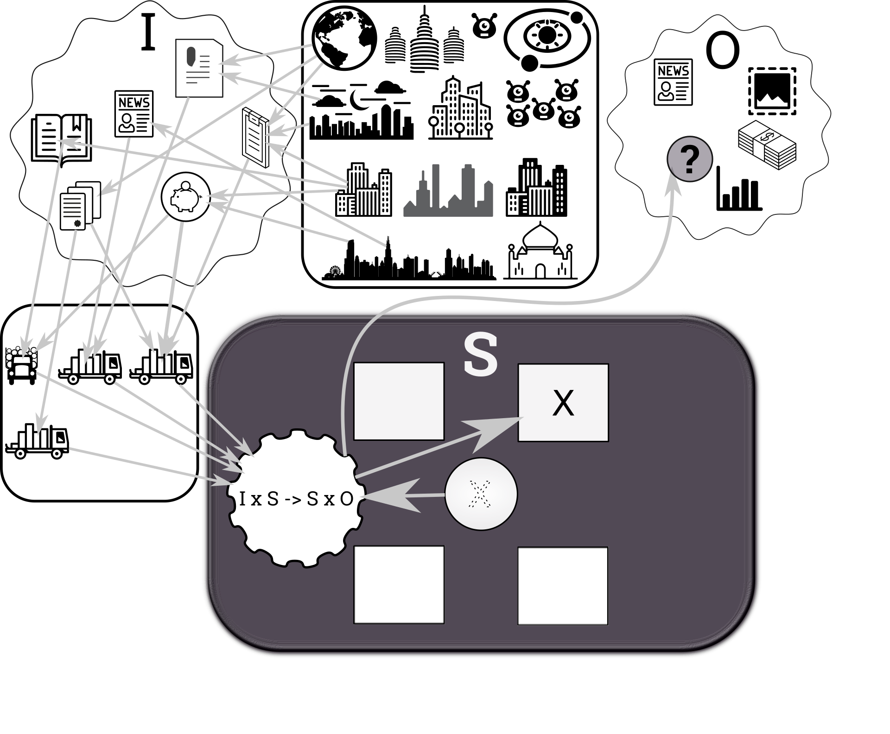

--

## Stats of the Bitcoin blockchain


--

[](http://www.skycoin.net)

- Why Skycoin?
- Core values
- Five pillars of Skycoin
- Understanding Skycoin transactions
- Skycoin ecosystem
- What's next?

---

## [Why we built Skycoin](https://www.skycoin.net/blog/statement/why-we-built-skycoin/)

- Issues with Proof of Work
- Proof of Stake: More Centralization Problems
- Technical improvements
  * Security problems associated with other blockchain networks
  * Decouple coin creation from the "mining" process
  * Fast confirmation of transaction
- Inflationary policies
  * The supply of Skycoin is fixed

--

## Issues with proof of work

- Control of the network => economic power
- Monopolization of mining
- Incentivized the purchase of hashing power
  * Disproportionate control over the network.
  * Bitcoin => SlushPool , Bitmain , BTCC
  * revert and falsify transactions 51% attack
- Economic and environmental cost

--

## SlushPool

##### Hash rate distribution

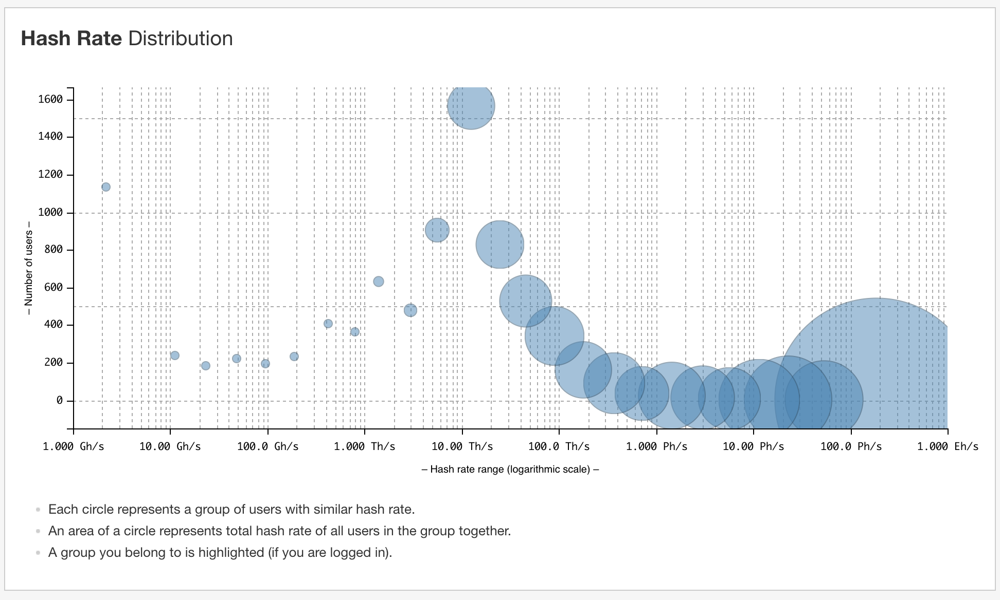

--

## Bitcoin inflation

- Transaction fees and inflation bleeding users dry.
  * Over $50, and go to centralized mining pools.
- More expensive than international bank transfer

---

## [Five pillars of Skycoin](https://www.skycoin.net/blog/posts/five-pillars-of-skycoin/)

- [Skycoin](https://github.com/skycoin/skycoin,) a coin technically better than Bitcoin
- [Skywire](https://www.skycoin.net/blog/tags/skywire/,) a mesh network
- [Fiber](https://www.skycoin.net/fiber/), like Ethereum's ERC20, but better
  * Every coin their own blockchain
  * [CX](https://www.skycoin.net/blog/overview/cx-overview/) programming language
  * add your own features
- DApps ecosystem
- Our own [hardware platform](https://www.skycoin.net/blog/statement/skywire-miner-hardware-for-the-next-internet/.)

---

## Bitcoin - Problems with UTXO

<small>
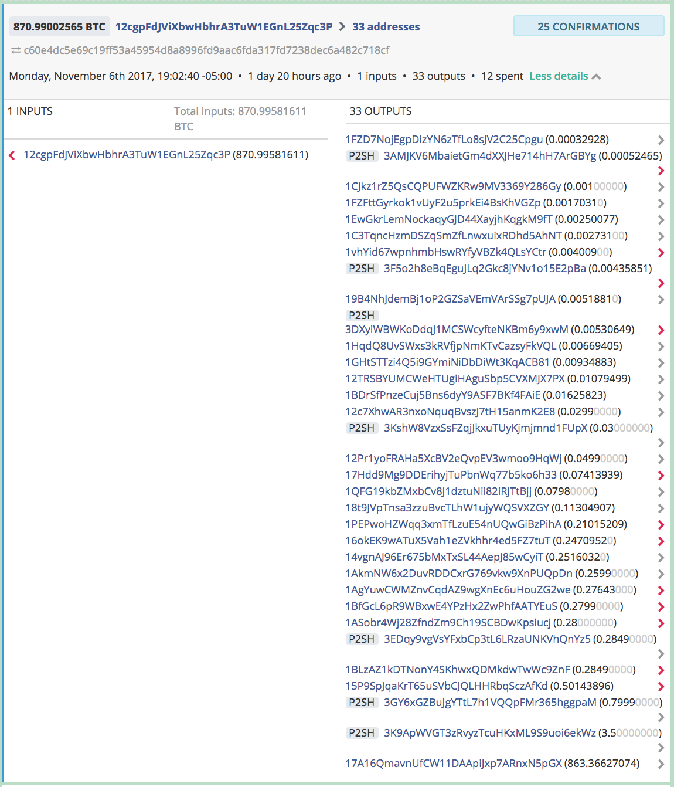
</small>

- Dust attack
  * Resource exhaustion
  * RAM and disk space

---

## Skycoin UXTX Spending

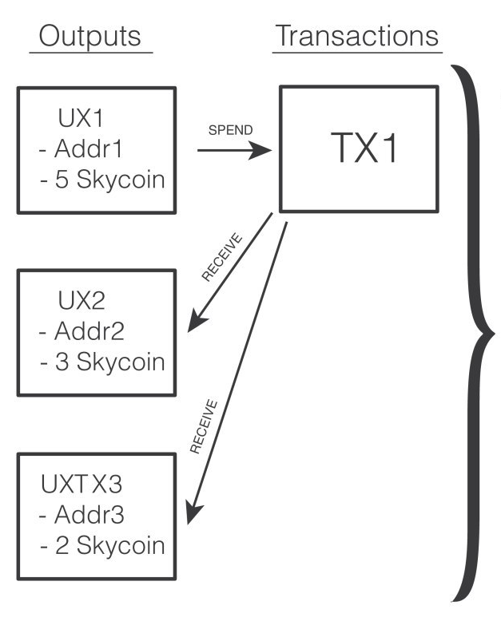

- Pruning spent UX is easy
- No mining, no fee (no mining, no fee ...)
  * Proof of burn - CoinHours

--

## Skycoin Coin Hours

##### The Fuel for the Skycoin ecosystem

- Holding Skycoin in a wallet
  * ... automatically generates Coin Hours
  * 1 SKY * 1 hour = 1 Coin Hour.
- Keep the Skywire network free of transaction fees.
- Virtual cat games can't skyrocket tx fees up 1600%
  * Recent issue in the Ethereum network.
- Users never pay to access and use the network

--

## Skycoin Coin Hours

### What if ... ?

- ... Coin Hours inflate dramatically
  * Max = 100 million Coin Hour per hour
  * Will be reached in decades
- ... no transactions ever took place on the network
  * max Coin Hours would not exceed `uint64` for centuries.

--

## Skycoin Spending transactions

##### Proof of burn

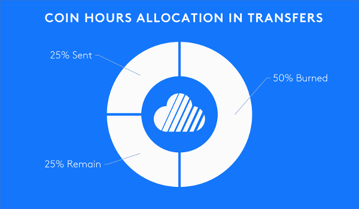

--

## Skycoin spend example

##### Comparison of number of purchases

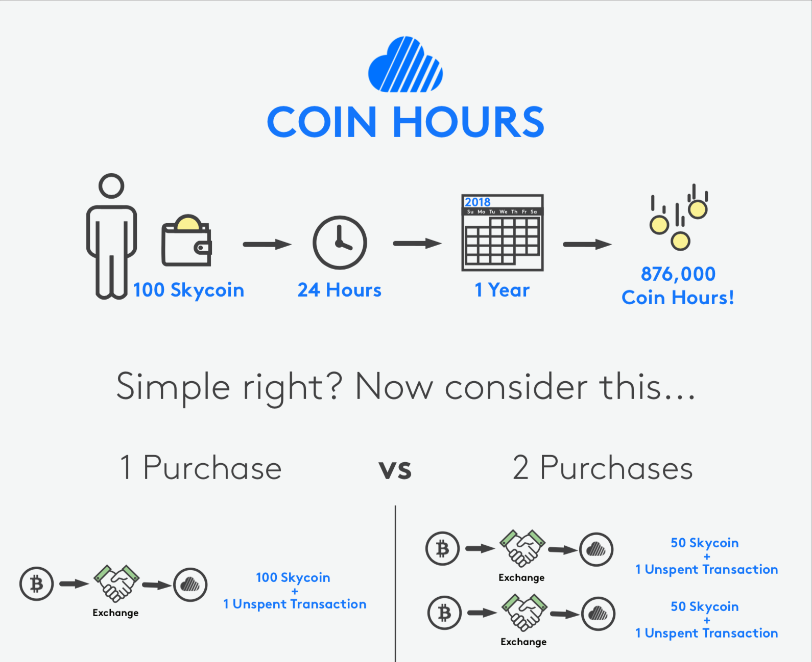

--

## Skycoin spend example

##### After 1 hour

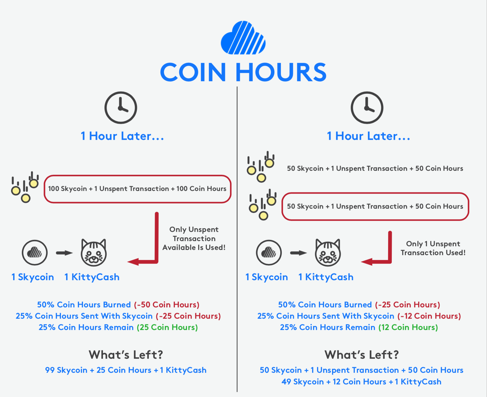

---

## Skycoin Protocol Overview

- No DNS during P2P discovery

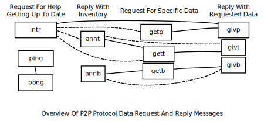

---

[](http://www.skycoin.net)

- Wallets
  * Desktop (Electron), Android, iOS
- Exchange integrations
- CX programming language
  * Smart contracts
- DApps

---

## A community of developers

- CX
- Use your preferred programming language

---

## Skycoin core libraries

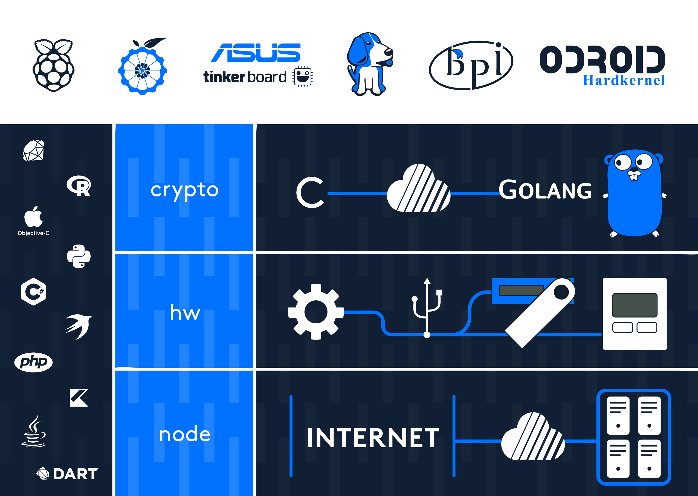

--

## Skycoin core libraries

- Transpiled
  * go src => transpiler => lang X src => ...
  * e.g. skycoin-lite
  * need maintenance
- Crypto API
  * go src => cgo => binary + header => ...
- REST API
  * go annotations => swagger => spec => lang X src => ...

---

## What are API sets?

- Groups API endpoints
- Related in intent
- Enabled / disabled at once via CLI
  * `--enable-api-sets`
  * `-disable-api-sets`
  * `-enable-all-api-sets`

---

## Skycoin 0.25.1 API sets 

- `READ` - Query data. Read only.
- `STATUS` - A subset of `READ` exposing node status
  * Application
  * Network
  * Blockchain
- `PROMETHEUS` - Node metrics in Prometheus text format

---

## Skycoin 0.25.1 API sets 

- `TXN` - Transaction ops (no wallet)
- `WALLET` - Local wallet files
- `NET_CTRL` - Network admin
- `INSECURE_WALLET_SEED` - BIP39 mnemonic
  * Used by desktop wallet only

---

## Swagger a.k.a Open API

- Model driven (Swagger spec)
- Literate programming `go-swagger`
  * Generate Swagger spec from annotations
  * only v2, no v3 support
- Auto-generate
  * REST client / server code
  * Documentation
  * Database models
  * ...

--

## Why Open API v3

```
URI: /api/v1/transaction
Method: GET
Args:
    txid: transaction id
    verbose: [bool] include verbose transaction input data
    encoded: [bool] return the transaction as hex-encoded serialized bytes
```

--

```json
{
    ...
        "inputs": [
            "5287f390628909dd8c25fad0feb37859c0c1ddcf90da0c040c837c89fefd9191"
        ],
    ...
}
```

###### curl http://127.0.0.1:6420/api/v1/transaction?txid=a6446654829a4a844add9f181949d12f8291fdd2c0fcb22200361e90e814e2d3

--

```json
{
    ...
        "inputs": [
            {
                "uxid": "5287f390628909dd8c25fad0feb37859c0c1ddcf90da0c040c837c89fefd9191",
                "owner": "2K6NuLBBapWndAssUtkxKfCtyjDQDHrEhhT",
                "coins": "8.000000",
                "hours": 7454,
                "calculated_hours": 7454
            }
        ],
    ...
}
```

###### curl http://127.0.0.1:6420/api/v1/transaction?txid=a6446654829a4a844add9f181949d12f8291fdd2c0fcb22200361e90e814e2d3&verbose=1

---

## Other projects 

- Skywire
- Hardware wallet daemon
- CXO
- DApps (BBS, ...)

---

## Swagger client libraries
#### Status

- Partially tested
  * Python, .NET, Java
- Fully generated
  * Objective-C, C (`libcurl`), Ruby
  * PHP, Javascript (`node` + `axios`)
- Work in progress
  * C++ (QT)
  * ... more at https://github.com/simelo

---

## Hardware wallet daemon
#### finished before product itself


---

## REST API test suite - golang
#### [TestVersion](https://github.com/skycoin/skycoin/blob/v0.26.0/src/api/integration/integration_test.go#L316-L327) test case @ v0.26.0

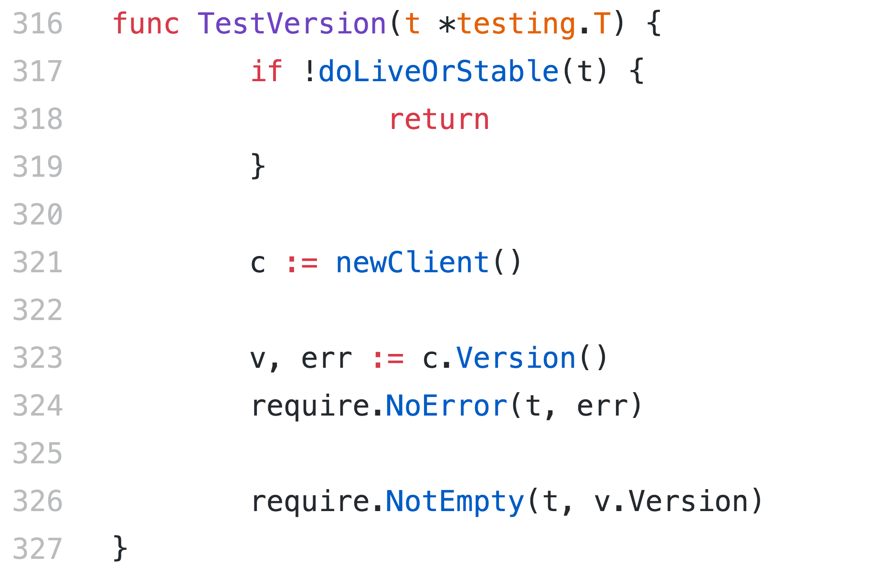

--

## REST API test suite - golang
#### [newClient](https://github.com/skycoin/skycoin/blob/v0.26.0/src/api/integration/integration_test.go#L75-L95) @ v0.26.0

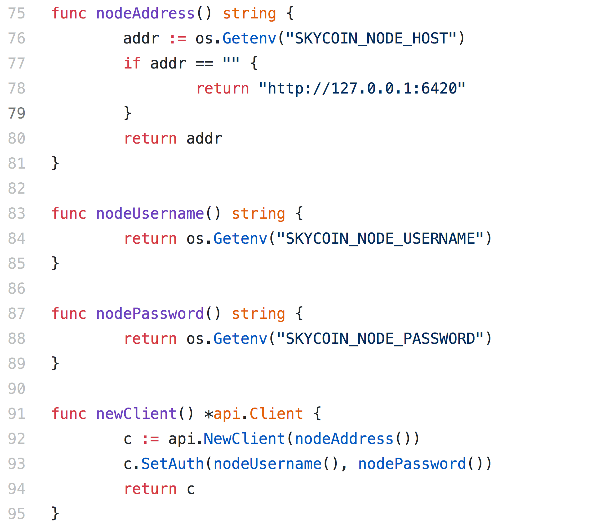

---

## Doing tests using docker

--

## Ruby

### Setup library ruby

```bash

git clone http://maceo@git.cuban.tech:30080/simelo/python-hackday.git

cd ruby-hackaday

docker run -it --network=host -v $(pwd):/app -w /app ruby-sky-meetup /bin/bash
```

--

## Python

### Setup library python

```bash

git clone http://maceo@git.cuban.tech:30080/simelo/python-hackday.git

cd python-hackaday

docker run -it --network=host -v $(pwd):/app -w /app skyapi-python-meetup /bin/bash
```

--

## Dotnet

### Setup library dotnet

```bash

git clone http://maceo@git.cuban.tech:30080/simelo/python-hackday.git

cd dotnet-hackaday

docker run -it --network=host -v $(pwd):/app -w /app skyapi-dotnet-meetup /bin/bash
```

---

## Testing with unittest in python

### Unittest Example

--

```py
import skyapi
import unittest

configuration = skyapi.Configuration()
configuration.host = 'http://localhost:6420'
api_instance = skyapi.DefaultApi(skyapi.ApiClient(configuration))

class TestSum(unittest.TestCase):
    def test_version(self):
        """
        Test /api/v1/version
        """
        result = api_instance.version()

        self.assertEqual(result['branch'], 'v0.26.0')
        self.assertEqual(result['commit'], 'ff754084df0912bc0d151529e2893ca86618fb3f')
        self.assertEqual(result['version'], '0.26.0')

if __name__ == '__main__':
    unittest.main()
```

--

## Testing with RSpec in ruby

### Rspec Example

--

```rb
require 'sky_api'

api_instance = SkyApi::DefaultApi.new
api_instance.api_client.config.host = 'http://localhost:6420'

describe 'version' do
  result = api_instance.version
  
  it 'check branch' do
    expect(result.branch).to eq 'v0.26.0'
  end
  
  it 'check version' do
    expect(result.commit).to eq 'ff754084df0912bc0d151529e2893ca86618fb3f'
  end

  it 'check commit' do
    expect(result.version).to eq '0.26.0'
  end
end
```

--

## Testing with Xunit in Dotnet

### Xunit Example

--

```cs
public class UnitTest1
{
    [Fact]
    public void Version() {

    Configuration.Default.BasePath = "http://localhost:6420";
    var apiInstance = new DefaultApi(Configuration.Default);

    try {
        var result = apiInstance.Version();
        Assert.Equal("v0.26.0", result.Branch);
        Assert.Equal("ff754084df0912bc0d151529e2893ca86618fb3f", result.Commit);
        Assert.Equal("0.26.0", result.Version);
        Console.WriteLine(result);
    }
    ...
```

---

## What's next?

- Next meetup : Skycoin projects explained !!!
- Telegram community : [https://t.me/Skycoin](https://t.me/Skycoin)
- Website: [https://www.skycoin.net](https://www.skycoin.net)
- Development - [https://github.com/skycoin](https://github.com/skycoin)
- News Channel: [https://t.me/skycoinnews](https://t.me/skycoinnews)
- Twitter: [https://twitter.com/Skycoinproject](https://twitter.com/Skycoinproject)
- Support: [https://t.me/skycoinsupport](https://t.me/skycoinsupport)

---

# Thanks for your attention!

## Questions?


